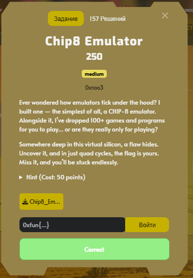
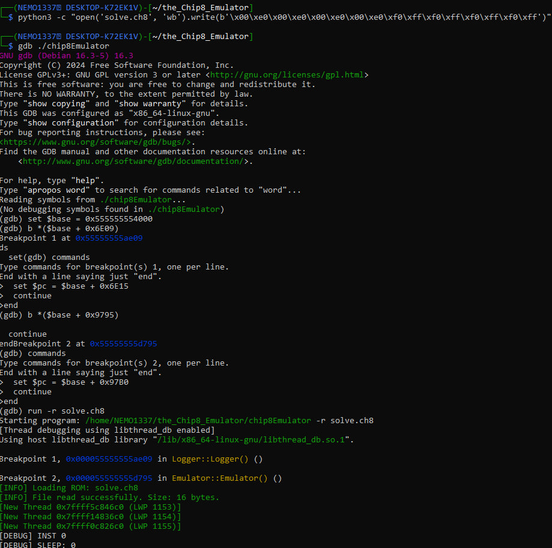
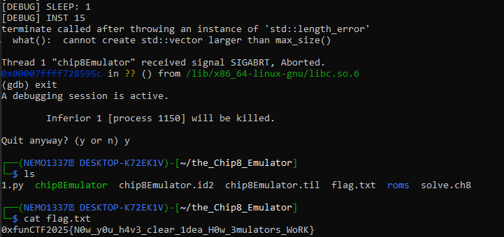

## 0xFUN CTF 2026 - Chip8 Emulator Write-up



### 1. Reverse Engineering & Opcode Analysis

We start by analyzing the provided binary, which is a CHIP-8 emulator. By inspecting the `Cpu::execute` function, we identify the standard CHIP-8 instruction set. However, a deeper look into the `0xF...` instruction group reveals a non-standard opcode: `0xFF`.

This opcode triggers a hidden function called `Cpu::superChipRendrer`. Instead of rendering graphics, this function is responsible for a multi-layered AES-256-CBC decryption process.

### 2. Identifying the "Silicon Flaw"

The challenge description mentions a "flaw" in the "virtual silicon." By examining the `Cpu::cache` and `Emulator::init` functions, we find numerous calls to `ptrace(0, 0, 0, 0)`. While typically used as an anti-debugging measure to terminate the program, here the result of `ptrace` is used as a source of entropy for the key generation algorithm.

```cpp
// Pseudocode of the flaw
long result = ptrace(PTRACE_TRACEME, 0, 0, 0); 
emu_key ^= (result * MAGIC_CONSTANT); // result is -1 if debugging
```

When running under a debugger like GDB, `ptrace` always returns `-1`. The "flaw" is that the key generator becomes deterministic under these conditions. The hint "quad cycles" suggests that the key stabilizes into its final valid form after 4 emulation cycles.

### 3. Crafting the Trigger ROM

To retrieve the flag, we need to execute at least 4 instructions to stabilize the key, followed by the secret `0xFF` opcode. We create a custom CHIP-8 ROM that performs 4 "No-Op" style instructions (like clearing the screen `00E0`) and then calls the secret renderer.

```python
# solve.py
# 4x Clear Screen (00E0) + Secret Opcode (F0FF) executed 4 times for multi-layer decryption
python3 -c "open('solve.ch8', 'wb').write(b'\x00\xe0\x00\xe0\x00\xe0\x00\xe0\xf0\xff\xf0\xff\xf0\xff\xf0\xff')"
```

### 4. GDB Execution & Anti-Debug Bypass

We run the emulator in GDB. To prevent the program from exiting due to the `ptrace` checks, we set breakpoints on the specific addresses where the `exit` calls occur and manually redirect the execution flow (Instruction Pointer) to the next valid instruction.

```gdb
set $base = 0x555555554000

# Bypass Logger anti-debug
b *($base + 0x6E09)
commands
  set $pc = $base + 0x6E15
  continue
end

# Bypass Emulator anti-debug
b *($base + 0x9795)
commands
  set $pc = $base + 0x97B0
  continue
end

run -r solve.ch8
```



The emulator executes the custom ROM. Because it's running under GDB, the "Silicon Flaw" triggers, and the `emu_key` is correctly derived cycle by cycle.

### 5. Data Extraction

After the 4th execution of the `F0FF` opcode, the program completes the final layer of decryption. The `superChipRendrer` function then performs a final XOR operation and writes the result to a file named `flag.txt`.



By inspecting the directory after the GDB session, we find the generated file.

**Flag:** `0xfunCTF2025{N0w_y0u_h4v3_clear_1dea_H0w_3mulators_WoRK}`