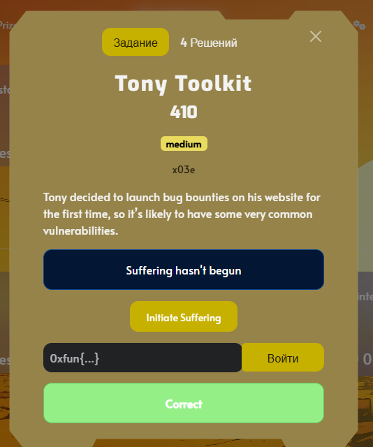
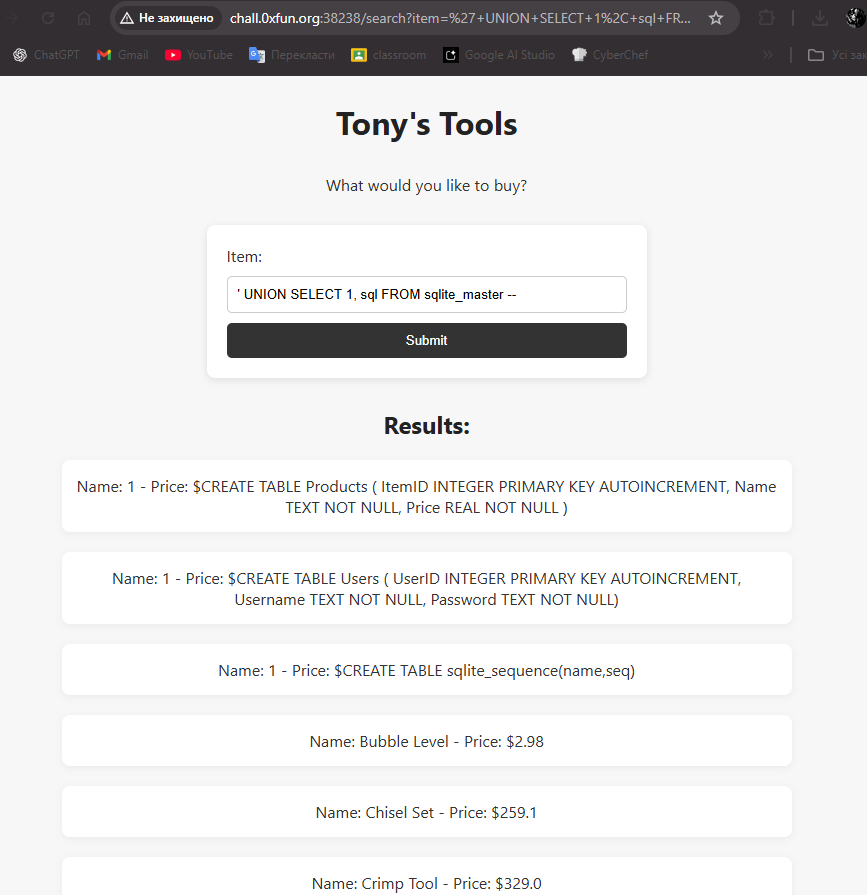
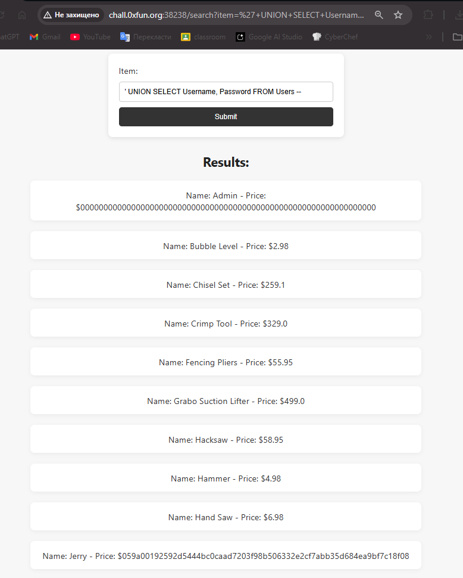
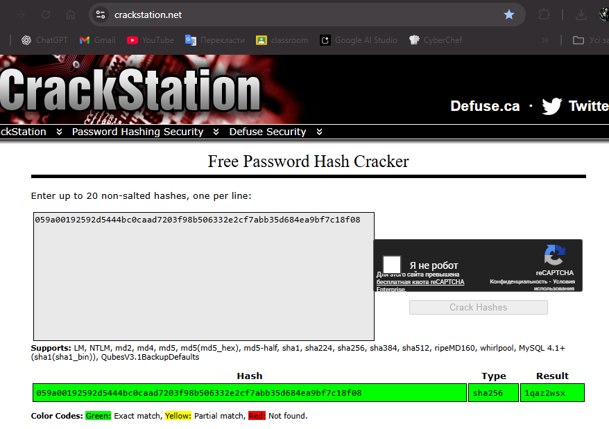
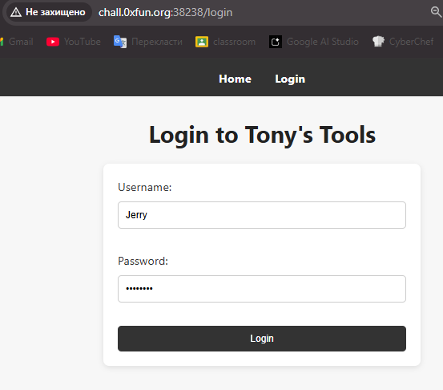
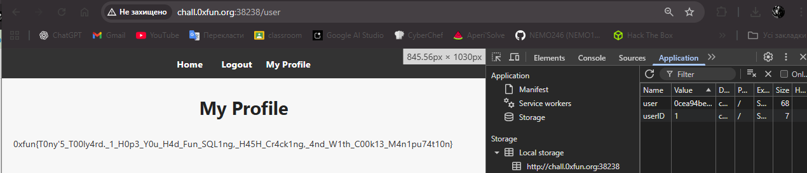

## 0xFUN CTF 2026 - Tony Toolkit Write-up



### 1. SQL Injection & Schema Enumeration

We start by identifying a search input vulnerable to SQL Injection. After determining the number of columns, we use `sqlite_master` to enumerate the database schema and find the table structure.

```sql
' UNION SELECT 1, sql FROM sqlite_master --

```



The output reveals a `Users` table containing `Username` and `Password` columns.

### 2. Data Extraction

With the schema known, we proceed to dump the credentials from the `Users` table.

```sql
' UNION SELECT Username, Password FROM Users --

```




We retrieve two users:

* **Admin:** `0000000000000000000000000000000000000000000000000000000000000000` (Placeholder hash).
* **Jerry:** `059a00192592d5444bc0caad7203f98b506332e2cf7abb35d684ea9bf7c18f08`.

### 3. Hash Cracking

We identify Jerry's hash as SHA-256 and use CrackStation to reverse it.



The password is **`1qaz2wsx`**.

### 4. IDOR & Privilege Escalation

We log in to the application using Jerry's credentials.



After logging in, the flag is not visible on the profile page. We inspect the browser's Local Storage and find a `userID` key set to `2`. Suspecting an Insecure Direct Object Reference (IDOR) vulnerability, we modify the `userID` to `1` to impersonate the administrator.



Upon refreshing the page, the server grants us admin access and reveals the flag.

**Flag:** `0xfun{T0ny'5_T00ly4rd._1_H0p3_Y0u_H4d_Fun_SQL1ng,_H45H_Cr4ck1ng,_4nd_W1th_C00k13_M4n1pu74t10n}`