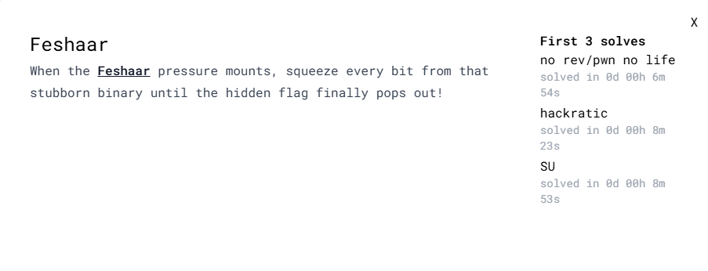
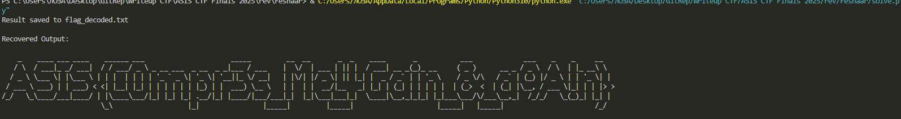
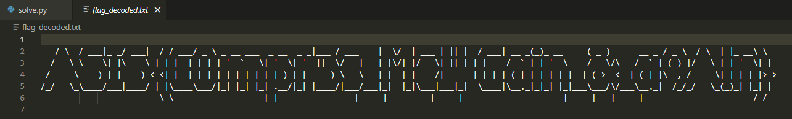

# ASIS CTF Finals 2025 - Feshaar Write-up



### Step 1: Analyzing the Binary Behavior

The challenge provides a 64-bit ELF binary named `feshar` and a file named `flag.fshr`.
Running the binary reveals that it acts as a compressor. It looks for a file named `flag`, compresses it using a custom algorithm, and writes the output to `flag.fshr`.

Since we are provided with the compressed `flag.fshr`, our goal is to reverse engineer the compression logic to create a decompressor and recover the original flag file.

### Step 2: Reversing the Compression Logic

We analyze the `main` function (at address `0x10E0`) in a disassembler. The program implements a variation of the **LZSS** compression algorithm. It reads the input file and maintains a "sliding window" to find repeated sequences in the data processed so far.

The most critical part is how it packs the data into the output file. The binary writes data in strict **2-byte chunks**:
1.  **Byte 1 (Token):** Contains the packed Offset and Length of the match.
2.  **Byte 2 (Literal):** The raw character at the current position is always appended.

Looking at the assembly at address `0x122A`, we see the bit-packing logic:
- `shl eax, 3`: The **Offset** (distance to the match) is shifted left by 3, meaning it occupies the **top 5 bits**.
- `or eax, ecx`: The **Length** is combined, meaning it occupies the **bottom 3 bits**.

### Step 3. Solution code `solve.py`

We implement the inverse logic in Python: read 2 bytes, parse the token, copy bytes from the output history (if length > 0), and append the literal.

```python
import sys

def decompress(input_file, output_file):
    try:
        with open(input_file, 'rb') as f:
            data = f.read()
    except:
        print(f"File {input_file} not found")
        return

    out_buffer = bytearray()

    # Process the file in 2-byte chunks (Token, Literal)
    for i in range(0, len(data), 2):
        if i + 1 >= len(data): break
            
        token = data[i]
        literal = data[i+1]

        # Reverse the bit-packing logic found in assembly:
        # Token >> 3  -> Top 5 bits = Offset
        # Token & 7   -> Bottom 3 bits = Length
        offset = token >> 3
        length = token & 0b111

        # Step 1: Recover compressed data from history
        if length > 0:
            start_index = len(out_buffer) - offset
            for _ in range(length):
                if start_index < len(out_buffer):
                    out_buffer.append(out_buffer[start_index])
                    start_index += 1
                else:
                    out_buffer.append(0)

        # Step 2: Always append the literal byte
        out_buffer.append(literal)

    # Save to file
    with open(output_file, 'wb') as f:
        f.write(out_buffer)
    print(f"Result saved to {output_file}\n")

    # Print to console
    print("Recovered Output:\n")
    print(out_buffer.decode('utf-8', errors='ignore'))

if __name__ == "__main__":
    decompress("flag.fshr", "flag_decoded.txt")
```

### Step 4: Execution and Results

We run the script to decompress `flag.fshr`. The script outputs the result to the console and saves it to `flag_decoded.txt`.



The console output shows that the recovery was successful. Now we inspect the generated file `flag_decoded.txt`.



The file contains an ASCII art header and the flag text at the bottom.

**Flag:** `ASIS{C0mpr3s_Me_4Gain_&_a9A!n}`