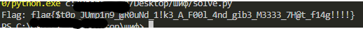

## BackdoorCTF 2025 - To jmp or not jmp Write-up


## Step 1: Static Analysis
Opening the binary in a disassembler (like IDA or Ghidra) reveals the "spaghetti code" mentioned in the description. The `main` function and subsequent calls are filled with conditional jumps designed to confuse the analyst.

However, instead of tracing every jump, we look for functions that manipulate data. We identify a function around address `0x1303` that accesses the `.rodata` section.

### Finding the Encryption Key
The program loads a string from address `0x2020`. It iterates through this string and performs a specific arithmetic operation on each byte before using it.

```assembly
; Code snippet from the key generation routine (approx address 0x1350)
.text:000000000000135A movzx   eax, byte ptr [rax+rdx]  ; Load a byte from the raw key string
.text:000000000000135D xor     eax, 52h                 ; <--- Critical: XOR with 0x52 ('R')
.text:0000000000001360 add     eax, esi
.text:0000000000001362 mov     [rbp-0Eh], al            ; Store the decrypted key byte
```

### Step 1.1: Detailed Key Reconstruction
To verify what this key is, we examine the raw bytes at `0x2020` and manually apply the `XOR 0x52` operation found in the assembly.

**Raw bytes at 0x2020:** `21 61 31 20 61 26 0D 39 61 2B 0D 20 31 66 73 52`

| Offset | Raw Byte (Hex) | Operation | Decrypted (Hex) | ASCII Character |
| :--- | :--- | :--- | :--- | :--- |
| `0x2020` | `0x21` | `^ 0x52` | `0x73` | **s** |
| `0x2021` | `0x61` | `^ 0x52` | `0x33` | **3** |
| `0x2022` | `0x31` | `^ 0x52` | `0x63` | **c** |
| `0x2023` | `0x20` | `^ 0x52` | `0x72` | **r** |
| `0x2024` | `0x61` | `^ 0x52` | `0x33` | **3** |
| `0x2025` | `0x26` | `^ 0x52` | `0x74` | **t** |
| `0x2026` | `0x0D` | `^ 0x52` | `0x5F` | **_** |
| `0x2027` | `0x39` | `^ 0x52` | `0x6B` | **k** |
| `0x2028` | `0x61` | `^ 0x52` | `0x33` | **3** |
| `0x2029` | `0x2B` | `^ 0x52` | `0x79` | **y** |
| `0x202A` | `0x0D` | `^ 0x52` | `0x5F` | **_** |
| `0x202B` | `0x20` | `^ 0x52` | `0x72` | **r** |
| `0x202C` | `0x31` | `^ 0x52` | `0x63` | **c** |
| `0x202D` | `0x66` | `^ 0x52` | `0x34` | **4** |
| `0x202E` | `0x73` | `^ 0x52` | `0x21` | **!** |

The recovered key is **`s3cr3t_k3y_rc4!`**. The name of the key explicitly reveals the algorithm used: **RC4**.

### Step 1.2: Locating the Ciphertext
Now that we have the algorithm (RC4) and the Key, we need the Encrypted Data (Ciphertext). Looking further into the `.rodata` section, immediately after the key at offset `0x2040`, there is a large array of bytes.

```assembly
.rodata:0000000000002040 ciphertext db  8Fh, 36h, 0CFh, 7Dh, 04h, 8Eh, 35h, 0ACh
.rodata:0000000000002048            db  0Fh, 0E8h, 3Fh, 53h, 8Bh, 87h, 0ACh, 26h
...
```

The program likely compares the user's input (encrypted with RC4) against this data, or decrypts this data to show success. We can bypass the program entirely and decrypt these bytes directly.

## Step 2: The Solution Script

We write a Python script to implement the RC4 Key-Scheduling Algorithm (KSA) and Pseudo-Random Generation Algorithm (PRGA), extract the ciphertext bytes from the binary, and decrypt them.

```python
# solve.py

def rc4(key, data):
    # KSA (Key Scheduling Algorithm)
    S = list(range(256))
    j = 0
    for i in range(256):
        j = (j + S[i] + key[i % len(key)]) % 256
        S[i], S[j] = S[j], S[i]

    # PRGA (Pseudo-Random Generation Algorithm)
    i = j = 0
    res = bytearray()
    for b in data:
        i = (i + 1) % 256
        j = (j + S[i]) % 256
        S[i], S[j] = S[j], S[i]
        k = S[(S[i] + S[j]) % 256]
        res.append(b ^ k)
    return res

# 1. The key recovered from the binary (XOR 0x52 logic)
key_str = "s3cr3t_k3y_rc4!"
key = [ord(c) for c in key_str]

# 2. The ciphertext extracted from .rodata (offset 0x2040)
# These are the raw hex bytes copied from the binary
ciphertext = [
    0x8F, 0x36, 0xCF, 0x7D, 0x04, 0x8E, 0x35, 0xAC, 0x0F, 0xE8, 0x3F, 0x53, 0x8B, 0x87, 0xAC, 0x26, 
    0x18, 0x5B, 0x13, 0xC7, 0xFF, 0xA6, 0x1D, 0x92, 0x29, 0xB7, 0x62, 0xAF, 0xA9, 0xB0, 0xCF, 0x74, 
    0xD2, 0x99, 0x4E, 0x55, 0x47, 0xA9, 0x77, 0x3B, 0x67, 0x28, 0xCB, 0x52, 0x74, 0x90, 0x47, 0x24, 
    0x15, 0x94, 0xE1, 0x4E, 0x4D, 0xF2, 0x57, 0xAD, 0x7F, 0x5D, 0x22, 0x17, 0x05, 0x08, 0x8B, 0x2A, 
    0xED, 0xF1
]

flag = rc4(key, ciphertext)
print("Flag:", flag.decode('latin-1'))
```

## Step 3: Results

Running the script successfully decrypts the ciphertext.



### Flag
`flag{$t0p_JUmp1n9_@R0uNd_1!k3_A_F00l_4nd_gib3_M3333_7H@t_f14g!!!!}`