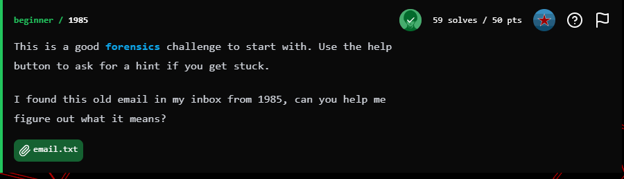
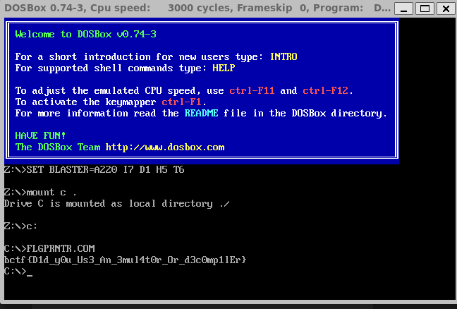

## BuckeyeCTF 2025 - 1985 Write-up



### Step 1: Analyzing the Source Email and Identifying the Encoding

The challenge began with a text block presented as an old email from 1985.

```text
Hey man, I wrote you that flag printer you asked for:

begin 755 FLGPRNTR.COM
MOAP!@#PD=`:`-"I&Z_6Z'`&T"<TAP[1,,,#-(4A)7DQ1;AM.=5,:7W5_61EU
;:T1U&4=?1AY>&EAU95AU3AE)&D=:&T9O6%<D
`
end
```

**Artifact Analysis:**
The key elements for identification are the `begin 755 FLGPRNTR.COM` and `end` directives. This structure is a classic indicator of **uudecode** (Unix-to-Unix decoding) encoding. This is a legacy method for converting binary files into ASCII text strings for safe transmission through systems that originally only supported text (like early email).

*   `begin` - Marks the start of the encoded file.
*   `755` - Represents the file's permissions in Unix format.
*   `FLGPRNTR.COM` - The name of the file to be created upon decoding.

### Step 2: Decoding the Payload

After identifying the format, the next step was to decode the data to retrieve the original `FLGPRNTR.COM` file. Since standard libraries for `uudecode` can be missing or deprecated in modern Python versions, a custom decoder was written to reliably handle the data.

The following Python script implements the `uudecode` logic manually. It reads the encoded lines, skipping the header and footer, and converts each line from its text representation back into binary bytes.

```python
# This program implements a manual decoder for the uuencode format.

lines = []
recording = False
# The encoded data from the email
data = """begin 755 FLGPRNTR.COM
MOAP!@#PD=`:`-"I&Z_6Z'`&T"<TAP[1,,,#-(4A)7DQ1;AM.=5,:7W5_61EU
;:T1U&4=?1AY>&EAU95AU3AE)&D=:&T9O6%<D
`
end
"""

# Parse the input data to extract only the encoded lines
for line in data.splitlines():
    if line.startswith("begin "):
        recording = True
        continue
    if line.startswith("end"):
        break
    if recording:
        lines.append(line.strip())

# Function to decode a single uu line
def uudecode_line(line):
    if not line:
        return b''
    # The first character determines the length of the decoded bytes in the line
    length = (ord(line[0]) - 32) & 0x3F
    line = line[1:]
    out = bytearray()
    while line:
        chunk, line = line[:4], line[4:]
        # Convert 4 ASCII characters into 3 bytes
        nums = [(ord(c) - 32) & 0x3F for c in chunk]
        a, b, c, d = nums + [0] * (4 - len(nums))
        out.extend([
            (a << 2 | b >> 4) & 0xFF,
            (b << 4 | c >> 2) & 0xFF,
            (c << 6 | d) & 0xFF
        ])
    return bytes(out[:length])

# Decode all lines and join them
decoded = b''.join(uudecode_line(l) for l in lines if l and not l.startswith('`'))

# Write the result to a binary file
with open("FLGPRNTR.COM", "wb") as f:
    f.write(decoded)

```
Executing this script successfully created the binary file `FLGPRNTR.COM`.

### Step 3: Analyzing and Executing the Binary

The resulting file, `FLGPRNTR.COM`, is a 16-bit executable program for MS-DOS. Such programs cannot be run directly on modern 64-bit operating systems.

**Analysis and Emulation:**
An MS-DOS emulator was required to run the file. **DOSBox** is the standard tool for such tasks. The process for running the program in DOSBox was as follows:

1.  Launch DOSBox.
2.  Mount the current directory as the `C:` drive using the command:
    `mount c .`
3.  Switch to the mounted `C:` drive:
    `c:`
4.  Run the program by typing its name:
    `FLGPRNTR.COM`

 

After executing these commands, the program ran and printed the flag directly to the emulator's console.

### FLAG

**`bctf{D1d_y0u_Us3_An_3mul4t0r_Or_d3c0mp1lEr}`**