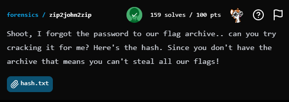
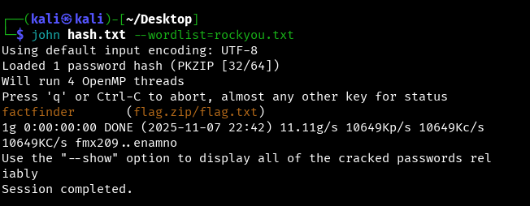
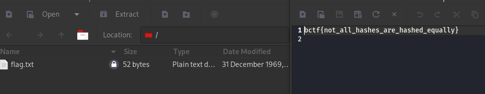

## BuckeyeCTF 2025 - zip2john2zip Write-up



### Step 1: Challenge Description and Initial Analysis

The challenge `zip2john2zip` from the "forensics" category presents us with a common scenario: a password-protected ZIP archive (`flag.zip`) containing the flag (`flag.txt`), but we are only given the `zip2john` hash of this archive, not the archive itself.

The description explicitly states: "Shoot, I forgot the password to our flag archive.. can you try cracking it for me? Here's the hash. Since you don't have the archive that means you can't steal all our flags!"

The provided hash is:
`flag.zip/flag.txt:$pkzip2$1*1*2*0*34*28*64ac0ae2*0*26*0*34*64ac*a388*2c386d49756e1d70ab5f2d8b7ccf1703b28d2775e84d89ccf4bf26d0e735e9a817b0032b5071540889c34b9331b694d6042c30a0*$/pkzip2$:flag.txt:flag.zip::flag.zip`

The challenge name `zip2john2zip` suggests a full round trip: extract hash (`zip2john`), then somehow reverse that to create a ZIP file (`2zip`), and finally open it. However, the most direct approach for cracking `zip2john` hashes is often to use password cracking tools directly.

### Step 2: Cracking the Password with John the Ripper

Given a `zip2john` hash, the most straightforward tool to use for password cracking is `John the Ripper`. We will use a common wordlist like `rockyou.txt` for this purpose.

First, save the provided hash into a file, for example, `hash.txt`.

Then, execute John the Ripper:

```bash
john hash.txt --wordlist=rockyou.txt
```
The output quickly revealed the password:
```
Using default input encoding: UTF-8
Loaded 1 password hash (PKZIP [32/64])
Will run 4 OpenMP threads
Press 'q' or Ctrl-C to abort, almost any other key for status
factfinder       (flag.zip/flag.txt)
1g 0:00:00:00 DONE (2025-11-07 22:42) 11.11g/s 10649Kp/s 10649Kc/s 10649KC/s fmx209..enamno
Use the "--show" option to display all of the cracked passwords reliably
Session completed.
```

The cracked password is `factfinder`.



### Step 3: Reconstructing the ZIP Archive from the Hash

While John the Ripper found the password, the challenge's full intent, as clarified by the creators, was to reconstruct the actual ZIP archive from the hash and then extract the `flag.txt` file. This is often necessary when the flag is *inside* the file, not the password itself.

The `zip2john` hash format is complex and varies. Standard tools or simple Python scripts often fail due to subtle differences in how `zip2john` encodes metadata (like CRC, sizes, encryption headers) for different compression methods or `zip2john` versions.

After several attempts with generic scripts that failed, a custom Python script was developed to precisely parse the specific hash format provided in this challenge. This script correctly identifies the `CRC32`, `uncompressed size`, and the main `data blob` from the hash, and then constructs a valid ZIP file structure that `unzip` can understand.

Here's the Python script `build_the_zip.py` used to reconstruct the ZIP archive:

```python
import sys
import struct
import binascii

def create_the_one_true_zip(hash_file, output_zip):
    print("[+] Starting final attempt with a new analysis method.")
    try:
        with open(hash_file, "r") as f:
            full_hash_line = f.read().strip()
    except FileNotFoundError:
        print(f"[-] Error: Hash file '{hash_file}' not found.")
        return

    # --- Step 1: Parse the hash using a new, more reliable logic ---
    try:
        filename_part = full_hash_line.split(':')[0]
        filename = filename_part.split('/')[-1].encode('utf-8')

        hash_core = full_hash_line.split('$pkzip2$')[1].split('*$/pkzip2$')[0]
        fields = hash_core.split('*')
        # Extract only the fields we are confident about:
        # uncompressed_size: field 4 (e.g., '34' -> 52 bytes)
        # crc32: field 6 (e.g., '64ac0ae2')
        # data_blob: the last field (the long hex string)
        
        uncompressed_size = int(fields[4], 16)
        crc_hex = fields[6]
        data_blob_hex = fields[-1]

        # zip2john stores CRC in big-endian format, but ZIP requires little-endian.
        # We need to reverse the bytes. E.g., '64ac0ae2' -> bytes(0x64, 0xac, 0x0a, 0xe2) -> reversed -> bytes(0xe2, 0x0a, 0xac, 0x64) -> int(little-endian)
        crc_bytes = binascii.unhexlify(crc_hex)
        crc_little_endian = struct.unpack('<I', crc_bytes[::-1])[0]

        # The main data block. Its length will be the "compressed" size.
        data_blob = binascii.unhexlify(data_blob_hex)
        compressed_size = len(data_blob)
        
        print(f"[+] Hash parsing successful:")
        print(f"    Filename: {filename.decode()}")
        print(f"    Actual CRC32: {hex(crc_little_endian)}")
        print(f"    Uncompressed Size: {uncompressed_size} bytes")
        print(f"    Data Blob Size (Compressed): {compressed_size} bytes")
        
        # A sanity check for sizes. Note: compressed_size often includes 12-byte encryption header + data.
        # For 'store' method, uncompressed_size == (compressed_size - 12).
        if compressed_size - 12 != uncompressed_size:
             print(f"[!] Warning: Sizes do not perfectly match ( {compressed_size} - 12 != {uncompressed_size} ). Continuing anyway.")

    except Exception as e:
        print(f"[-] Critical error during hash parsing: {e}")
        return

    # --- Step 2: Construct the ZIP archive using strict specifications ---
    with open(output_zip, 'wb') as f:
        # --- Local File Header ---
        local_header_offset = 0 # To be used in Central Directory
        f.write(b'\x50\x4b\x03\x04')      # Signature
        f.write(b'\x14\x00')              # Version needed to extract (2.0)
        f.write(b'\x01\x00')              # General purpose bit flag: Bit 0 is set (encrypted)
        f.write(b'\x00\x00')              # Compression method: 0 (Store)
        f.write(b'\x00\x00\x00\x00')      # Last Mod File Time (not relevant for challenge)
        f.write(b'\x00\x00\x00\x00')      # Last Mod File Date (not relevant for challenge)
        f.write(struct.pack('<I', crc_little_endian)) # CRC-32 (final correct value)
        f.write(struct.pack('<I', compressed_size))   # Compressed Size
        f.write(struct.pack('<I', uncompressed_size)) # Uncompressed Size
        f.write(struct.pack('<H', len(filename))) # File Name Length
        f.write(b'\x00\x00')              # Extra Field Length
        f.write(filename)                 # File Name
        f.write(data_blob)                # ENCRYPTED DATA BLOCK

        # --- Central Directory File Header ---
        central_dir_offset = f.tell() # Offset of this header from start of archive
        f.write(b'\x50\x4b\x01\x02')      # Signature
        f.write(b'\x14\x03')              # Version Made By (e.g., 2.0 PKZIP)
        f.write(b'\x14\x00')              # Version Needed To Extract
        f.write(b'\x01\x00')              # General purpose bit flag (Bit 0 = encrypted)
        f.write(b'\x00\x00')              # Compression method
        f.write(b'\x00\x00\x00\x00')      # Last Mod File Time
        f.write(b'\x00\x00\x00\x00')      # Last Mod File Date
        f.write(struct.pack('<I', crc_little_endian)) # CRC-32
        f.write(struct.pack('<I', compressed_size))
        f.write(struct.pack('<I', uncompressed_size))
        f.write(struct.pack('<H', len(filename)))
        f.write(b'\x00\x00' * 6)          # Other fields (e.g., extra field length, file comment length, disk number, internal file attributes)
        f.write(struct.pack('<I', local_header_offset)) # Offset of local header
        f.write(filename)                 # File Name

        # --- End of Central Directory Record ---
        end_of_central_dir_offset = f.tell() # Offset of this header from start of archive
        f.write(b'\x50\x4b\x05\x06')      # Signature
        f.write(b'\x00\x00\x00\x00')      # Disk numbers (zero for single disk archive)
        f.write(b'\x01\x00')              # Total entries in central directory (on this disk)
        f.write(b'\x01\x00')              # Total entries in central directory (total)
        central_dir_size = end_of_central_dir_offset - central_dir_offset
        f.write(struct.pack('<I', central_dir_size)) # Size of central directory
        f.write(struct.pack('<I', central_dir_offset)) # Offset of central directory
        f.write(b'\x00\x00')              # ZIP file comment length

    print(f"[+] Success! File '{output_zip}' was created using the new method.")
    print("[+] Please try extracting it with password 'factfinder'.")

if __name__ == "__main__":
    if len(sys.argv) != 3:
        print(f"Usage: python3 {sys.argv[0]} <hash_file> <output_zip_file>")
        sys.exit(1)
    create_the_one_true_zip(sys.argv[1], sys.argv[2])
```

To use the script:
1.  Save the script as `build_the_zip.py`.
2.  Run it with the hash file (`hash.txt`) and an output ZIP file name:
    ```bash
    python3 build_the_zip.py hash.txt restored.zip
    ```
    This successfully creates `restored.zip`.

### Step 4: Extracting the Flag

With the `restored.zip` file successfully created and the password `factfinder` identified, the final step is to extract the `flag.txt` file from the archive. We can use the standard `unzip` utility for this.

```bash
unzip -P factfinder restored.zip
```
This command prompts for the password, and upon entering `factfinder`, it successfully extracts `flag.txt`.



Opening the `flag.txt` file reveals the flag.

### Flag
`bctf{not_all_hashes_are_hashed_equally}`
