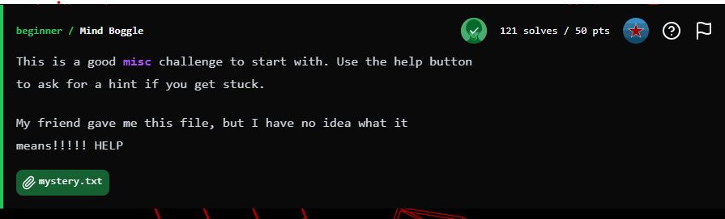
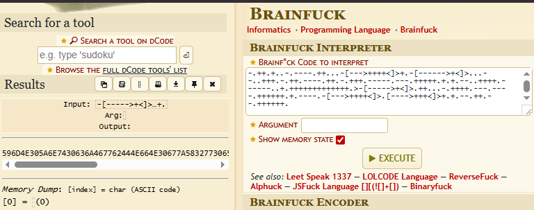
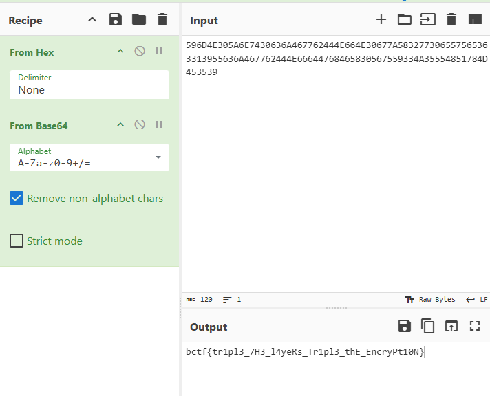

## BuckeyeCTF 2025 - Mind Boggle Write-up

 

### Step 1: Initial Analysis - Identifying the Language

The challenge provides a text file, `mystery.txt`, containing a long string of symbols: `-[----->+<]>++.--.`, etc. This distinct set of eight characters (`+`, `-`, `>`, `<`, `.`, `,`, `[`, `]`) is the signature of the esoteric programming language **Brainfuck**.

The first step is to find an interpreter to execute this code.

### Step 2: Layer 1 - Decoding Brainfuck

We use an online Brainfuck interpreter, like the one on dcode.fr, to run the code from `mystery.txt`. Executing the script doesn't produce readable text but instead outputs a long hexadecimal string.

 

### Step 3: Layer 2 & 3 - From Hex to Base64 to Flag

The hexadecimal output is clearly another layer of encoding. We can use a tool like CyberChef to decode it.

1.  **From Hex:** We paste the hexadecimal string into CyberChef and apply the "From Hex" recipe.
2.  **From Base64:** The result of the hex decoding appears to be a Base64 encoded string. Applying the "From Base64" recipe to this result finally reveals the flag.

 

### Flag
`bctf{tr1pl3_7H3_l4yeRs_Tr1pl3_thE_EncryPt10N}`