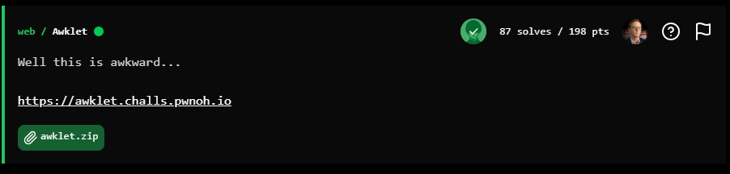
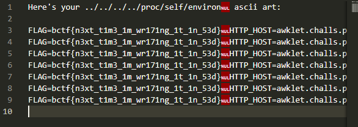

## BuckeyeCTF 2025 - Awklet Write-up

### Step 1: Initial Analysis and Problem Description

The challenge provides a web application called **Awklet**, which generates ASCII art from user-input text using various fonts. The service is built on Apache with CGI enabled, running an AWK script (`awklet.awk`) to process requests. Users can select a font (standard, block, slant, shadow) and input text via a form, which sends GET parameters to the CGI script.

The source code, provided in a Dockerfile and related files, reveals that the script parses the query string, loads a font file based on the `font` parameter, and renders the ASCII art. Notably, the font loading function concatenates the font name with ".txt" and reads it without any validation or sanitization, hinting at a path traversal vulnerability.

The environment also passes a `FLAG` variable to Apache, accessible via `/proc/self/environ` in the process context.

**Objective:** Exploit the path traversal to read arbitrary files, specifically the process environment to retrieve the flag.

### Step 2: Exploitation Strategy and Exploit Creation

The vulnerability lies in the `load_font` function, which opens `font_name ".txt"` using `getline`. By supplying a `font` parameter with directory traversal (e.g., `../../../../some/file`), we can read files outside the intended directory. To bypass the ".txt" suffix, we use a null byte (`%00`) in the URL, which terminates the filename string in AWK, allowing us to target files like `/proc/self/environ` without the extension.

The exploit involves crafting a GET request to read `/proc/self/environ`, which contains the `FLAG` environment variable. No preliminary testing is needed; we proceed directly to the final payload.

### Step 3: Step-by-Step Execution

#### 1. Direct Exploitation with Final Payload

Craft the URL to traverse directories and read `/proc/self/environ` directly, using the null byte to handle the file extension.

URL: `https://awklet.challs.pwnoh.io/cgi-bin/awklet.awk?name=x&font=../../../../proc/self/environ%00`

The response displays the contents of `/proc/self/environ` as "ASCII art" lines, including the `FLAG` environment variable.

### Flag

`bctf{n3xt_t1m3_1m_wr171ng_1t_1n_53d}`