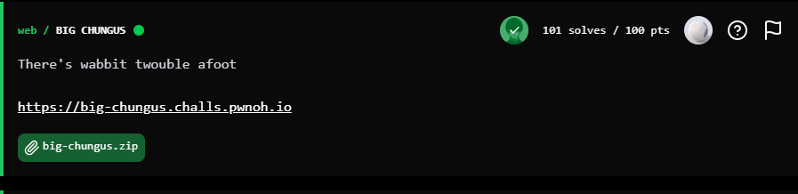

## BuckeyeCTF 2025 - BIG CHUNGUS Write-up




### Step 1: Initial Analysis and Source Code Review

The challenge provides a web application and a zip archive containing its source code. The main page features a simple form asking for a `username`.

Analyzing the `index.js` file from the archive is the key to understanding the logic. The code is written in Node.js using the Express framework. The core logic is found within the GET request handler:

1.  If the `username` parameter is missing, a "NO CHUNGUS" page is displayed.
2.  If a `username` is provided, its length is compared to the hexadecimal number `0xB16_C4A6A5`.
3.  If the length is **greater than** this number, the server displays the "BIG CHUNGUS" page, which contains the flag.
4.  Otherwise, a sad "little chungus" page is shown.

The critical piece of code containing the condition to get the flag is:
```javascript
if (req.query.username.length > 0xB16_C4A6A5) {
    res.send(`
    ...
    FLAG: ${process.env.FLAG || "FLAG_NOT_SET"}
    ...
    `);
    return;
}
```
First, we must convert `0xB16_C4A6A5` to its decimal value to understand the required length. This number is equal to `47,612,473,445`. It's obviously impossible to send a URL parameter of this length due to technical limitations. This indicates that we need to find a bypass related to how Express.js parses query parameters.

### Step 2: Vulnerability Discovery and Payload Crafting

The problem is to make the expression `req.query.username.length` return a massive number without actually sending billions of characters.

The vulnerability lies in how the `qs` library (the default query parser in Express) handles nested parameters. If you send a parameter in the format `?name[property]=value`, the server will create an object `req.query.name` with a property named `property`.

This allows us to directly manipulate the `username` object on the server. Instead of trying to force the server to calculate the length of a massive array (which is often blocked for security reasons), we can simply **give the `username` object a `length` property** with the value we want.

Thanks to JavaScript's loose (dynamic) typing, when the comparison `req.query.username.length > 47612473445` is made, the string we provide will be automatically converted into a number.

Therefore, we can craft a payload that sets `username.length` to a value that is guaranteed to be larger than `47,612,473,445`.

**Payload:**
```
https://big-chungus.challs.pwnoh.io/?username[length]=99999999999
```

### Step 3: Exploitation and Retrieving the Flag

By sending the crafted URL, we trigger the following chain of events on the server:

1.  The server receives the request, and the `qs` parser transforms `?username[length]=99999999999` into a `req.query` object that looks like this: `{ username: { length: '99999999999' } }`.
2.  The code proceeds to the check: `if (req.query.username.length > 0xB16_C4A6A5)`.
3.  The expression `req.query.username.length` returns the value `'99999999999'`.
4.  JavaScript compares the number `99999999999` with the number `47612473445`.
5.  The condition evaluates to `true`, and the server returns the "BIG CHUNGUS!!!" HTML page, which contains the flag.


### Flag
`bctf{b16_chun6u5_w45_n3v3r_7h15_b16}`