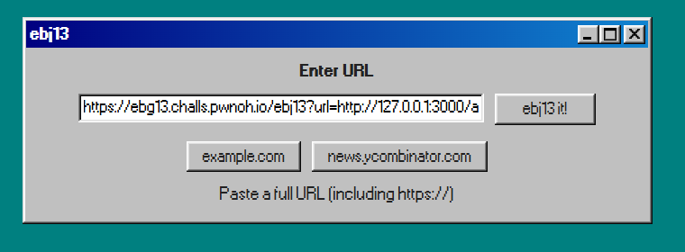
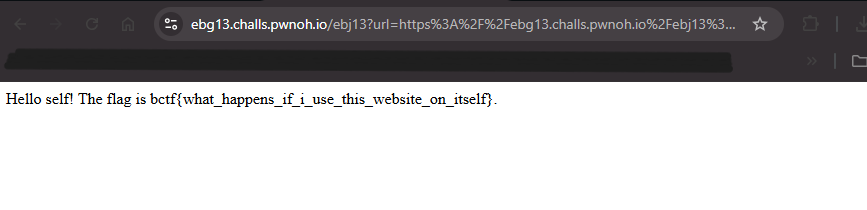

## BuckeyeCTF 2025 - ebg13 Write-up


### Step 1: Initial Analysis and Source Code Review

The challenge presents a simple web application that promises to display the ROT13 version of any website. The description itself is encoded in ROT13: `V znqr na ncc gung yrgf lbh ivrj gur ebg13 irefvba bs nal jrofvgr!` decodes to `I made an app that lets you view the rot13 version of any website!`.

A zip file with the source code (`server.js`) is provided, which is the key to understanding the application's logic. Analyzing the code reveals two important endpoints:

1.  `/ebj13`: This endpoint takes a `url` as a query parameter. It uses `fetch()` to retrieve the content of the provided URL, applies the `rot13` cipher to all text nodes using the `cheerio` library, and then sends the modified HTML back to the user. This is a classic pattern for a **Server-Side Request Forgery (SSRF)** vulnerability.

2.  `/admin`: This is a hidden endpoint that contains the flag. Access is restricted by an IP check. It will only reveal the flag if the request originates from `localhost` (`127.0.0.1`). Any other IP will be rejected.

```javascript
fastify.get('/admin', async (req, reply) => {
    if (req.ip === "127.0.0.1" || req.ip === "::1" || req.ip === "::ffff:127.0.0.1") {
      return reply.type('text/html').send(`Hello self! The flag is ${FLAG}.`)
    }

    return reply.type('text/html').send(`Hello ${req.ip}, I won't give you the flag!`)
})
```

### Step 2: Crafting the SSRF Payload

The goal is to exploit the SSRF vulnerability in the `/ebj13` endpoint to make the server send a request to its own `/admin` endpoint. This will bypass the IP address restriction.

From the source code, we know the application is running on port `3000`:
`fastify.listen({ port: 3000, host: '0.0.0.0' })`

Therefore, the internal URL we need the server to request is `http://127.0.0.1:3000/admin`.

We can pass this internal URL as the `url` parameter to the main `/ebj13` endpoint. This will form our final payload.

**Payload:**
```
https://ebg13.challs.pwnoh.io/ebj13?url=http://127.0.0.1:3000/admin
```
 


### Step 3: Exploitation and Retrieving the Flag

Submitting the crafted URL instructs the server to perform the following actions:

1.  The `/ebj13` endpoint receives our request with the `url` parameter pointing to its own `/admin` page.
2.  The server's `fetch()` function makes a request to `http://127.0.0.1:3000/admin`.
3.  Because this request originates from the server itself, its source IP is `127.0.0.1`.
4.  The IP check in the `/admin` endpoint passes, and it returns the success message containing the flag.
5.  The `/ebj13` function receives this response. Although it's supposed to apply ROT13, the simple text response from `/admin` isn't processed by the `cheerio` HTML parser, so the cipher is not applied.
6.  The server returns the unmodified content from the `/admin` page directly to us, revealing the flag in cleartext.

 

### Flag
`bctf{what_happens_if_i_use_this_website_on_itself}`