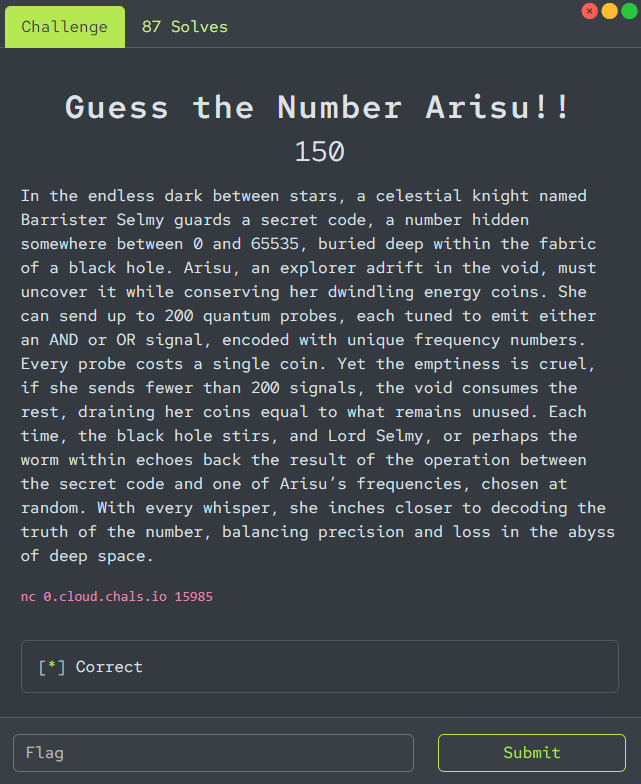
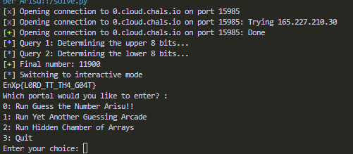

## EnigmaXplore 3.0 - Guess the Number Arisu!! 150 Write-up



## Core Solution

The goal is to guess a 16-bit number `X`. This is achieved using two `OR` operation queries within a single session. The first query determines the upper 8 bits of the number, and the second determines the lower 8 bits. The results are then combined.

## Solution Plan

1.  **Determine the upper 8 bits (bits 8 to 15):**
    *   Send an `OR` operation with a list of numbers from 0 to 199. All of these numbers have their upper 8 bits equal to zero.
    *   In the received response `R1`, the upper 8 bits will be identical to those of the secret number `X`. We isolate them using a bitmask: `upper_bits = R1 & 0xFF00`.

2.  **Determine the lower 8 bits (bits 0 to 7):**
    *   Send an `OR` operation with a list of numbers that are multiples of 256 (`0, 256, 512, ...`). All of these numbers have their lower 8 bits equal to zero.
    *   In the response `R2`, the lower 8 bits will be identical to those of `X`. We isolate them: `lower_bits = R2 & 0x00FF`.

3.  **Assemble the final number:**
    *   Combine the two parts using an `OR` operation: `secret_number = upper_bits | lower_bits`.

This method works because each query independently determines its half of the number, and the server's random choice of a number from our list does not affect the "clean" bits in the response.

## Solution Script `solve.py`

```python
from pwn import *

HOST = '0.cloud.chals.io'
PORT = 15985

def make_query(r, numbers):
    """Sends an OR query with a list of numbers and returns the result."""
    r.sendlineafter(b'Enter your choice: ', b'1')
    r.sendlineafter(b'Enter operation type (1 for AND, 2 for OR): ', b'2')
    r.recvuntil(b'Enter up to 200 unique numbers (end with -1):\n')
    for num in numbers:
        r.sendline(str(num).encode())
    r.sendline(b'-1')
    r.recvuntil(b'Result: ')
    return int(r.recvline().strip().decode())

# Connect and select the game
r = remote(HOST, PORT)
r.sendlineafter(b'Enter your choice: ', b'0')

# Step 1: Determine the upper 8 bits
log.info("Query 1: Determining the upper 8 bits...")
numbers1 = [i for i in range(200)]
result1 = make_query(r, numbers1)
upper_bits = result1 & 0xFF00

# Step 2: Determine the lower 8 bits
log.info("Query 2: Determining the lower 8 bits...")
numbers2 = [i * 256 for i in range(200)]
result2 = make_query(r, numbers2)
lower_bits = result2 & 0x00FF

# Step 3: Assemble the number and send the answer
secret_number = upper_bits | lower_bits
log.success(f"Final number: {secret_number}")
r.sendlineafter(b'Enter your choice: ', b'2')
r.sendlineafter(b'Enter your guess: ', str(secret_number).encode())

# Get the flag
r.interactive()
```


### Flag
Running the script outputs the flag: `EnXp{L0RD_TT_TH4_G04T}`