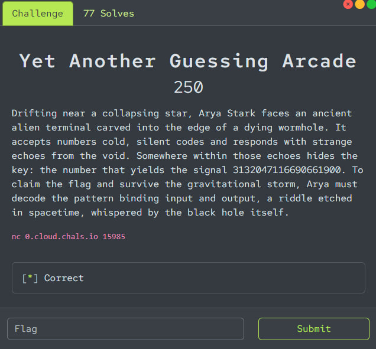
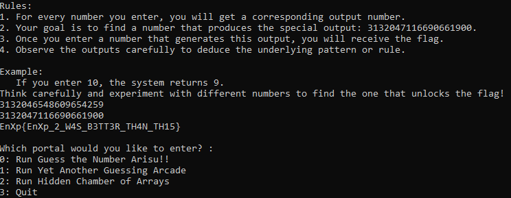

# EnigmaXplore 3.0 - Yet Another Guessing Arcade 250 Write-up



## Challenge Description

The challenge is a "black box" service. We can send it numbers and receive other numbers in response. The goal is to find an input number that causes the service to return a specific target value: `3132047116690661900`.

```bash
nc 0.cloud.chals.io 15985
```

## Solution Process

### Step 1: Data Collection

The first step in any "black box" challenge is to gather as many "input -> output" pairs as possible to try and find a pattern. After a few manual inputs, we had the following dataset:

| Input | Output |
|-------|--------|
| 10    | 9      |
| 0     | 0      |
| 123   | 68     |
| 56    | 63     |
| 78    | 65     |

Simple arithmetic operations (`+`, `-`, `*`, `/`) did not reveal any consistent pattern. This is a classic sign that we need to look into bitwise operations.

### Step 2: Finding the Pattern

The most common operation in such challenges is `XOR`. Let's test the hypothesis: `Output = Input XOR Key`. If the key were constant, then `Key = Input XOR Output` would be the same for all pairs.

-   `10 XOR 9` = `3`
-   `123 XOR 68` = `63`
-   `56 XOR 63` = `7`
-   `78 XOR 65` = `15`

The keys are different. The hypothesis of a constant key is incorrect. However, if we look at the keys themselves (`3`, `63`, `7`, `15`), we can notice something interesting. Let's look at their binary representations:

-   `3` = `11` (binary)
-   `63` = `111111` (binary)
-   `7` = `111` (binary)
-   `15` = `1111` (binary)

All the keys consist **only of ones**. Such numbers can be generated by the formula `2^n - 1`. The remaining task is to figure out what `n` is.

Let's hypothesize that `n` is the number of set bits (ones) in the **input number**. This metric is called "population count" or `popcount`.

Let's test this new hypothesis:

-   **Input = 10** (`1010`**b**). `popcount` = **2**.
    -   Key `K = 2^2 - 1 = 3`.
    -   Check: `10 XOR 3 = 9`. **It matches!**

-   **Input = 123** (`1111011`**b**). `popcount` = **6**.
    -   Key `K = 2^6 - 1 = 63`.
    -   Check: `123 XOR 63 = 68`. **It matches!**

-   **Input = 56** (`111000`**b**). `popcount` = **3**.
    -   Key `K = 2^3 - 1 = 7`.
    -   Check: `56 XOR 7 = 63`. **It matches!**

-   **Input = 78** (`1001110`**b**). `popcount` = **4**.
    -   Key `K = 2^4 - 1 = 15`.
    -   Check: `78 XOR 15 = 65`. **It matches!**

We have found the exact formula used by the server:
**`Output = Input XOR (2^popcount(Input) - 1)`**

### Step 3: Finding the Correct Input

We need to find a number `X` that satisfies the equation:

`X XOR (2^popcount(X) - 1) = 3132047116690661900`

Solving this equation directly is difficult because `popcount(X)` depends on `X` itself. However, for a 64-bit number, the `popcount` can only take 65 possible values (from 0 to 64). This allows us to simply iterate through all possible `popcount` values.

**Search Algorithm:**
1.  Iterate `p` (the potential `popcount`) in the range from 0 to 64.
2.  For each `p`, calculate the key `K = 2^p - 1`.
3.  Find a candidate for the correct input: `X = TARGET XOR K`.
4.  Check if `popcount(X)` is indeed equal to `p`.
5.  If it is, we have found the required number `X`.

## Solution Script

This script `solve.py` implements the algorithm described above and finds the correct number to input.

```python
TARGET = 3132047116690661900

def popcount(n):
  """Counts the number of set bits in an integer."""
  return bin(n).count('1')

# Iterate through all possible bit counts (p)
for p in range(65):
  # Calculate the key K = 2^p - 1.
  # (1 << p) is a fast way to compute 2^p.
  key = (1 << p) - 1
  
  # Find the potential input X
  potential_input = TARGET ^ key
  
  # Check if the popcount of our candidate matches p
  if popcount(potential_input) == p:
    print(f"[+] Found!")
    print(f"    Bit count (p): {p}")
    print(f"    Key (K): {key}")
    print(f"    Correct Input (X): {potential_input}")
    # Exit the loop after finding the solution
    break
```

Running this script yields the result:
```
[+] Found!
    Bit count (p): 43
    Key (K): 8796093022207
    Correct Input (X): 3132046548609654259
```

By sending the number `3132046548609654259` to the server, we receive the flag.



### Flag
Flag: `EnXp{EnXp_2_W4S_B3TT3R_TH4N_TH15}`