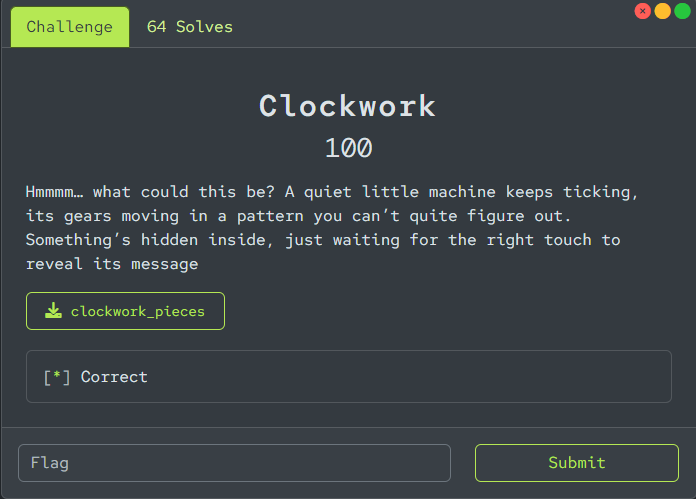

# EnigmaXplore 3.0 - Clockwork 100 Write-up



## Solution

### Initial Analysis
The assembly code is from an ELF binary for x86-64. It includes the main function starting at address 0x1140, several subroutines, and data in the .rodata and .data sections.

Simply put, the program acts like a locked box. It asks for a "key" (password), checks if it's correct, but in this challenge, the real goal isn't to find the key—it's to understand how the program works internally to extract a hidden message (the flag).

The main function:
- Gets the current time and uses it to create a special value stored in memory.
- Prints "Try harder." initially (perhaps to mislead).
- Asks for "Enter key: " and reads your input.
- Checks the input in sub_14C0: it must be exactly 8 characters and match a specific sequence built from hidden bytes in memory.
- If the check passes (correct key), it prints "Try harder." again.
- If wrong, it performs some calculations on the stack and prints "Invalid key".

But the flag isn't printed by the program. Instead, the flag is the decrypted version of some data hidden in the code. To find it, we need to reverse the decryption logic.

### Detailed Assembly Breakdown (Simple Explanation)
Let's break down the key parts of the code like we're taking apart a clock to see how the gears work. I'll explain each important function in plain language, avoiding too much jargon.

1. **Main Function (at 0x1140)**:
   - This is the starting point of the program.
   - It sets up some memory on the stack (temporary storage).
   - Calls `time()` to get the current seconds since 1970, then does math to get a byte (0-255) from it.
   - Duplicates this byte into a 16-byte vector (using SSE instructions like movdqa, punpcklbw) and adds a constant vector from memory (xmmword_2030 = "pib[TMF?812*#\\x1c\\x15\\x0e\\x07").
   - Stores this in xmmword_40C0 (a global variable).
   - Calls sub_1460 on some stack area (but this might be red herring or setup).
   - Prints "Try harder."
   - Prompts "Enter key: ", reads up to 64 chars with fgets.
   - Removes newline, calls sub_14C0 to check.
   - If check returns non-zero (likely correct), prints "Try harder." again.
   - If zero (wrong), does a loop adding values to 50 bytes on stack (perhaps bogus to confuse), then prints "Invalid key".
   - Ends.

   The key check is in sub_14C0, but for the flag, we look elsewhere.

2. **sub_14C0: Key Checker**
   - Checks if input length (from strlen) is exactly 8. If not, return 0 (fail).
   - Builds an 8-byte value by combining specific bytes from three 16-byte constants (xmmword_4060, 4070, 4080) and byte_4096.
   - Example: Takes byte from position 15 of xmmword_4080, shifts left 8, OR with next, etc.
   - XORs this with the value from xmmword_40C0 (time-based, but in static analysis, we can ignore or compute).
   - Compares the 8 bytes to the input. If match, return 1 (pass), else 0.
   - This is the password check, but we don't need the password; it's a distraction.

3. **sub_15B0: Load Encrypted Flag Buffer**
   - This function copies encrypted data from .data section into a buffer on stack.
   - The data comes from dwords and bytes like dword_403A = 0x751CF86C, byte_403E = 0x19, etc.
   - It assembles a 26-byte buffer at rdi (e.g., rsp+20h).
   - Sets size to 0x1A (26 bytes), another value to 0x10.
   - The buffer in hex is: 6C F8 1C 75 19 81 47 80 0E 21 F5 CD CA 10 12 4A 05 63 4E 3E 91 79 40 95 1D 91

4. **sub_1380: Decryption Function**
   - This is the key "gear" mechanism. It decrypts the buffer using a key-like array.
   - The key comes from byte_4020 and following: 10h,01,10h,00,FFh, then words and dwords, but actually assembled as 16 bytes? Wait, the key is from dword_404C, qword_4040, etc., but in python it's given as [0x29,0x4b,...]
   - It loops over layers (while byte ==0x10).
   - For each layer, gets r9 = next byte (1 or 0).
   - Then for each byte in buffer:
     - Computes position i % 3.
     - If r9=1, shift right (8 - pos), else shift left pos.
     - XOR the buffer byte with this value.
   - This is like a simple stream cipher with shifting.

5. **The Print Function at 0x1670**
   - This is not called in main, but it's the code to decrypt and print the flag.
   - Calls sub_15B0 to load buffer.
   - Calls sub_1380 to decrypt with size 26, some param 0x10.
   - Loops printing each byte as char with putc, then newline.
   - So, to get the flag, we replicate this in python.

### Reverse Engineering Process
To solve, we don't run the binary but analyze statically.

1. **Find the Encrypted Data**:
   - From sub_15B0, extract the 26-byte buffer as above.

2. **Understand the Decryption**:
   - sub_1380 is a double-pass XOR with shifts.
   - First pass with r9=1 (right shift), second with r9=0 (left shift).
   - Key is repeating 16-byte array: 29 4B 11 05 31 2D 04 69 4F 76 55 66 82 91 53 7E
     - This comes from the constants in .data, like dword_404C=05114B29h, etc.

3. **Implement in Python**:
   - Write a function to XOR each buffer byte with the shifted key byte, based on position %3.
   - Apply twice: once with right-shift, once with left.

4. **Run to Get Flag**:
   - Output: EnXp{5CR3W_TH3_4WN_4UTH0R}

The time-based part in main might randomize, but for the flag, it's not used; the decryption is fixed.

## Final Script
The Python code to decrypt and reveal the flag is as follows:

```python
buf = [0x6C, 0xF8, 0x1C, 0x75, 0x19, 0x81, 0x47, 0x80, 0x0E, 0x21, 0xF5, 0xCD, 0xCA, 0x10, 0x12, 0x4A, 0x05, 0x63, 0x4E, 0x3E, 0x91, 0x79, 0x40, 0x95, 0x1D, 0x91]
key = [0x29, 0x4B, 0x11, 0x05, 0x31, 0x2D, 0x04, 0x69, 0x4F, 0x76, 0x55, 0x66, 0x82, 0x91, 0x53, 0x7E]

def decrypt(buf, key, r9):
    for i in range(len(buf)):
        k = key[i % len(key)]
        pos = i % 3
        if r9 == 1:
            shift = 8 - pos
            val = (k >> shift) & 0xFF if shift != 8 else 0
        else:
            shift = pos
            val = (k << shift) & 0xFF
        buf[i] ^= val
    return buf

buf = list(decrypt(decrypt(buf, key, 1), key, 0))
print(''.join(chr(b) for b in buf))
```

### Flag
Running the script outputs the flag: `EnXp{5CR3W_TH3_4WN_4UTH0R}`.
