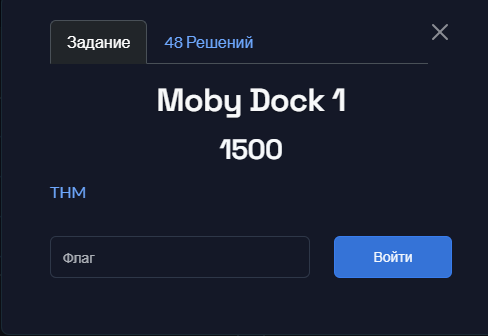
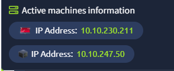
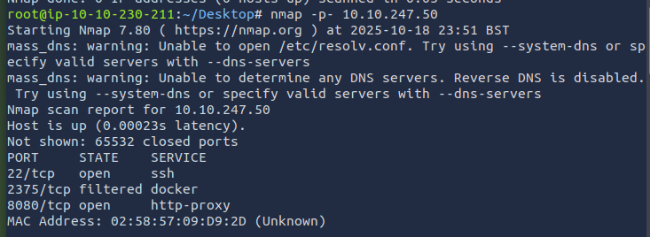
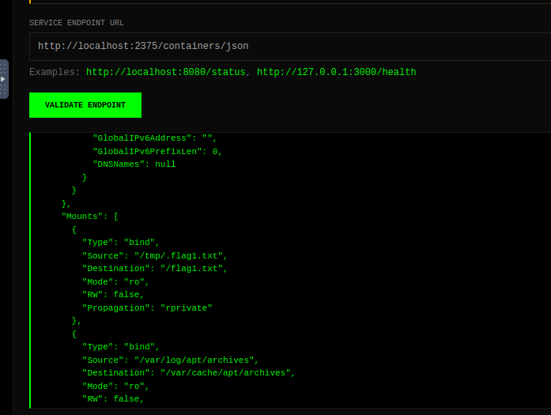
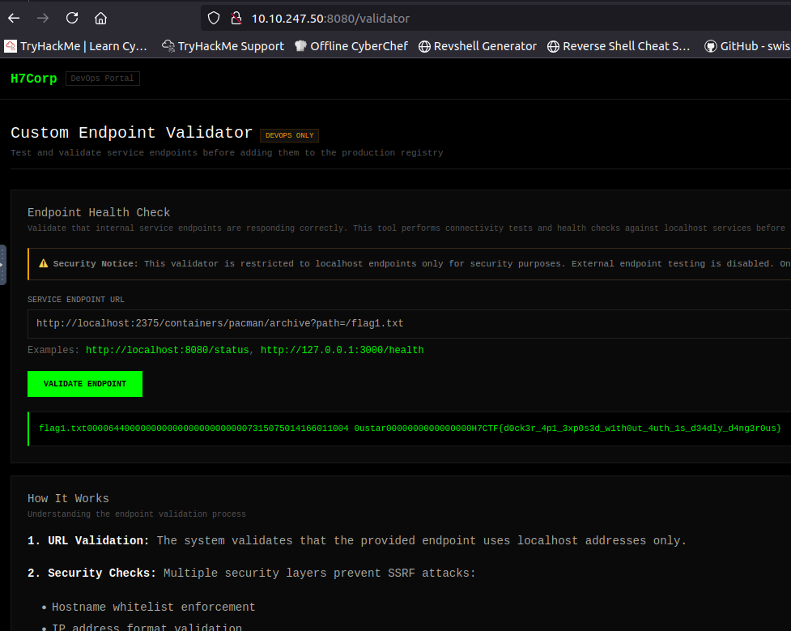

## H7CTF 2025- Moby Dock 1 1500 Write-up



## Challenge Summary & Technical Analysis

**Moby Dock 1** was a multi-stage web security challenge that required the sequential exploitation of several vulnerabilities to retrieve the flag. The solution path involved port scanning to discover a web application, identifying a Server-Side Request Forgery (SSRF) vulnerability, and leveraging it to interact with an internal Docker API. The final step was to read the flag from the running container's filesystem via this API.

This write-up provides a step-by-step walkthrough of the exploitation process, supplemented with analysis of the vulnerabilities found.

-----

### Step 1: Scanning and Service Discovery

Initial reconnaissance was performed by port scanning the target machine (`10.10.247.50`) from our attacker machine (`10.10.230.211`).



**Scanning Analysis (Nmap):**
A full port scan with `nmap -p-` was run to find all open TCP ports. This initial scan identified three interesting ports: **22 (SSH)**, **8080 (http-proxy)**, and **2375 (docker)**.



```
PORT     STATE    SERVICE
22/tcp   open     ssh
2375/tcp filtered docker
8080/tcp open     http-proxy
```

Port 22 (SSH) was noted, but the web service on port 8080 and the filtered Docker port 2375 were the most promising avenues for attack. This indicated a custom web application and a potential backend Docker service, which became the main focus.

### Step 2: Discovering SSRF and the Internal Docker API

While exploring the "H7Corp DevOps Portal" web application on port 8080, a "Custom Endpoint Validator" was discovered. This functionality was designed to send requests to other services from the server, a classic vector for SSRF.

**Vulnerability Analysis (Endpoint Validator):**
The validator only allowed requests to `localhost`. The initial scan had identified port 2375 (Docker API) as "filtered," implying it was likely accessible only from the host itself. We used the SSRF to test this hypothesis by sending a request to `http://localhost:2375/containers/json`.



A successful JSON response confirmed that we could interact with the Docker API.

### Step 3: Information Disclosure via Docker API

The response from the `/containers/json` endpoint contained critical information about the running containers.

**API Response Analysis:**
A container named `/pacman` was found in the JSON response. Analysis of its configuration, specifically the `Mounts` section, showed that a file from the host machine, `/tmp/.flag1.txt`, was mounted inside the container at the path `/flag1.txt`.

```json
"Mounts": [
  {
    "Type": "bind",
    "Source": "/tmp/.flag1.txt",
    "Destination": "/flag1.txt",
    "Mode": "ro",
    "RW": false,
    "Propagation": "rprivate"
  },
...
]
```

This meant that to get the flag, we needed to read the `/flag1.txt` file from within the `pacman` container.

### Step 4: Reading the Flag with the /archive Endpoint

With the container name and file path, all that remained was to extract it. Since the validator only allows `GET` requests, we could not use `docker exec`.

**API Exploitation (`/archive`):**
We used a different Docker API endpoint: `GET /containers/{id}/archive`, which allows downloading a file or directory from a container as a TAR archive. We formed the URL:

`http://localhost:2375/containers/pacman/archive?path=/flag1.txt`



The server successfully processed the request and returned the file's contents as a raw TAR archive. The flag was visible within this text response.

**FLAG**

`H7CTF{d0ck3r_4p1_3xp0s3d_w1th0ut_4uth_1s_d34dly_d4ng3r0us}`