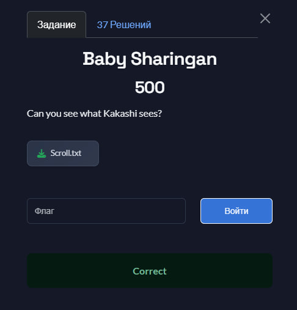
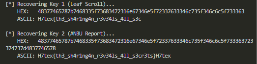

## H7CTF 2025- Baby Sharingan 500 Write-up



### Step 1: Initial Analysis and Vulnerability Confirmation

We are provided with two sets of data: "Leaf Scroll" and "ANBU Report". 📜 Each set consists of:

1.  An encrypted message (Ciphertext, `C`)
2.  A decrypted message (Plaintext, `P`)
3.  A "Chakra Signature" (presumably the key, `K`)

The name "Sharingan" (Copy Wheel Eye) and the presence of $(P, C)$ pairs strongly hint at a **Known-Plaintext Attack**.

The first step is to test the simplest hypothesis: a stream cipher using the **XOR** operation. If this hypothesis is correct, then the equation $K = P \oplus C$ must be true.

We can immediately verify this using Python. Let's take the first pair ("Leaf Scroll"):

```python
# P1: Decoded Leaf Scroll
p1 = bytes.fromhex("4b414b4153484920434f50494553204556455259204a5554535520484520534545532e")
# C1: Encoded Leaf Scroll
c1 = bytes.fromhex("03763f242b333d48701023217121112b31713c065279236767395317714c3f1a36604d")

# K = P ⊕ C
k1_calculated = bytes([p_byte ^ c_byte for p_byte, c_byte in zip(p1, c1)])

print(f"Calculated Key (hex): {k1_calculated.hex()}")
```

The script returns:
`Calculated Key (hex): 48377465787b7468335f73683472316e67346e5f72337633346c735f346c6c5f733363`

We compare this result with the provided `🔍 Chakra Signature (Leaf Scroll)`: they are an **exact match**. This definitively confirms our hypothesis. The vulnerability is simple XOR encryption, and the "Chakra Signature" is the keystream.

### Step 2: Key Analysis and First Hurdle

Now that we know the "Chakra Signature" is the key, our goal is to find the flag. The flag is most likely hidden **inside the key itself**.

Let's convert the key we recovered (`k1_calculated`) from hex to ASCII to see what it contains.

```python
print(f"Calculated Key (ascii): {k1_calculated.decode('utf-8')}")
```

Result:
`Calculated Key (ascii): H7tex{th3_sh4r1ng4n_r3v34ls_4ll_s3c`

We see the beginning of the flag, but it's **cut off**. This is our first hurdle. The "Leaf Scroll" message was too short, and consequently, the key we recovered from it is also too short to contain the entire flag.

### Step 3: Automation and Breakthrough

There's no point in manually checking the second pair when we can automate the process. The problem with the first key was its length. The "ANBU Report" ⚡ is longer than the "Leaf Scroll", which means its "Chakra Signature" (key) must also be longer.

This is our key to victory. We will write a full script to perform the same operation for *both* pairs and print both keys in ASCII.

#### Key Extractor Script (`solve.py`)

```python
def xor_hex_strings(hex_str1, hex_str2):
    """XORs two hex strings and returns a hex result."""
    bytes1 = bytes.fromhex(hex_str1)
    bytes2 = bytes.fromhex(hex_str2)
    
    length = min(len(bytes1), len(bytes2))
    xored_bytes = bytearray(length)
    
    for i in range(length):
        xored_bytes[i] = bytes1[i] ^ bytes2[i]
        
    return xored_bytes.hex()

def hex_to_ascii(hex_str):
    """Converts hex to ASCII, ignoring errors."""
    try:
        return bytes.fromhex(hex_str).decode('utf-8', errors='ignore')
    except ValueError:
        return "[Error decoding hex]"

# --- Data from the challenge ---
c1 = "03763f242b333d48701023217121112b31713c065279236767395317714c3f1a36604d"
p1 = "4b414b4153484920434f50494553204556455259204a5554535520484520534545532e"
c2 = "1c7f31453b34243113113a267e33113d33662714376056647d383b7f6725201a3d674322613130341b7e3b2b56"
p2 = "54484520434f5059204e494e4a4120535452494b455320574954482053494c454e5420505245434953494f4e2e"

# --- Calculation ---
print("[*] Recovering Key 1 (Leaf Scroll)...")
key1_hex = xor_hex_strings(p1, c1)
print(f"    HEX:   {key1_hex}")
print(f"    ASCII: {hex_to_ascii(key1_hex)}\n")

print("[*] Recovering Key 2 (ANBU Report)...")
key2_hex = xor_hex_strings(p2, c2)
print(f"    HEX:   {key2_hex}")
print(f"    ASCII: {hex_to_ascii(key2_hex)}\n")
```

### Step 4: Execution and Flag Retrieval

We run our script and examine the output.



As we expected, the ASCII representation of the **second key** contains the full flag. (The extra `H7tex` at the end is just the keystream repeating, which confirms the nature of a stream cipher).

### Flag

Flag: `H7tex{th3_sh4t1ng4n_r3v34ls_4ll_s3cr3ts}`