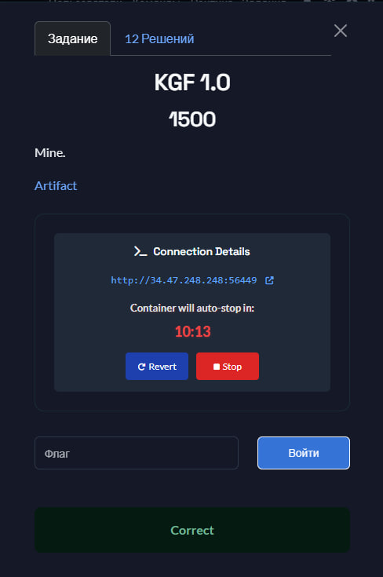
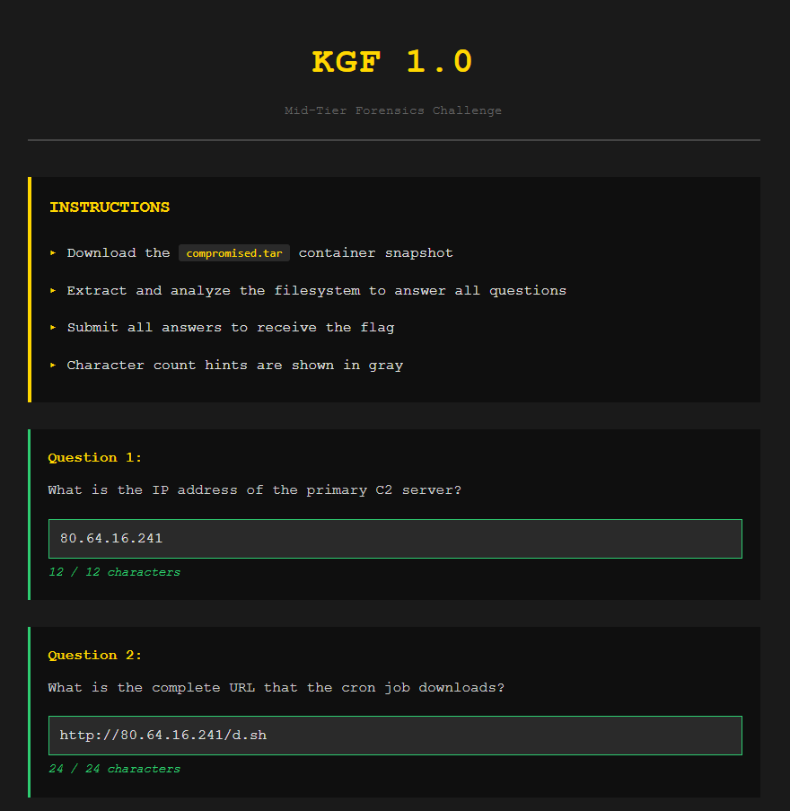
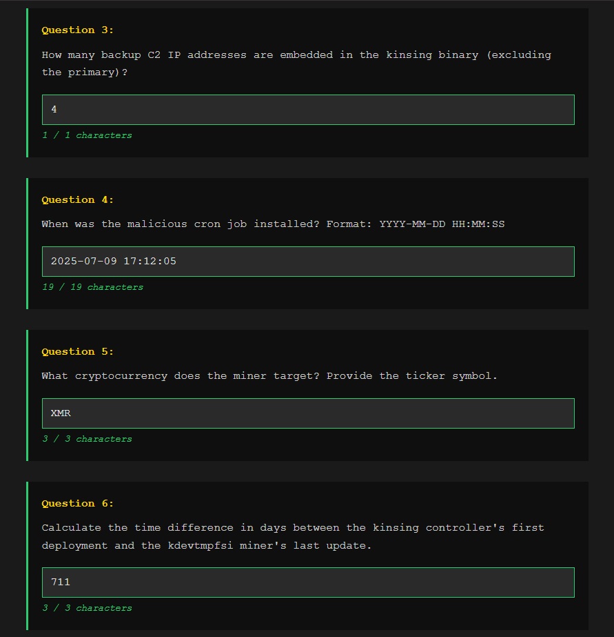

## H7CTF 2025- KGF 1.0 1500 Write-up

### Solution

### Step 1: What is the IP address of the primary C2 server?

The first step of the investigation was to identify the address of the main Command and Control (C2) server. This was done by inspecting the root crontab file, which contained a scheduled task using the `wget` command to initiate the compromise. The IP address was extracted directly from this command.

**Answer:** **80.64.16.241**

### Step 2: What is the complete URL that the cron job downloads?

To fully document the vector of compromise, the entire URL used to download the malicious script needed to be recorded. The artifact for this was the complete `wget` command string found in the crontab job.

**Answer:** **http://80.64.16.241/d.sh**

### Step 3: How many backup C2 IP addresses are embedded in the kinsing binary (excluding the primary)?

To assess the malware's resiliency against network disruption, the embedded infrastructure needed to be mapped. The methodology involved performing a deep string analysis of the primary Kinsing binary to identify all hardcoded fallback IP addresses.

**Answer:** **4**

### Step 4: When was the malicious cron job installed? (Format: YYYY-MM-DD HH:MM:SS)

Establishing the correct timeline required retrieving the modification time (`mtime`) of the persistence file and adjusting it for the required timezone. The timestamp derived from the crontab file's metadata (`07:42:05 -0400`) was converted to **IST (UTC+5:30)**.

**Answer:** **2025-07-09 17:12:05**

### Step 5: What cryptocurrency does the miner target? Provide the ticker symbol.

To understand the attacker's motive, the cryptocurrency mined by the payload had to be identified. The Kinsing malware utilizes a variant of the XMRig miner, which is universally configured to target Monero.

**Answer:** **XMR**

### Step 6: Calculate the time difference in days between the kinsing controller's first deployment and the kdevtmpfsi miner's last update.

The chronological difference required calculating the number of days between two specific file modification times (`Modify`): the controller binary (`./etc/kinsing` on 2023-07-28 17:17:09) and the miner payload (`./tmp/kdevtmpfsi` on 2025-07-09 07:39:09). The difference of 710 full days and 14 hours was rounded up to the required integer.

**Answer:** **711**

### Step 7: What Chrome browser version does the malware impersonate in its User-Agent string?

The malware uses a deceptive User-Agent string to mask its C2 communication as legitimate web traffic. This hardcoded string was extracted from the binary.

**Answer:** **99.0.4844.51**

### Step 8: What filename does the malware use for the downloaded port scanner?

The final step was to identify the obfuscated name given to the secondary tool downloaded by the initial shell script, used for network scanning.

**Answer:** **firewire**

### Flag

`H7CTF{n0w_y0u_und3rst4nd_where_th3_n4me_0f_th3_ch4llenge_c0mes_fr0m_ffa9866b-914e-4eca-8d79-5420905873be}`