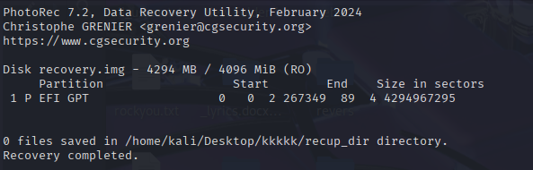

## H7CTF 2025- RecoverFS 1750 Write-up

### Challenge Summary & Technical Analysis

**RecoverFS** was a multi-stage digital forensics challenge that required the sequential application of various recovery tools to retrieve a flag from a damaged disk image. The solution path involved identifying a corrupt partition table, diagnosing a truncated disk image, bypassing the filesystem to list files, extracting a target file's raw data, and performing a multi-step repair of a corrupted PNG file header.

This write-up provides a step-by-step walkthrough of the investigation and recovery process, mirroring the commands and discoveries made during the challenge.

-----

### Step 1: Initial Analysis and Partition Table Corruption

The initial analysis began by examining the provided `recovery.img` file with `gdisk` to understand its partition structure.

**Analysis (`gdisk`):**
The output immediately revealed a `protective` MBR but also showed `GPT: not present`. This indicated that the disk was originally a GPT disk, but the primary GPT header was missing or corrupt. This corruption prevented standard tools from recognizing or mounting any partitions, necessitating more advanced recovery methods.

### Step 2: Deep Scan and the Truncated Image Problem

To find the lost partition, `TestDisk` was used to perform a deep scan of the disk image.

**Analysis (`TestDisk`):**
`TestDisk` successfully located an `MS Data` (NTFS) partition. However, it threw a critical error: **`The hard disk [...] seems too small!`**. The tool determined that the partition's metadata pointed to an end sector (`16740350`) far beyond the actual size of the 4GB image file. This proved that `recovery.img` was a **truncated copy** of a larger original drive, making automatic partition table repair impossible.

### Step 3: A Failed Attempt with File Carving

Since partition recovery failed, the next logical step was to try file carving with `PhotoRec`, a tool that scans raw data for file signatures.

**Analysis (`PhotoRec`):**
The scan completed but resulted in **`0 files saved`**. This was an important finding: it suggested that the required files were either fragmented, used an unknown signature, or that a more precise, filesystem-aware approach was needed. Simple carving was not the solution.

### Step 4: Filesystem Traversal with The Sleuth Kit

With carving ruled out, the focus shifted to manually reading the filesystem structure. The Sleuth Kit's `fls` tool was used, providing the partition's starting sector (`32768`, found by `TestDisk` in an earlier step not pictured) as an offset.

**Analysis (`fls`):**
This was the breakthrough. The command `fls -o 32768 -r recovery.img` successfully read the NTFS filesystem's metadata and listed the entire directory tree. A file named **`secret_is_here.png`** was located inside a `secret` directory. Crucially, `fls` provided its inode number: **42**.

### Step 5: File Extraction and Header Corruption

Using the inode number, the file's raw data was extracted with `icat`.

**Analysis (`xxd`):**
A hex dump of the extracted `recovered_secret.png` immediately showed that the file was corrupt. Instead of the mandatory 8-byte PNG signature (`89 50 4e 47...`), the file began with null bytes. The actual PNG data appeared to start later in the file.

### Step 6: Manual Header Repair and IHDR Issues

A first attempt at repair involved manually prepending a standard PNG header to the file's data.

While this added a valid signature, subsequent checks with `file` and `pngcheck` revealed a deeper problem.

**Analysis (`file` and `pngcheck`):**
The `file` command reported absurd image dimensions, and `pngcheck` confirmed multiple errors within the **IHDR** chunk, including an `invalid sample depth`. This proved that simply adding the signature was not enough; the entire metadata header block was corrupt and had to be rebuilt from scratch.

### Step 7: Automated Repair and Final Solution

To fix the complex IHDR issues and recalculate the correct CRC checksum, a Python script was written to automate the final repair.

The script successfully located the file, extracted its data, constructed a completely new and valid PNG header with the correct dimensions (1010x152, inferred from the hex data), and wrote the final, repaired image to disk.

### FLAG

Opening the `FINAL_SECRET.png` file generated by the script revealed the flag, confirming the successful completion of the challenge.

**`H7CTF{f1l3_syst3m_1s_v3ry_fun!!!_9a7}`**