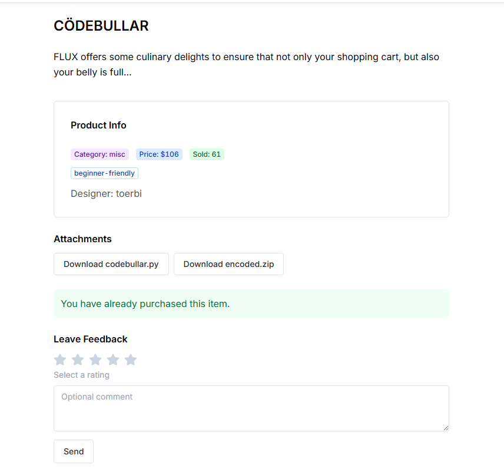
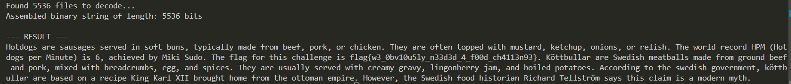

## Hack.lu CTF 2025 - CÖDEBULLAR 109 Write-up



### Step 1: Initial Analysis (Analyzing `codebullar.py`)

We are given two files: the challenge script `codebullar.py` and a zip archive `encoded.zip` containing 5,536 JPEG images.

The first step is to analyze the `codebullar.py` script to understand how the data was encoded.

```python
import os
import random
from PIL import Image

köttbullar_dir = './assets/köttbullar'
hotdogs_dir = './assets/hotdogs'
output_dir = './encoded'
os.makedirs(output_dir, exist_ok=True)

köttbullar_files = [os.path.join(köttbullar_dir, f) for f in os.listdir(köttbullar_dir)]
hotdogs_files = [os.path.join(hotdogs_dir, f) for f in os.listdir(hotdogs_dir)]

with open('./secret.txt', 'r') as f:
    FLAG = f.read().strip()

bin_str = ''.join(format(ord(c), '08b') for c in FLAG)

for i, bit in enumerate(bin_str):
    src = random.choice(köttbullar_files) if bit == '0' else random.choice(hotdogs_files)
    dst = os.path.join(output_dir, f'{i:04}.jpeg')
    with Image.open(src) as img:
        img.save(dst, format='JPEG', quality=95)

print(f'Encoded {len(bin_str)} bits with CODEBULLAR encoding')
```

The script's logic is clear:

1.  It reads a flag from `secret.txt`.
2.  It converts each character of the flag into an 8-bit binary string.
3.  It iterates through this long binary string, bit by bit.
4.  If the bit is **`0`**, it saves a random image from the `köttbullar` (meatballs) directory.
5.  If the bit is **`1`**, it saves a random image from the `hotdogs` directory.
6.  Each image is saved sequentially with a numbered filename (e.g., `0000.jpeg`, `0001.jpeg`, etc.) in the `encoded` directory.

Our goal is to reverse this process. We must iterate through all files in the `encoded` directory *in numerical order*, determine if each image is a meatball (`0`) or a hotdog (`1`), and convert the resulting binary string back to text.

### Step 2: Enumeration and Problem Discovery

The `encoded.zip` archive contains all the output images, but the `assets` folder (containing the *original* meatball and hotdog images) is not provided.

This presents a problem. The script uses `random.choice`, meaning there are multiple different unique images used to represent '0' and multiple unique images for '1'. We cannot simply compare files.

The solution is to use file hashing (e.g., MD5) to identify all unique images. By running a simple script, we discover there are **32 unique images** used in total.

Since we don't have the original `assets` to automatically create a `hash -> bit` mapping, we must build it manually. We need to look at one example of all 32 unique images and classify them ourselves.

### Step 3: Automation (Scripting the Solution)

We use a two-script approach. The first script helps us build the hash map, and the second script uses that map to decode the flag.

#### Script 1: Manual Mapper (`manual_mapper.py`)

This script iterates through the `encoded` files. When it finds a file with a hash it hasn't seen before, it stops and asks for user input (`0` for meatball, `1` for hotdog). It repeats this 32 times and then prints a complete Python dictionary to be used in our decoder.

```python
import os
import glob
import hashlib

def get_file_hash(filepath):
    """Calculates the MD5 hash of a file"""
    hasher = hashlib.md5()
    with open(filepath, 'rb') as f:
        buf = f.read()
        hasher.update(buf)
    return hasher.hexdigest()

encoded_dir = './encoded'
hash_to_bit_map = {}
seen_hashes = set()

# Get and sort all files numerically
files = glob.glob(os.path.join(encoded_dir, '*.jpeg'))
try:
    files.sort(key=lambda x: int(os.path.basename(x).split('.')[0]))
except ValueError:
    print(f"Error sorting files. Ensure filenames are like '0000.jpeg'.")
    exit()

print("Starting manual hash mapping...")
print(f"A total of 32 unique hashes were found.\n")

for filepath in files:
    file_hash = get_file_hash(filepath)
    
    # If this is a new, unseen hash
    if file_hash not in seen_hashes:
        print(f"\n--- NEW HASH FOUND ({len(seen_hashes) + 1}/32) ---")
        print(f"File to inspect: {filepath}")
        print(f"Hash: {file_hash}")
        
        # Ask user for classification
        bit = ""
        while bit not in ('0', '1'):
            bit = input("What's in the picture? (0 = meatball, 1 = hotdog): ")
        
        hash_to_bit_map[file_hash] = bit
        seen_hashes.add(file_hash)
        print(f"-> Saved: '{file_hash}' is '{bit}'")
        
    if len(seen_hashes) == 32:
        print("\n--- All 32 unique hashes have been mapped. ---")
        break

print("\n\n--- COMPLETE DICTIONARY FOR DECODER ---")
print("Copy this dictionary into your decoder.py script:\n")
print("hash_to_bit_map = {")
for file_hash, bit in hash_to_bit_map.items():
    print(f"    '{file_hash}': '{bit}',")
print("}")
```


#### Script 2: Final Decoder (`decoder.py`)

After running the `manual_mapper.py` script and classifying all 32 images, we paste the resulting dictionary into this final decoder script. This script then processes all 5,536 files, builds the complete binary string, and converts it to ASCII text.

```python
import os
import glob
import hashlib

# Populate this dictionary using the output from manual_mapper.py
hash_to_bit_map = {
    # Example:
    # '9b6e11ad1b835cd3fb4e4c4999bbcb5b': '0',
    # '1cecd8652db95bdb9f5aa3929395115c': '1',
    # ... (paste all 32 key-value pairs here) ...
}

def get_file_hash(filepath):
    """Calculates the MD5 hash of a file"""
    hasher = hashlib.md5()
    with open(filepath, 'rb') as f:
        buf = f.read()
        hasher.update(buf)
    return hasher.hexdigest()

def decode_bits_to_text(binary_string):
    """Converts a binary string into ASCII text"""
    text = ""
    for i in range(0, len(binary_string), 8):
        byte = binary_string[i:i+8]
        if len(byte) == 8:
            try:
                char_code = int(byte, 2)
                text += chr(char_code)
            except Exception:
                text += "?" # Add '?' for non-printable chars
    return text

def main():
    encoded_dir = './encoded'
    
    if not hash_to_bit_map:
        print("Error: 'hash_to_bit_map' is empty. Please run manual_mapper.py first.")
        return

    files = glob.glob(os.path.join(encoded_dir, '*.jpeg'))
    
    # Critically important: sort files numerically
    try:
        files.sort(key=lambda x: int(os.path.basename(x).split('.')[0]))
    except ValueError as e:
        print(f"Error sorting files: {e}")
        return

    print(f"Found {len(files)} files to decode...")
    
    binary_string = ""
    for filepath in files:
        file_hash = get_file_hash(filepath)
        
        if file_hash in hash_to_bit_map:
            bit = hash_to_bit_map[file_hash]
            binary_string += bit
        else:
            print(f"\n! ERROR: Unknown file hash: {file_hash} (for file {filepath})")
            print("! Please add this hash to 'hash_to_bit_map'.")
            return

    print(f"Assembled binary string of length: {len(binary_string)} bits")
    
    # Decode the string
    flag_text = decode_bits_to_text(binary_string)
    
    print("\n--- RESULT ---")
    print(flag_text)

if __name__ == "__main__":
    main()
```

### Step 4: Retrieving the Flag

After filling the `hash_to_bit_map` in `decoder.py` and running it, the script processes all files and outputs a large block of text. This text contains descriptions of hotdogs and meatballs, and the flag is embedded directly within it.

The decoded text clearly reveals the flag.



### Flag

`flag{w3_0bv10u5ly_n33d3d_4_f00d_ch4113n93}`