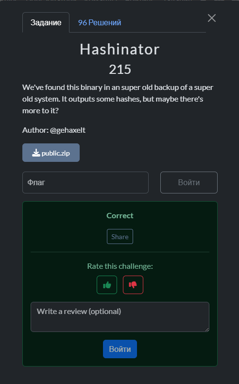
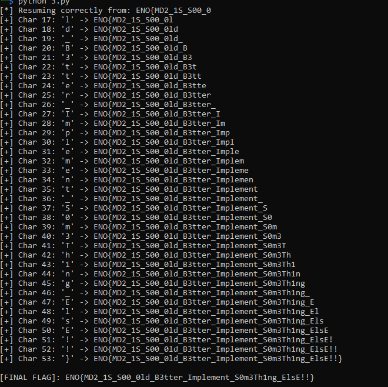

## HackIM CTF Goa 2026 - Hashinator Write-up



## Step 1: initial Analysis

Running the binary with the flag provides a list of hashes. The command `cat ./flag.txt | ./challenge_final` generates a file `OUTPUT.txt` containing 54 lines of 32-character hexadecimal strings.

At first glance, these look like MD5 hashes (128-bit). However, checking the first hash `8350e5a3e24c153df2275c9f80692773` against rainbow tables or common hash signatures reveals it is **MD2** (specifically, MD2 of an empty string).

### Step 1.1: Verifying Standard MD2

We hypothesized that the program calculates the hash cumulatively for every character entered.

1. Line 1: `MD2("")`
2. Line 2: `MD2("f")`
3. Line 3: `MD2("fl")`
...and so on.

Using a standard Python `Crypto.Hash.MD2` library, we were able to recover the first 15 characters: `ENO{MD2_1S_S00_`.

### The Anomaly

However, the standard MD2 algorithm stopped working exactly at the 16th byte (the boundary of the first 16-byte block).

Static analysis of the binary hinted at the existence of **two different S-Boxes**. It appears the program switches to a custom S-Box or changes the padding logic once the first block (16 bytes) is filled. Instead of reverse-engineering the complex custom logic ("spaghetti code"), we decided to perform a Side-Channel attack using the binary itself.

## Step 2: The Oracle Solution

Since we have the executable and the target hashes (`OUTPUT.txt`), we can use the binary as an **Oracle**. We don't need to know *how* it hashes the data; we just need to find an input that produces the same output.

We wrote a Python script that:

1. Takes the known part of the flag.
2. Appends a printable character.
3. Feeds this candidate to `./challenge_final` via `subprocess`.
4. Compares the generated hash at the specific index with the target hash from `OUTPUT.txt`.

### The Solver Script

```python
import subprocess
import string
import sys

TARGET_HASHES = [
    "8350e5a3e24c153df2275c9f80692773", "6bf156f1b6534f1ab59454344bd74c16",
    "591a83751ad9849419fff2f134e18d55", "7df816d74efa91bd7b56d94ae4185c22",
    "6f948d895aa7b60104a4488414a61ac9", "7fb4021d7a232a0681d77c2be330b8cb",
    "03a47a46960817f23332452a6aa5c5ab", "27806c7b8ae7d4ca7e1a79b35877218b",
    "71b78ed814cb338e1580453a18081258", "d586abc55ac017ed37674fd19323be33",
    "f1f7ba1c2652df15d5f400ae04547aba", "4ce04419c490c44bfc3aba4963f4c8bf",
    "43ec14ca4df022274c9393bf603e2d71", "cfdce7cdbccae4f0d0d9f4c5654ffa82",
    "3d93caf4c665a28c648953052de10aec", "086e7de005d104ff9fb97954d8fa53e7",
    "9e535b20d839efce78d6f8e8d0a1cb6b", "d5407d3beac51200ad370251eeb73c1b",
    "31bac0706098aeddeb75cc4722878c59", "a11d2a165b280618a9412bb6ac2f47b8",
    "9697f36c361431f67de83c4328985710", "ff295026f5f4b07316da17ac5660bd3e",
    "46a13d4e2fe53a5a2ca5c1c6594cfc6e", "9443a9a3a8d86d76733a04285e7b90d2",
    "4f47d56aac53a429d6cce7adae3500ba", "892340d0fe013cd4c99770cea81dc607",
    "666687b0b676f90d83d7bafcc6771303", "85a076163dedc4446965f5251801fe10",
    "91cacc9dae71ddf39df2b3731a9d5395", "927ff0d6edcf7f22e265f347e79d27c9",
    "bf5964e0f6a321484e76665985904551", "9284f02d080efafb02206529a46e3bda",
    "6a4c69ca8746bfbc17d75b0373c28450", "3b7e2660a93f8e971887a31e48e85863",
    "cfeec2f067bf35be45ce082ea1c47000", "848ec1f32fc3d8ff0292b7dd031bf0e3",
    "e01cfdb5234565b4b8d92fdde8dff8a1", "d046f627215108fbbe12bf609b029293",
    "50c053943356878ba1c8eac5f9901f41", "4b50c45fcfa1a673c5e4f5a9fac6d26f",
    "a4e5a101441292f4d771c8526681839f", "fafb2950e121ae61c61d9b72046ba8a5",
    "b32bec82a7bb2291bba950c43d3a19b7", "451fd7f22320f7a120e1172651b2b833",
    "0ad532e27bfc8ab66611db68390517e1", "3f024a229083c0a87d399bbb01785d60",
    "7dcf541bf7131be55072d884c3e5d054", "6c18d448c85f4377fc11cfc80b895655",
    "67ca187b815926b2a423a29bf0b0bfaa", "3d8cfaae26e2e0b6b60285c4b97767a0",
    "e95d388e6da8cafda9c86b0c255aae83", "091f2cfea1342b5a64d03227bebd025a",
    "a0adac6bcaee0e0eb0a8ce218f9c03b3", "0b536eb9c62363f1c165ee709bbb0865"
]

def solve():
    binary_path = "./challenge_final"
    flag = "ENO{MD2_1S_S00_0" 
    
    print(f"[*] Resuming correctly from: {flag}")
    
    charset = string.ascii_letters + string.digits + "{}_!?@-."
    
    
    while len(flag) < len(TARGET_HASHES) - 1:
        target_index = len(flag) + 1 
        if target_index >= len(TARGET_HASHES):
            break
            
        target_hash = TARGET_HASHES[target_index]
        found = False
        
        for char in charset:
            candidate = flag + char
            
            try:
                process = subprocess.Popen(
                    [binary_path],
                    stdin=subprocess.PIPE,
                    stdout=subprocess.PIPE,
                    stderr=subprocess.PIPE,
                    text=True
                )
                
                stdout, _ = process.communicate(input=candidate)
                hashes_out = stdout.strip().split()
                
                if len(hashes_out) > target_index:
                    if hashes_out[target_index] == target_hash:
                        flag += char
                        print(f"[+] Char {len(flag)}: '{char}' -> {flag}")
                        found = True
                        break
            except Exception as e:
                print(f"Error: {e}")
                sys.exit()
        
        if not found:
            print(f"[-] Stuck at length {len(flag)+1}. Trying brute-force byte mode...")
            for val in range(256):
                char = chr(val)
            break

    print(f"\n[FINAL FLAG]: {flag}")

if __name__ == "__main__":
    solve()
```

## Step 3: Results

The script successfully bypassed the custom S-Box logic by brute-oracling the binary character by character.



### Flag

`ENO{MD2_1S_S00_0ld_B3tter_Implement_S0m3Th1ng_ElsE!!}`
