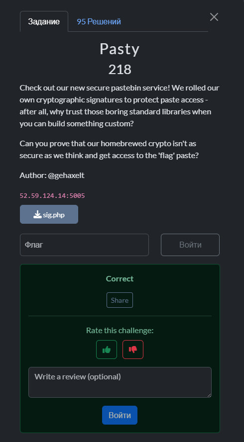
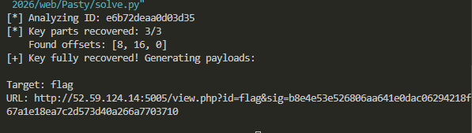
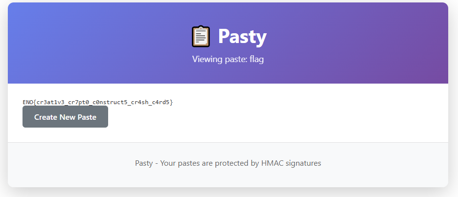

## HackIM CTF Goa 2026 - Pasty Write-up



## Step 1: Initial Analysis

The challenge presents a "Secure Pastebin" service that uses custom cryptographic signatures to protect pastes. We are provided with the source code for the signature generation (`sig.php`):

```php
function _x($a,$b){$r='';for($i=0;$i<strlen($a);$i++)$r.=chr(ord($a[$i])^ord($b[$i]));return $r;}
function compute_sig($d,$k){
    $h=hash('sha256',$d,1);
    $m=substr(hash('sha256',$k,1),0,24);
    $o='';
    for($i=0;$i<4;$i++){
        $s=$i<<3;
        $b=substr($h,$s,8);
        $p=(ord($h[$s])%3)<<3;
        $c=substr($m,$p,8);
        $o.=($i?_x(_x($b,$c),substr($o,$s-8,8)):_x($b,$c));
    }
    return $o;
}

```

### The Vulnerability

The signature algorithm is fundamentally broken due to its **linearity**:

1. It uses only XOR operations.

2. The internal key `m` is only 24 bytes, split into three 8-byte blocks `(K₀, K₁, K₂)`.

3. The output is constructed block-by-block in a CBC-like mode:

   - `O₀ = B₀ ⊕ Kₚ`
   - `Oᵢ = Bᵢ ⊕ Kₚ ⊕ Oᵢ₋₁` (for `i > 0`)

4. Since we know the data `d` (and its hash `B`) and the resulting signature `O`, we can reverse the XOR to recover the key blocks `Kₚ`.

## Step 2: Key Recovery & Forgery

By creating a legitimate paste, we get a valid `id` and `sig` pair. We can then calculate the SHA-256 of the `id` and XOR it with the signature to extract the secret key blocks. Once we have all three blocks of the key, we can sign any arbitrary string — including the string `"flag"`.

### The Solver Script

```python
import hashlib
import sys

# --- Your data from the website ---
KNOWN_ID = "e6b72deaa0d03d35"
KNOWN_SIG = "3b58587e19723b59defda57f8e2e9e4e500a32234e78598d1fd944a31c95dc38"
TARGET_URL = "http://52.59.124.14:5005/view.php"

def xor_bytes(a, b):
    return bytes([x ^ y for x, y in zip(a, b)])

def get_key_offset(byte_val):
    return (byte_val % 3) * 8

def recover_key(data_str, sig_hex):
    try:
        sig = bytes.fromhex(sig_hex)
    except ValueError:
        print("[-] Signature format error")
        return {}
        
    # Emulating hash('sha256', $d, 1) from PHP
    h = hashlib.sha256(data_str.encode()).digest()

    O = [sig[i:i+8] for i in range(0, 32, 8)]
    B = [h[i:i+8] for i in range(0, 32, 8)]
    
    key_parts = {}

    # Block 0: K = O[0] ^ B[0]
    p0 = get_key_offset(B[0][0])
    key_parts[p0] = xor_bytes(O[0], B[0])
    
    # Remaining blocks: K = O[i] ^ B[i] ^ O[i-1]
    for i in range(1, 4):
        p = get_key_offset(B[i][0])
        k = xor_bytes(xor_bytes(O[i], B[i]), O[i-1])
        key_parts[p] = k
        
    return key_parts

def sign_new_data(data_str, key_parts):
    # Reassembling the full key from parts
    if len(key_parts) < 3:
        return None
        
    m = key_parts[0] + key_parts[8] + key_parts[16]
    h = hashlib.sha256(data_str.encode()).digest()
    o = b''
    
    for i in range(4):
        s = i * 8
        b_block = h[s:s+8]
        p = (h[s] % 3) * 8
        c_block = m[p:p+8]
        
        if i == 0:
            val = xor_bytes(b_block, c_block)
        else:
            prev_o = o[s-8:s]
            val = xor_bytes(xor_bytes(b_block, c_block), prev_o)
        o += val
        
    return o.hex()

if __name__ == "__main__":
    print(f"[*] Analyzing ID: {KNOWN_ID}")
    keys = recover_key(KNOWN_ID, KNOWN_SIG)
    
    print(f"[*] Key parts recovered: {len(keys)}/3")
    print(f"    Found offsets: {list(keys.keys())}")

    if len(keys) < 3:
        print("[-] Warning: This paste was not enough to recover the full key.")
        print("[-] Create another paste on the site and add its data to the script.")
    else:
        print("[+] Key fully recovered! Generating payloads:\n")
        
        # List of targets to check
        targets = ["flag"]
        
        for t in targets:
            sig = sign_new_data(t, keys)
            url = f"{TARGET_URL}?id={t}&sig={sig}"
            print(f"Target: {t}")
            print(f"URL: {url}\n")
```

## Step 3: Results



After recovering the key from the provided URL, we generated a valid signature for `id=flag`.

Navigating to the forged URL revealed the flag:



### Flag

`ENO{cr3at1v3_cr7pt0_c0nstruct5_cr4sh_c4rd5}`

