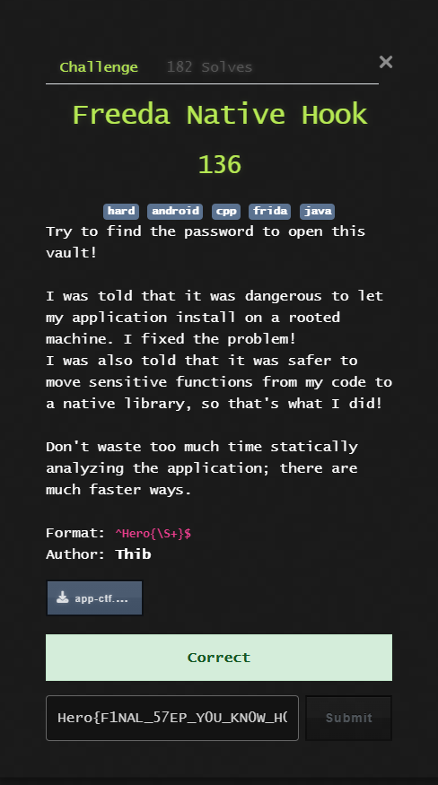
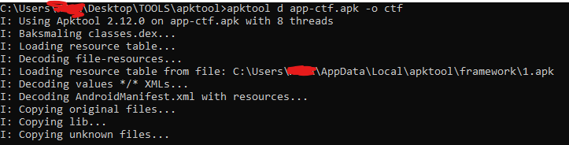
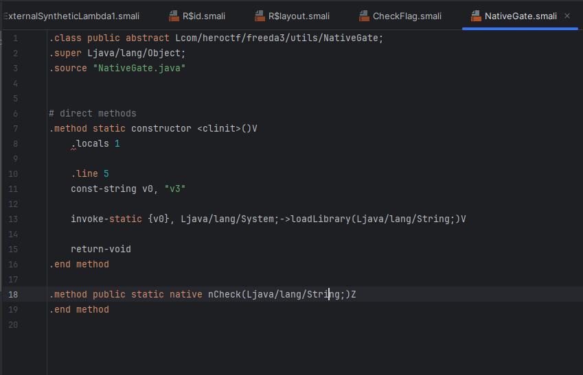
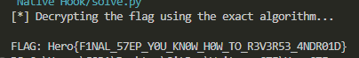

## HeroCTF v7 - Freeda Native Hook Write-up



### Step 1: Decompilation and Initial Analysis
The first step is to examine the contents of the APK file. We use the standard tool `apktool` to decompile the application, which gives us access to Smali code, resources, and most importantly, native libraries.

```bash
apktool d app-ctf.apk -o ctf
```
This command unpacks the APK into the `ctf` folder, which contains the full application structure ready for analysis.



### Step 2: Analysis of Java Code to Find Native Call
After decompilation, we examine the Smali/Java code to find the entry point to the native code. The call chain is quite simple:
1. `MainActivity` calls the `CheckFlag.checkFlag()` method when the button is pressed.
2. `CheckFlag.checkFlag()` in turn calls the native method `NativeGate.nCheck()`.
The `NativeGate` class is key, as it loads the native library and declares the external method.
**`com/heroctf/freeda3/utils/NativeGate.smali`**



The `System.loadLibrary("v3")` command indicates that all the logic is in the `libv3.so` file.

### Step 3: Analysis of the Native Library (`libv3.so`)
Now we open the `libv3.so` file in a decompiler. We are interested in the function `Java_com_heroctf_freeda3_utils_NativeGate_nCheck`. Its analysis shows that it calls another function — `get_flag` — to obtain the correct password, and then compares it with the one entered by the user.
Inside `get_flag`, we see that `check_root` is first called to check for root privileges. If the check is successful, the program refuses to issue the flag. If not, the decryption function is called (in our case `sub_285C` for ARM64 or `sub_2630` for x86).
This function contains the flag generation algorithm. It is not stored in plain text but is constructed dynamically. The analysis shows that the algorithm uses data from the `.rodata` section and performs a series of mathematical operations.

**Fragment of code from the decryption function (ARM64)**
```armasm
; ...
LDRB W2, [X13,W4,SXTW] ; Load byte from the first array (arr1)
LDRB W4, [X14,W4,SXTW] ; Load byte from the second array (arr2)
; ...
EOR W2, W2, W4 ; W2 = arr1[idx] ^ arr2[idx]
EOR W5, W5, W3 ; W5 (key)
EOR W5, W5, W2 ; W5 = key_byte ^ (arr1[idx] ^ arr2[idx])
EON W2, W2, W5 ; W2 = W2 EOR (NOT W5) - complex operation that reduces to NOT
; ...
LSR W4, W4, W6 ; Logical shift right (part of ROR)
LSL W2, W2, W5 ; Logical shift left (part of ROR)
ORR W2, W4, W2 ; Combining for the final ROR
STRB W2, [X1,W3,SXTW] ; Storing the decrypted character
; ...
```

### Step 4: Reproducing the Algorithm in Python
Instead of trying to debug or patch complex assembly code, it is much simpler to extract the necessary data and reproduce the logic in a high-level language like Python. We copy the data arrays and key directly from the decompiler.
The most difficult parts to reproduce are:
1. **Index permutation formula** (`idx = (29 * pos + 7) % 48`).
2. **Formula for calculating the shift amount** (`rotate_amount = ((pos % 7) + 1) & 7`).
Both formulas were carefully reconstructed from the assembly code.

#### Decryption Script (`solve.py`)
```python
def solve():
    # 1. Data from the .rodata section of the libv3.so file (byte_848)
    arr1 = [
        0x17, 0x11, 0x05, 0xB3, 0xC1, 0x42, 0xD0, 0x1E, 0x38, 0x7C, 0x6B, 0x4E, 0x22, 0x75, 0x90, 0xA3, 
        0x38, 0x0F, 0xCD, 0x84, 0xAC, 0xF2, 0x87, 0xAD, 0xC1, 0x78, 0xF9, 0x1D, 0x92, 0x6B, 0x99, 0x4F, 
        0x81, 0xC1, 0x05, 0xB2, 0xF1, 0x6D, 0x69, 0x3A, 0xDB, 0xC3, 0xBE, 0x34, 0x0F, 0xC8, 0x61, 0x1F
    ]
    # 2. Data from the .rodata section (byte_878)
    arr2 = [
        0x31, 0xD9, 0x1F, 0x31, 0x89, 0x13, 0x39, 0xB2, 0x2D, 0xEB, 0xB6, 0xD7, 0xAF, 0x6D, 0x56, 0x92, 
        0xAF, 0xFE, 0xF1, 0x75, 0x2B, 0x50, 0x8C, 0xDB, 0xEC, 0x92, 0x06, 0x4E, 0x74, 0xA9, 0xEE, 0x86, 
        0x54, 0x88, 0x4E, 0x0F, 0xE0, 0x97, 0x6F, 0xCC, 0xC3, 0xAD, 0xEB, 0x41, 0xAC, 0x22, 0x37, 0x26
    ]
    
    # 3. Key found in the code (0x5F9D7BC3)
    key_bytes = [0xC3, 0x7B, 0x9D, 0x5F]

    # Rotate right (ROR) function
    def ror(val, r):
        r = r % 8
        return ((val >> r) | (val << (8 - r))) & 0xFF

    print("[*] Decrypting the flag using the exact algorithm...")
    flag = [""] * 48
    
    # Main loop for the 48 characters of the flag
    for pos in range(48):
        # 4. Permutation formula to select bytes (recovered from ASM)
        idx = (29 * pos + 7) % 48
        
        # 5. Select bytes from the arrays using the "permuted" index
        b1 = arr1[idx]
        b2 = arr2[idx]
        
        # 6. The key is selected based on the current position in the flag
        k = key_bytes[pos % 4]
        
        # 7. The core logic: ~(A ^ B ^ Key)
        val = (~(b1 ^ b2 ^ k)) & 0xFF
        
        # 8. EXACT ROTATION FORMULA (recovered from ASM)
        # In the assembly, this is complex math, but it simplifies to a basic formula:
        rotate_amount = ((pos % 7) + 1) & 7
        
        # 9. Apply the rotation
        decrypted_char = chr(ror(val, rotate_amount))
        
        flag[pos] = decrypted_char
        
    result = "".join(flag)
    print(f"\nFLAG: {result}")

solve()
```

### Step 5: Obtaining the Flag
All that remains is to run solve.py. 



### Flag
`Hero{F1NAL_57EP_Y0U_KN0W_H0W_TO_R3V3R53_4NDR01D}`