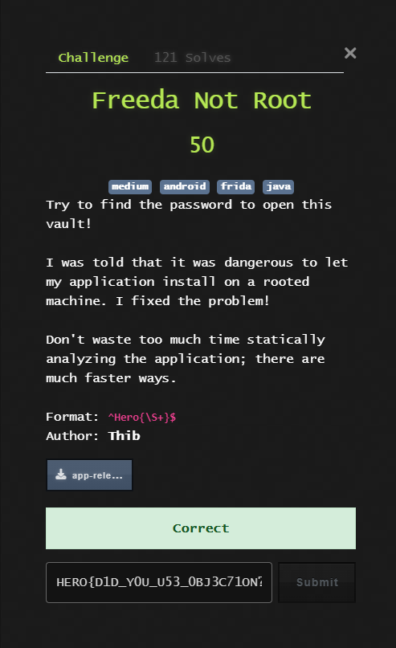
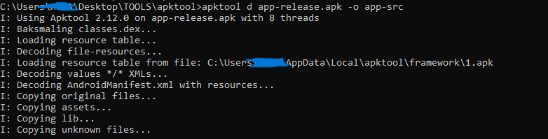
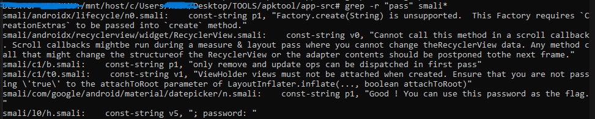
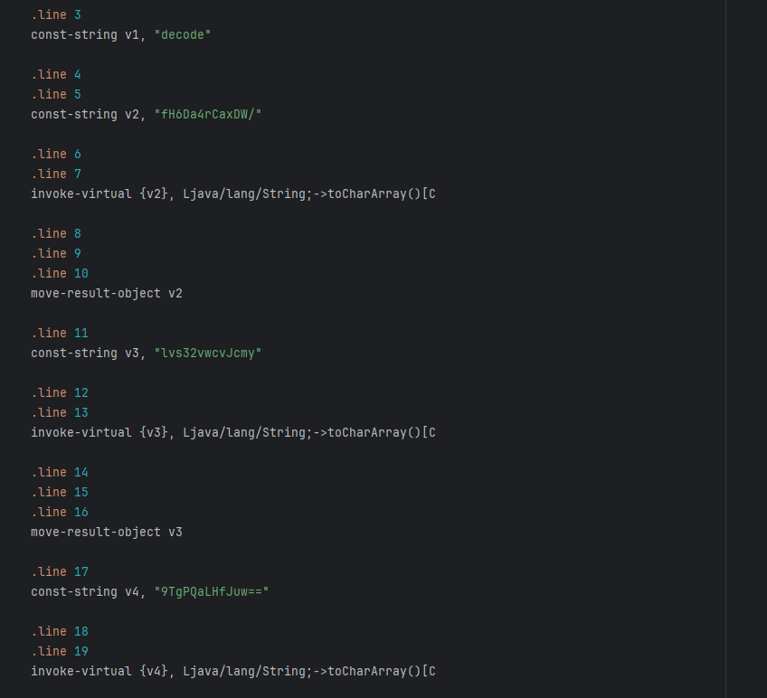
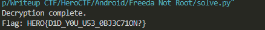

## HeroCTF v7 - Freeda Not Root Write-up



### Step 1: Decompilation and Initial Analysis

The first step in analyzing any Android application is to decompile it. We use the standard tool `apktool` to convert the `app-release.apk` file into readable smali files and resources.

```bash
apktool d app-release.apk -o app-src
```

This command creates the `app-src` directory, which contains the entire application structure, ready for static analysis.



### Step 2: Searching for Interesting Strings and Entry Points

After decompilation, our goal is to find the code responsible for checking the password. The quickest way is to search for keywords like `password`, `flag`, or UI element IDs.

We perform a search for the word `pass` across all smali files.

```bash
grep -r "pass" smali*
```

The result immediately gives us a critical clue: the string that is displayed upon successful password entry.

`smali/com/google/android/material/datepicker/n.smali: const-string p1, "Good ! You can use this password as the flag."`

This finding is our key. The password validation logic must be located right before the call that shows this success message.



### Step 3: Analyzing the Obfuscated Logic

By tracing the code back from the success message, we arrive at the `CheckFlag` class, which in turn uses Java reflection to call a private method named `get_flag` from the `com.heroctf.freeda2.utils.Vault` class. This is done to complicate static analysis.

Inside the `Vault` class, we discover that the flag is not stored in plaintext. Instead, it is generated by a complex, obfuscated algorithm. A key part of this algorithm is the `E()` method, which assembles the encrypted data from several Base64-encoded strings.



### Step 4: Replicating the Algorithm in Python

Analyzing convoluted smali code is time-consuming and inefficient. It's much easier to translate the decryption logic into a high-level language like Python. We write a script that precisely replicates all the steps performed in the `Vault` class:

1.  Assembles and decodes the Base64 string from the `E()` method.
2.  Uses the hardcoded key from the `K()` method.
3.  Generates a "permutation table" using a custom pseudo-random number generator (methods `P()` and `X()`).
4.  Iterates through the encrypted bytes, applying subtraction, circular shift, and XOR operations with the key bytes to each one.

#### Decryption Script (`solve.py`)
```python
import base64

def get_key_seed():
    return 0x5f9d7bc3

def get_encrypted_data():
    part1 = "fH6Da4rCaxDW/"
    part2 = "lvs32vwcvJcmy"
    part3 = "9TgPQaLHfJuw=="
    base64_string = part1 + part2 + part3
    return base64.b64decode(base64_string)

def xorshift(n):
    n &= 0xffffffff
    n ^= (n << 13) & 0xffffffff
    n ^= (n >> 17) & 0xffffffff
    n ^= (n << 5) & 0xffffffff
    return n

def generate_permutation_table(length, seed):
    arr = list(range(length))
    current_seed = seed ^ 0xA5A5A5A5
    for i in range(length - 1, 0, -1):
        current_seed = xorshift(current_seed)
        j = current_seed % (i + 1)
        arr[i], arr[j] = arr[j], arr[i]
    return arr

def key_to_bytes(key):
    return [key & 0xff, (key >> 8) & 0xff, (key >> 16) & 0xff, (key >> 24) & 0xff]

def decrypt_flag():
    key_seed = get_key_seed()
    encrypted_bytes = get_encrypted_data()
    data_length = len(encrypted_bytes)
    key_bytes = key_to_bytes(key_seed)
    permutation_table = generate_permutation_table(data_length, key_seed)
    ror_amount = (key_seed >> 27) & 7
    decrypted_bytes = [0] * data_length
    
    for i in range(data_length):
        permuted_index = permutation_table[i]
        encrypted_byte = encrypted_bytes[permuted_index]
        temp_byte = (encrypted_byte - i) & 0xff
        rotated_byte = ((temp_byte >> ror_amount) | (temp_byte << (8 - ror_amount))) & 0xff
        decrypted_byte = rotated_byte ^ key_bytes[i % 4]
        decrypted_bytes[i] = decrypted_byte
        
    return bytes(decrypted_bytes).decode('utf-8')

if __name__ == "__main__":
    flag = decrypt_flag()
    print("Decryption complete.")
    print(f"Flag: {flag}")
```

### Step 5: Retrieving and Submitting the Flag

All that's left is to run our script. It will perform all the complex calculations and print the final flag.




### Flag
Flag: `HERO{D1D_Y0U_U53_0BJ3C71ON?}`