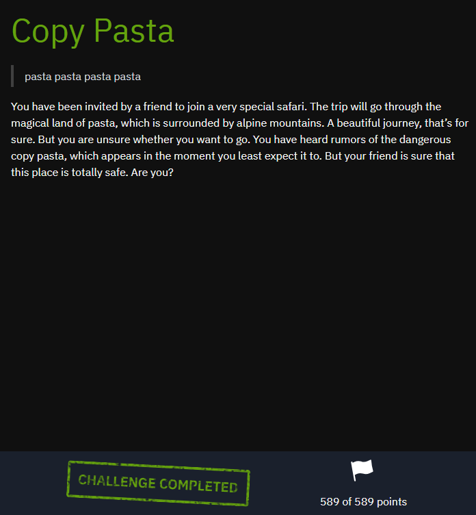
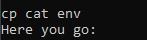
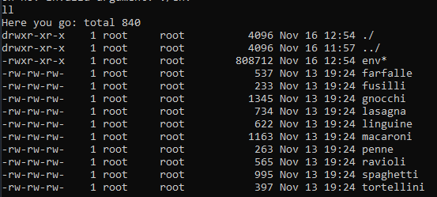
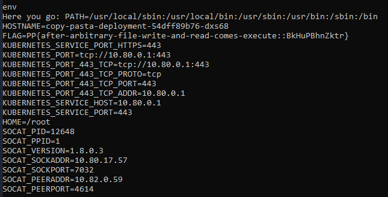

## Platypwn 2025 - Copy Pasta Write-up



This challenge, named "Copy Pasta," involves a remote service running a Rust program in a Docker container based on Alpine Linux. The goal is to retrieve the flag stored in the `FLAG` environment variable. The program acts as a restricted shell, allowing execution of a limited set of commands while warning about "copy pasta" files identified by a specific SHA1 hash.

### Step 1: Initial Analysis and Understanding the Environment

We connect to the challenge instance using `netcat`:

```bash
nc 10.80.17.57 7032
```

The service greets us with a message about the "pasta safari" and the dangers of "copy pasta," whose SHA1 hash is documented (revealed as `e80a903c5b91a0481185caa4e07348f7f0aebdac`).

The allowed commands are: `cat`, `cp`, `echo`, `ll`, `ls`, `ps`, `pwd`, `sha1sum`, `touch`. Arguments must be alphanumeric; otherwise, an error occurs. Commands in the allowed list run from `/bin/`, while others attempt to run from `./` (the working directory `/pasta`).

Running `ll` (a custom alias for `ls -alF`) lists Wikipedia excerpts about pasta types in the current directory, and after exploitation, shows additional files.

### Step 2: Identifying the "Copy Pasta" and Busybox Insight

We compute SHA1 hashes of the allowed binaries using `sha1sum <binary>`.

Most allowed binaries (`cat`, `cp`, `echo`, `ls`, `ps`, `pwd`, `sha1sum`) share the same hash: `e80a903c5b91a0481185caa4e07348f7f0aebdac`. Triggering `sha1sum` on these prints a warning: "Gah! A copy pasta. You should stay away from it."

This indicates the binaries are symlinks to Busybox—a multi-call binary in Alpine Linux that behaves differently based on its invocation name (argv[0]). The "copy pasta" refers to Busybox being "copied" (symlinked) under multiple names.

### Step 3: Exploiting for Arbitrary Execution

The program allows arbitrary file writes (via `cp <allowed> <alphanum>`, copying `/bin/<allowed>` to `./<alphanum>`).

Since arguments can't include paths, we can't directly access files outside `./`. However, copying a Busybox-linked binary (e.g., `/bin/cat`) creates a standalone Busybox copy in `./`.

To retrieve the `FLAG` env var, we need to run the `env` command, which prints environment variables. `env` isn't allowed, so it would run as `./env` if it exists.

Busybox includes an `env` applet. By copying Busybox to `./env`, invoking `env` runs Busybox as `env`.

Command:

```bash
cp cat env
```

This runs `/bin/cp /bin/cat ./env` (since `cat` is allowed, resolving to `/bin/cat`).



Now, `ll` shows `./env`.



Then:

```bash
env
```

This runs `./env` (since `env` not allowed), which is Busybox called as `env`, printing all env vars, including `FLAG`.



### Step 4: Capturing the Flag

The output reveals:

```
FLAG=PP{after-arbitrary-file-write-and-read-comes-execute::BkHuPBhnZktr}
```

This confirms arbitrary file write (via `cp`) leads to arbitrary execute (by controlling argv[0] for Busybox).

### Flag
`PP{after-arbitrary-file-write-and-read-comes-execute::BkHuPBhnZktr}`