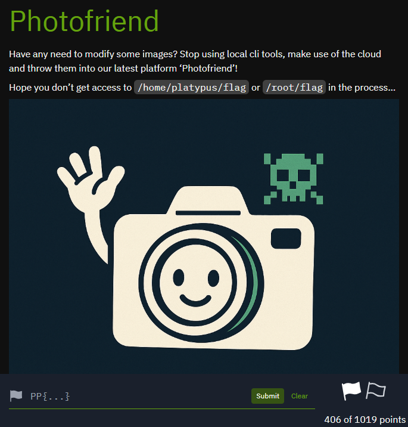
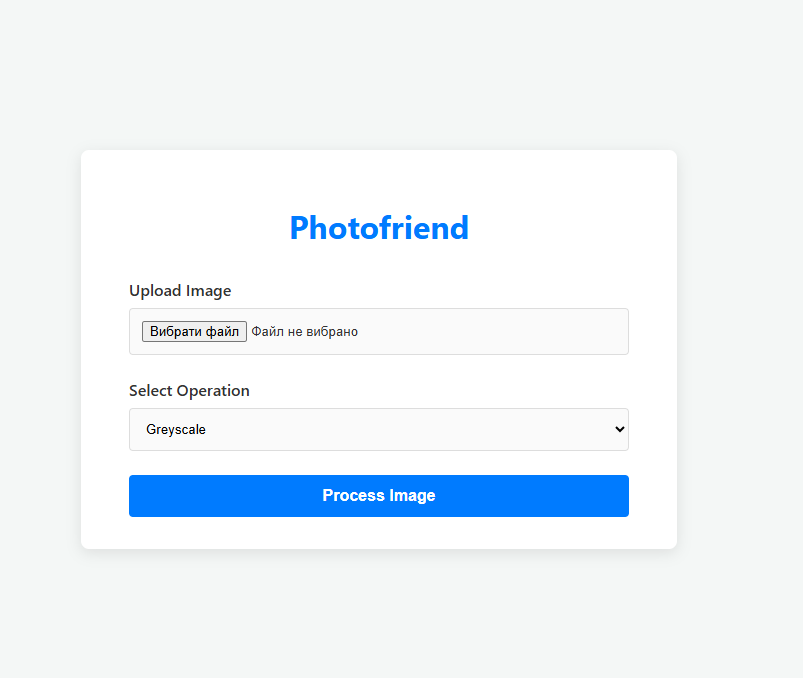
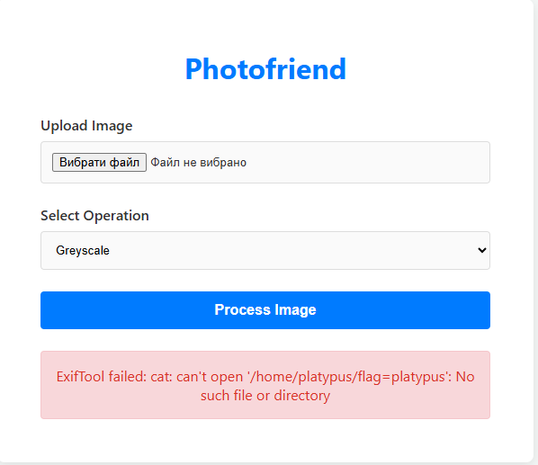
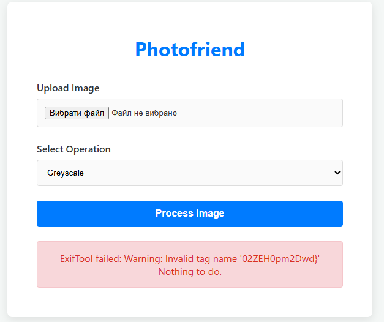
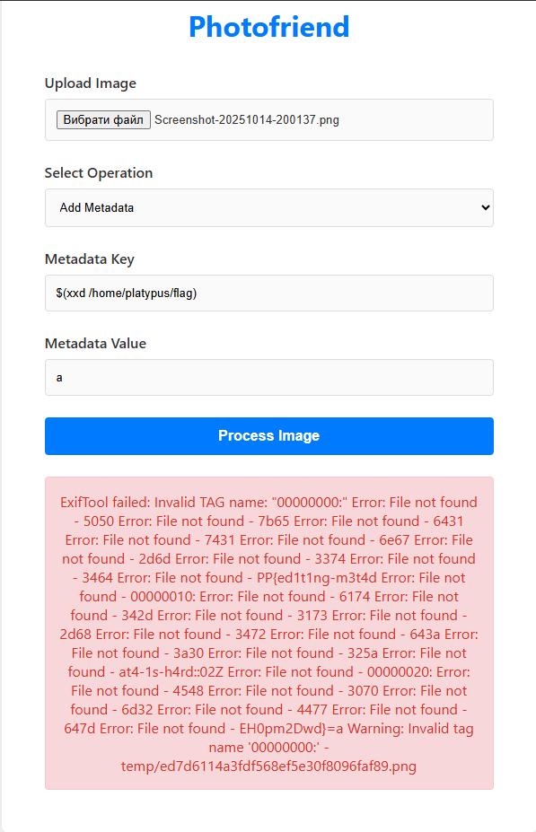

## Platypwn 2025 - Photofriend Write-up

This challenge, "Photofriend," is a web vulnerability where we need to read the contents of two files on the server: `/home/platypus/flag` and `/root/flag`. The goal is to bypass the platform's image modification restrictions to execute arbitrary commands and extract the flag, which appears to be split into two parts.

### **Part 1: Finding the First Flag (`/home/platypus/flag`)**

#### Step 1: Initial Analysis and Vulnerability Identification

The application provides a simple interface that allows users to upload images and apply operations to them, such as "Greyscale" or "Add Metadata."

The "Add Metadata" feature immediately catches our attention, as it accepts two user-controlled text fields: `Metadata Key` and `Metadata Value`. This is a classic vector for a **Command Injection** attack if the server does not properly sanitize these inputs before passing them to a command-line utility.

An initial injection attempt using the `cat` command in the `Metadata Key` field and `platypus` in the `Value` field results in a predictable error.

The error message `cat: can't open '/home/platypus/flag=platypus'` is extremely useful. It reveals that:
1. A command injection vulnerability does indeed exist.
2. The server-side application concatenates the key, an `=` sign, and the value into a single string before passing it to the shell. This means that simple injections with spaces or semicolons will not work.

#### Step 2: Exploitation via Command Substitution and the Output Problem

To bypass the concatenation issue, we can use the shell's **Command Substitution** mechanism—`$(command)`. The shell first executes the command inside `$(...)` and then substitutes its standard output (stdout) into the main string.

We try the following payload to read the flag:
*   **Metadata Key:** `$(cat /home/platypus/flag)`
*   **Metadata Value:** `a`

This leads to partial success. The `cat` command was executed, and its result was substituted as the tag name. `ExifTool` failed to recognize such a tag and returned an error, but this error only displayed **the last part of the flag**.

This suggests that either the output in the error message is truncated, or the flag itself contains characters that prevent it from being processed as a single string. We need a way to extract the flag that is not dependent on these limitations.

#### Step 3: The Final Exploit with `xxd`

The idea is to use a utility that formats its output by adding spaces and newlines, such as `xxd`. When the shell substitutes this multi-line output, it will apply **Word Splitting**—breaking the output into separate "words" at the spaces. Each such "word" will be interpreted as a separate command, causing a cascade of "File not found" errors. It is within this cascade of errors that we will see the entire flag in pieces.

We use the final payload:
*   **Metadata Key:** `$(xxd /home/platypus/flag)`
*   **Metadata Value:** `a`

This results in a large and chaotic block of errors that contains all the parts of the flag.

The result looks like a messy collection of errors, but it is exactly what we need. Amidst this "noise," we can clearly see the ASCII representation of the flag, broken into parts:
*   `PP{ed1t1ng-m3t4d`
*   `at4-1s-h4rd::02Z`
*   And the last part, `EH0pm2Dwd}`, which we had seen earlier.

Here I accidentally displayed the first flag when I wanted to execute another command

#### Step 4: Assembling the First Flag

We now have all the components extracted from the `/home/platypus/flag` file. By combining them, we get the first flag.

### First Flag
`PP{ed1t1ng-m3t4dat4-1s-h4rd::02ZEH0pm2Dwd}`