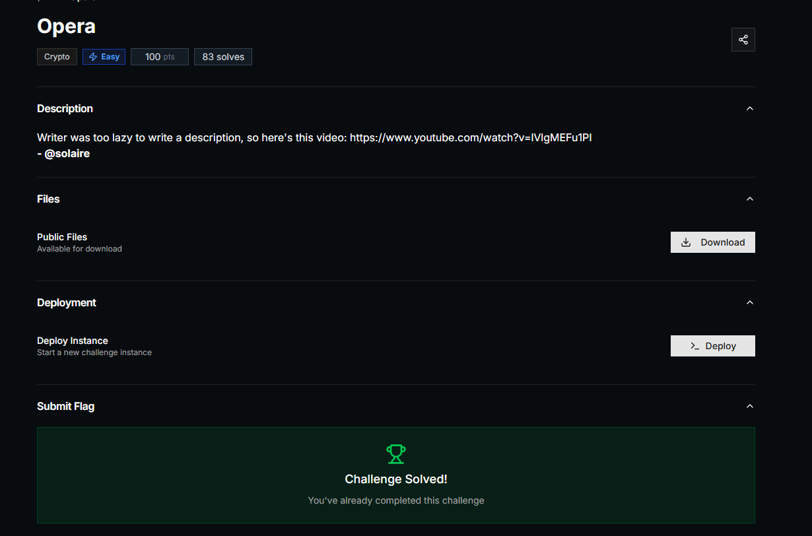
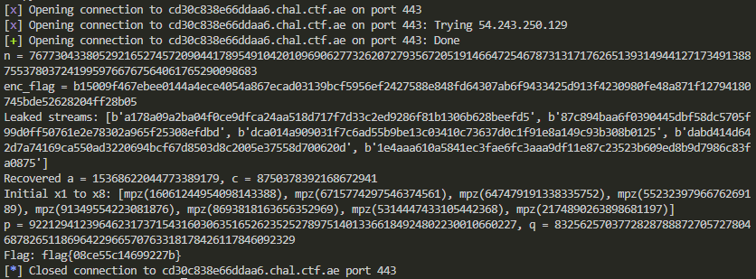

## PwnSec CTF 2025 - Opera Write-up



### Step 1: Analyzing the Challenge Source Code

The challenge provides a Python script running on a remote server. It uses RSA to encrypt the flag with a 512-bit modulus `n = p * q`, but the encryption for the flag is done modulo `n`, while user inputs are encrypted modulo `p` (a prime factor). Both the flag and user ciphertexts are XORed with a stream from a Linear Congruential Generator (LCG) before being sent.

The LCG is defined as `x_{i+1} = (a * x_i + c) % (1<<64)`, with random `a`, `c`, `x0`. The stream is concatenated 8-byte big-endian representations of `x_i`.

Our goal is to recover the flag by unmasking the XOR, obtaining the RSA ciphertext, factoring `n`, and decrypting.

### Step 2: Leaking LCG Stream Chunks

By choosing option 2 and providing an empty input (`m = 0`), the encryption returns `pow(0, e, p) = 0`, so the response is purely the LCG stream chunk (32 bytes, 4 x `x_i`).

We leak multiple such chunks (e.g., 5 times) to get consecutive `x_9` to `x_28` (since the flag uses the first 64 bytes: `x_1` to `x_8`).

### Step 3: Recovering LCG Parameters

Using the leaked `x_i`, compute differences `d1 = x_{i+1} - x_i`, `d2 = x_{i+2} - x_{i+1}` mod `m=2^64`.

Solve for `a` using `a = d2 * inv(d1) mod m`, handling GCD cases for multiple candidates. Verify with subsequent `x_i`.

Once `a` and `c` are recovered, compute inverse `inv_a = mod_inverse(a, m)` and backtrack from `x_9` to get `x_1` to `x_8`.

Reconstruct the initial stream `S0` and XOR with the encrypted flag to get the RSA ciphertext `C_flag = pow(flag, e, n)`.

### Step 4: Factoring n Using the Oracle

To factor `n`, encrypt `m=2` via option 2: gets `C = pow(2, e, p)` XORed with the next stream chunk (predictable from current LCG state).

UnXOR to get `c_p = 2^e mod p`.

Compute `c_n = 2^e mod n` locally.

Then `p = gcd(|c_n - c_p|, n)`, since `c_n ≡ 2^e mod p`, so `p` divides the difference.

With `p` and `q = n // p`, compute `phi = (p-1)*(q-1)`, `d = inv(e, phi)`, and decrypt `flag = pow(C_flag, d, n)`.

### Step 5: Running the Exploit

We implement the above in a Python script using `pwntools` for remote interaction, `gmpy2` for inverses, and basic math.

The script connects, retrieves `enc_flag` and `n`, leaks streams, recovers LCG params, unmasks `C_flag`, uses the oracle for factoring, and decrypts.

```python
from pwn import *
from gmpy2 import invert
import binascii
from math import gcd

# Connect to remote
HOST = "cd30c838e66ddaa6.chal.ctf.ae"
port = 443
io = remote(HOST, port, ssl=True, sni=HOST)

# Step 1: Get enc_flag and n
io.recvuntil(b"> ")
io.sendline(b"1")
enc_flag_hex = io.recvline().strip().decode()
n = int(io.recvline().strip().decode())
enc_flag = binascii.unhexlify(enc_flag_hex)
print(f"n = {n}")
print(f"enc_flag = {enc_flag_hex}")

# Step 2: Leak LCG stream chunks by encrypting empty string (m=0)
leaks = []
for _ in range(5):
    io.recvuntil(b"> ")
    io.sendline(b"2")
    io.recvuntil(b"> ")
    io.sendline(b"")
    leak_hex = io.recvline().strip().decode()
    leak = binascii.unhexlify(leak_hex)
    leaks.append(leak)
print("Leaked streams:", [binascii.hexlify(l) for l in leaks])

# Parse leaks into list of x_i (64-bit ints, big endian)
x_list = []
for leak in leaks:
    for i in range(0, 32, 8):
        x = int.from_bytes(leak[i:i+8], 'big')
        x_list.append(x)

# Step 3: Recover a, c from consecutive x's
m = 1 << 64
def recover_lcg(xs):
    for i in range(len(xs) - 2):
        d1 = (xs[i+1] - xs[i]) % m
        d2 = (xs[i+2] - xs[i+1]) % m
        g = gcd(d1, m)
        if g == 0:
            continue
        if d2 % g != 0:
            continue
        mod = m // g
        d1_g = d1 // g
        d2_g = d2 // g
        inv_d1 = invert(d1_g, mod)
        a_cand = (d2_g * inv_d1) % mod
        for k in range(g):
            a = a_cand + k * mod
            if a % m == 0: continue
            c = (xs[i+1] - a * xs[i]) % m
            valid = True
            for j in range(i+1, len(xs)-1):
                next_x = (a * xs[j] + c) % m
                if next_x != xs[j+1]:
                    valid = False
                    break
            if valid:
                return a, c
    raise ValueError("Could not recover LCG")

a, c = recover_lcg(x_list)
print(f"Recovered a = {a}, c = {c}")

# Step 4: Compute backwards to get x1 to x8
inv_a = invert(a, m)
# Leaks start from x9
current_x = x_list[0]  # x9
x_prev = []
for _ in range(8):
    prev_x = (inv_a * (current_x - c)) % m
    x_prev.append(prev_x)
    current_x = prev_x
x_prev = x_prev[::-1]  # x1 to x8
print("Initial x1 to x8:", x_prev)

# Build S0 (initial stream for flag)
S0 = b''
for x in x_prev:
    S0 += x.to_bytes(8, 'big')

# Unmask to get Cflag = pow(m, e, n).to_bytes(64, 'big')
Cflag_bytes = xor(enc_flag, S0)

# Step 5: Use oracle to get pow(2, e, p), then factor n
e = 65537

# Current x after 5 leaks is x28
current_x = x_list[-1]  # x28

# Compute next 4 for the upcoming stream
x29 = (a * current_x + c) % m
x30 = (a * x29 + c) % m
x31 = (a * x30 + c) % m
x32 = (a * x31 + c) % m
stream_next = x29.to_bytes(8, 'big') + x30.to_bytes(8, 'big') + x31.to_bytes(8, 'big') + x32.to_bytes(8, 'big')

# Send option 2, encrypt m=2
io.recvuntil(b"> ")
io.sendline(b"2")
io.recvuntil(b"> ")
io.sendline((2).to_bytes(1, 'big'))  # b'\x02'
leak_hex = io.recvline().strip().decode()
leak = binascii.unhexlify(leak_hex)

# Get pow(2, e, p).to_bytes(32, 'big')
C_bytes = xor(leak, stream_next)
c_p = int.from_bytes(C_bytes, 'big')

# Compute pow(2, e, n)
c_n = pow(2, e, n)

# Compute gcd(|c_n - c_p|, n) = p
diff = c_n - c_p
p = gcd(abs(diff), n)
q = n // p
print(f"p = {p}, q = {q}")

# Step 6: Decrypt the flag
phi = (p - 1) * (q - 1)
d = invert(e, phi)
C = int.from_bytes(Cflag_bytes, 'big')
m_int = pow(C, d, n)
flag = m_int.to_bytes((m_int.bit_length() + 7) // 8, 'big').decode()
print("Flag:", flag)

io.close()
```



### Flag
`flag{08ce55c14699227b}`