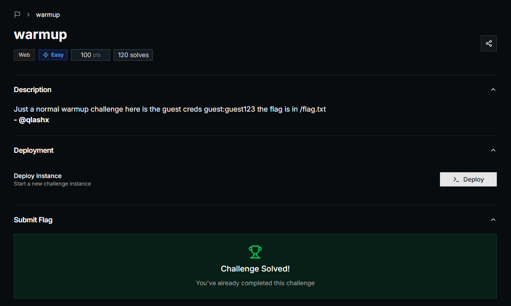
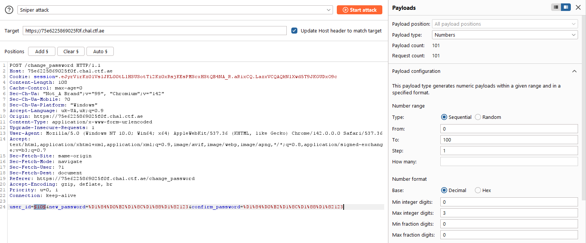
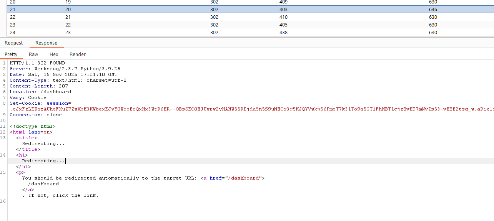
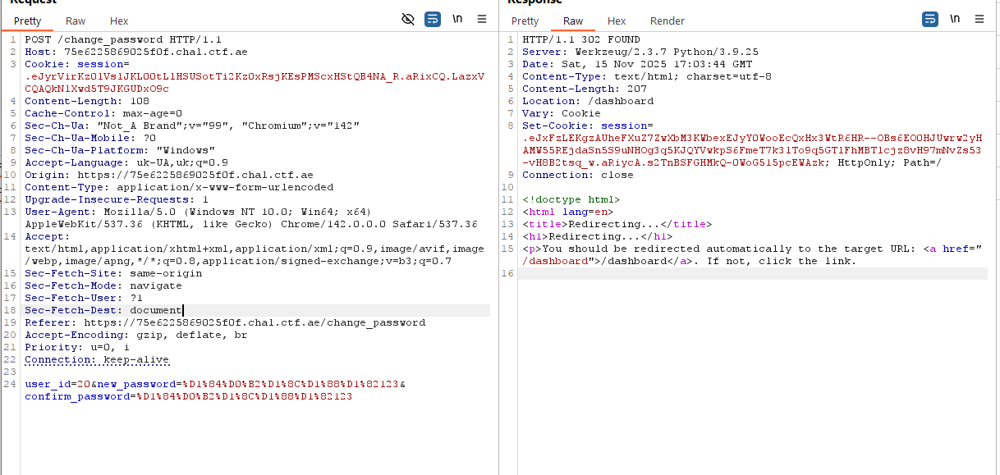
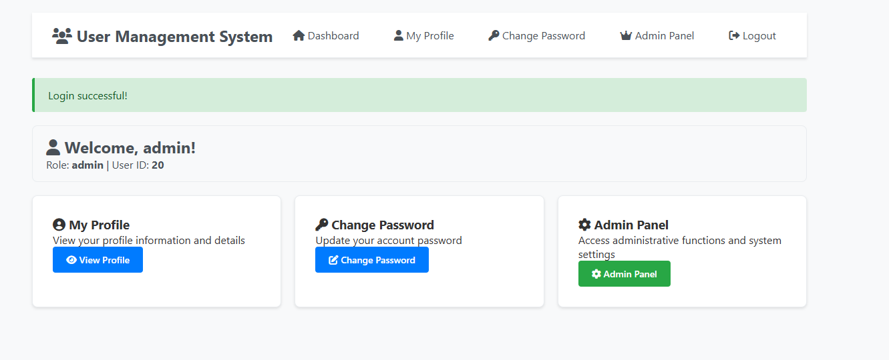
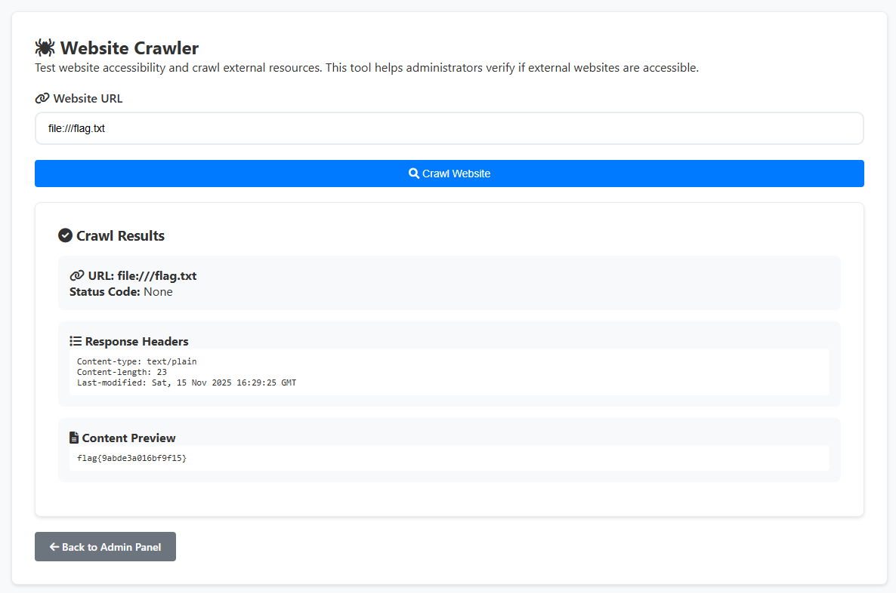

## PwnSec CTF 2025 - warmup Write-up



### Step 1: Initial Access and IDOR Vulnerability Discovery

We begin with the provided credentials: `guest:guest123`. After logging in, we explore the available functionality. The most interesting feature is the "Change Password" page (`/change_password`).

The password change form includes a **"Target User ID"** field. This field allows the user to specify which `user_id`'s password they want to change. The lack of a server-side check to verify if the current user has the right to perform this action for another user is a classic **Insecure Direct Object Reference (IDOR)** vulnerability. Our objective is to find the administrator's `user_id` and change their password.

### Step 2: Exploiting IDOR with Burp Intruder

Since we don't know the administrator's ID (we only know our own ID = 1), we need to find it. Manual enumeration would be time-consuming, so we automate the process using **Burp Suite Intruder**.

1.  **Intercept the Request:** We submit the password change form with an arbitrary `user_id` and intercept the request in Burp Suite.
2.  **Configure Intruder:** The request is sent to Intruder. We clear all default payload positions and set a single position on the value of the `user_id` parameter.
3.  **Set Payloads:** We use the "Numbers" payload type and configure a range to iterate through, for example, from 1 to 100.

4.  **Analyze Results:** We launch the attack and monitor the "Status" and "Length" columns. Most requests fail with a "User not found" message. However, the request with `user_id=20` returns a `302 Found` status, indicating a successful password change.



The request targeting `user_id=20` received a different response, confirming that the user exists and their password was successfully changed.



### Step 3: Gaining Administrative Access

Knowing that the administrator's ID is **20** and having set a new password for them, we log out and log back in as the administrator.

*   **Username:** `admin` (a standard assumption)
*   **Password:** `123123` (the password we set via Burp Intruder)

The login is successful, and we gain access to the user dashboard, which now includes a new **"Admin Panel"** function.



### Step 4: Exploiting SSRF to Read the Flag

Inside the admin panel, we discover a **"Website Crawler"** tool. This feature is intended to check the availability of external websites but is often vulnerable to **Server-Side Request Forgery (SSRF)**.

Instead of an HTTP URL, we can use the `file://` protocol wrapper to force the server to access its own local file system. Our goal, as stated in the challenge description, is to read `/flag.txt`.

We enter the following payload into the URL field:
```
file:///flag.txt
```
The server executes the request to the local file and displays its contents in the crawl results.



### Step 5: Capturing the Flag

The flag is successfully retrieved. We can now submit it on the platform to solve the challenge.

### Flag
`flag{9abde3a016abf9f15}`