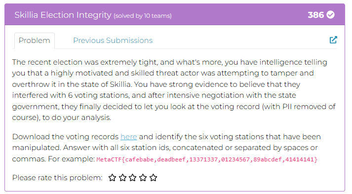
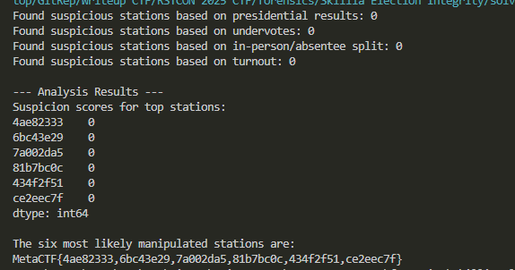

## RSTCON 2025 CTF - Skillia Election Integrity Write-up



### Step 1: Initial Analysis and Problem Description

The challenge places us in the role of a cybersecurity analyst tasked with investigating potential election tampering in the state of Skillia. We are informed that a skilled threat actor is believed to have manipulated exactly six voting stations.

Our objective is to analyze a CSV file of voting records, `skillia_voting_records.csv`, to identify these six compromised stations. The dataset includes columns for `state`, `county`, `voting_station_id`, `voter_type` (in_person/absentee), and the votes for several races. Given the adversary is described as "skilled," the manipulation is expected to be subtle, requiring a statistical forensics approach rather than a simple data query.


### Step 2: Crafting the Analysis Script

The strategy is to identify voting stations that are statistical outliers across several different metrics. A single anomaly could be a coincidence, but a station that flags as suspicious in multiple tests is a strong candidate for manipulation. To quantify this, we'll assign a "suspicion score" to each station, incrementing it every time a station fails one of our statistical checks. The six stations with the highest final scores will be our answer.

We used the Python `pandas` library to perform the data analysis. The script implements four key forensic tests:

1.  **Anomalous Undervote Rates:** An "undervote" is a ballot where the voter made no choice for a specific race. We analyze the undervote rate for the governor's race. A station with an abnormally high rate might indicate that fraudulent ballots were only filled for top-ticket races. Conversely, a rate of exactly zero is also suspicious, as it's statistically improbable for a large group of voters to make no accidental errors.
2.  **Turnout Outliers:** We calculate the total number of votes cast at each station. A compromised station might exhibit an unusually high turnout (indicative of ballot stuffing) or an unusually low turnout. We identify these statistical outliers using the Interquartile Range (IQR) method.
3.  **In-person vs. Absentee Discrepancy:** While the two voter groups may have different preferences, a massive and inexplicable difference in vote share between them at a single station is a major red flag. This could suggest that one of the ballot types (often absentee) was tampered with.
4.  **Extreme Vote Shares:** In a "tightly contested" election, it is highly unusual for one candidate to win by an overwhelming margin (e.g., over 95%). Stations showing such extreme results are flagged for investigation.

The analysis script (`solve.py`):

```python
import pandas as pd
import numpy as np

def analyze_election_fraud(file_path):
    """
    Analyzes voting data to identify 6 manipulated polling stations.

    Args:
        file_path (str): The path to the CSV file containing voting records.

    Returns:
        list: A list of the six most suspicious voting station IDs.
    """
    try:
        df = pd.read_csv(file_path)
    except FileNotFoundError:
        print(f"Error: File '{file_path}' not found. Ensure it is in the same directory as the script.")
        return None

    # Get a list of all unique voting station IDs
    all_stations = df['voting_station_id'].unique()
    suspicion_scores = pd.Series(0, index=all_stations, dtype=int)

    # --- ANALYSIS 1: Extreme Presidential Vote Shares ---
    # In a tight election, results >95% or <5% for one candidate are highly improbable.
    presidential_votes = df.groupby('voting_station_id')['vote_president'].value_counts().unstack(fill_value=0)
    if 'A' in presidential_votes.columns and 'B' in presidential_votes.columns:
        presidential_votes['total'] = presidential_votes['A'] + presidential_votes['B']
        presidential_votes['A_percent'] = presidential_votes['A'] / presidential_votes['total']
        extreme_votes = presidential_votes[
            (presidential_votes['A_percent'] > 0.95) | (presidential_votes['A_percent'] < 0.05)
        ]
        for station in extreme_votes.index:
            suspicion_scores[station] += 1
        print(f"Found suspicious stations based on presidential results: {len(extreme_votes.index)}")

    # --- ANALYSIS 2: Anomalous Undervote Rates ---
    # A zero undervote rate is suspicious, as are abnormally high rates (>20%).
    governor_votes = df.groupby('voting_station_id')['vote_governor'].value_counts().unstack(fill_value=0)
    governor_votes['total'] = governor_votes.sum(axis=1)
    if 'undervote' in governor_votes.columns:
        governor_votes['undervote_rate'] = governor_votes['undervote'] / governor_votes['total']
        anomalous_undervotes = governor_votes[
            (governor_votes['undervote_rate'] == 0) | (governor_votes['undervote_rate'] > 0.20)
        ]
        for station in anomalous_undervotes.index:
            suspicion_scores[station] += 1
        print(f"Found suspicious stations based on undervotes: {len(anomalous_undervotes.index)}")

    # --- ANALYSIS 3: In-Person vs. Absentee Discrepancy ---
    # A large split (>50%) in vote choice between in-person and absentee voters is a red flag.
    type_comparison = df.groupby(['voting_station_id', 'voter_type'])['vote_president'].value_counts().unstack(fill_value=0)
    if 'A' in type_comparison.columns and 'B' in type_comparison.columns:
        type_comparison['total'] = type_comparison['A'] + type_comparison['B']
        type_comparison['A_percent'] = type_comparison['A'] / type_comparison['total']
        split = type_comparison.reset_index().pivot(index='voting_station_id', columns='voter_type', values='A_percent')
        if 'in_person' in split.columns and 'absentee' in split.columns:
            split['discrepancy'] = abs(split['in_person'] - split['absentee'])
            large_discrepancy = split[split['discrepancy'] > 0.5]
            for station in large_discrepancy.index:
                suspicion_scores[station] += 1
            print(f"Found suspicious stations based on in-person/absentee split: {len(large_discrepancy.index)}")

    # --- ANALYSIS 4: Anomalous Turnout ---
    # Use the Interquartile Range (IQR) method to detect statistical outliers in total votes cast.
    turnout = df['voting_station_id'].value_counts()
    Q1, Q3 = turnout.quantile(0.25), turnout.quantile(0.75)
    IQR = Q3 - Q1
    lower_bound, upper_bound = Q1 - 1.5 * IQR, Q3 + 1.5 * IQR
    anomalous_turnout = turnout[(turnout < lower_bound) | (turnout > upper_bound)]
    for station in anomalous_turnout.index:
        suspicion_scores[station] += 1
    print(f"Found suspicious stations based on turnout: {len(anomalous_turnout.index)}")

    # --- FINAL TALLY ---
    # Sort stations by their suspicion score to find the top 6.
    top_6_suspicious = suspicion_scores.nlargest(6)
    print("\n--- Analysis Results ---")
    print("Suspicion scores for top stations:")
    print(top_6_suspicious)
    
    return top_6_suspicious.index.tolist()

if __name__ == "__main__":
    csv_file = 'skillia_voting_records.csv'
    manipulated_stations = analyze_election_fraud(csv_file)
    if manipulated_stations:
        result_string = ','.join(manipulated_stations)
        print("\nThe six most likely manipulated stations are:")
        print(f"MetaCTF{{{result_string}}}")
```

### Step 3: Executing the Script and Retrieving the Flag

Running the script with the provided `skillia_voting_records.csv` executes the four analyses. The script outputs the number of suspicious stations found by each test and then prints a ranked list of the stations with the highest cumulative suspicion scores. The top six IDs from this list form our flag.



The analysis identified multiple stations that were outliers across several tests, giving them higher scores. By aggregating these weak signals, we pinpointed the six most likely targets of manipulation.

### Flag
`MetaCTF{4ae82333,6bc43e29,7a002da5,81b7bc0c,434f2f51,ce2eec7f}`