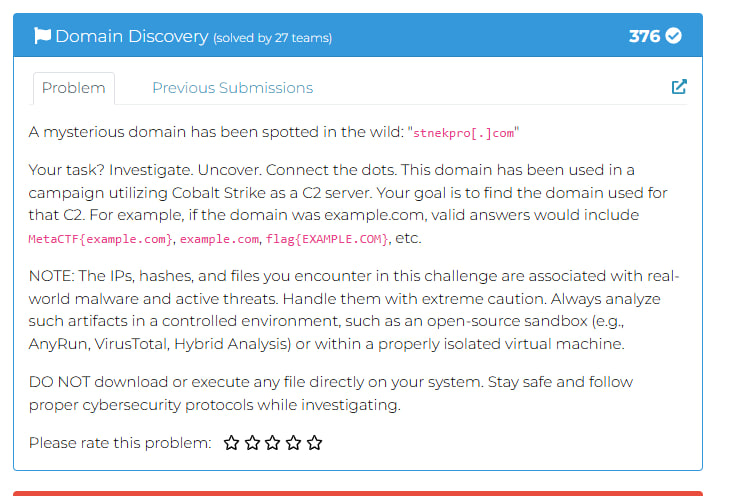
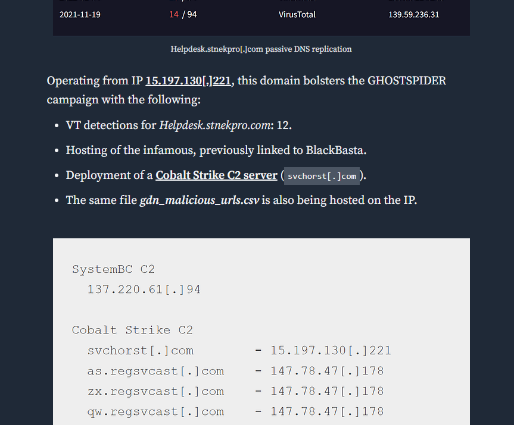
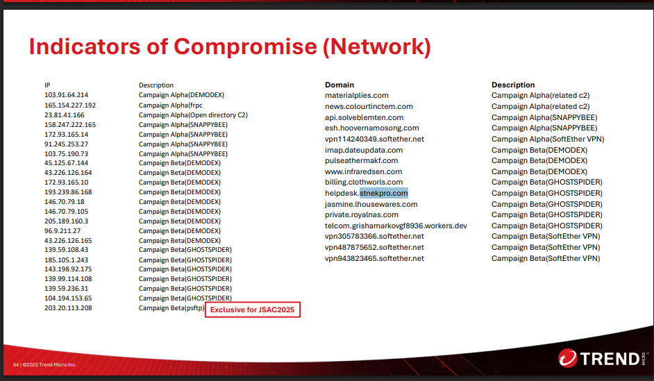

## RSTCON 2025 CTF - Domain Discovery Write-up

### Step 1: Initial Analysis and Problem Description

The challenge highlights a mysterious domain "stnekpro[.]com" (subdomain: helpdesk.stnekpro.com) tied to a Cobalt Strike C2 campaign. Goal: Identify the exact C2 domain using OSINT, with caution—avoid direct access, use sandboxes if needed.

Linked to Salt Typhoon (Earth Estries APT), targeting telecom/government with GHOSTSPIDER and BlackBasta tools.

[Trend Micro: Earth Estries Campaign](https://www.trendmicro.com/en_us/research/24/k/earth-estries.html)

**Objective:** Trace stnekpro.com to its Cobalt Strike C2

### Step 2: Step-by-Step Execution

#### 1. Web Search and Blog Analysis

Search: "stnekpro.com cobalt strike C2" or "helpdesk.stnekpro.com salt typhoon".

Result: OSINT Team blog (Jan 8, 2025) on Salt Typhoon telecom hacks, connecting helpdesk.stnekpro.com to GHOSTSPIDER/BlackBasta.

[OSINT Team Blog: Salt Typhoon Part III](https://osintteam.blog/the-most-significant-telecom-hack-in-history-inside-the-salt-typhoon-cyberattack-part-iii-4dd840940e08)

Mirror: [Freedium](https://freedium.cfd/https://osintteam.blog/the-most-significant-telecom-hack-in-history-inside-the-salt-typhoon-cyberattack-part-iii-4dd840940e08). Scroll to IOC section—key line: "VT detections for Helpdesk.stnekpro.com: 12. Hosting of the infamous, previously linked to BlackBasta. Deployment of a Cobalt Strike C2 server (svchorst[.]com)."

IP: 15.197.130.221. Related: as.regsvcast[.]com (147.78.47.178).

#### 2. JSAC2025 PDF Analysis

PDF: [JSAC2025: Earth Estries Intrusions](https://jsac.jpcert.or.jp/archive/2025/pdf/JSAC2025_1_5_leon-chang_theo-chen_en.pdf) (Jan 21, 2025).

Search (Ctrl+F) "stnekpro.com": p.54 IOC table lists helpdesk.stnekpro.com under Campaign Beta/GHOSTSPIDER (IP 15.197.130.221).

| IP          | Description          | Domain                | Campaign     |
|-------------|----------------------|-----------------------|--------------|
| 15.197.130.221 | Beta/GHOSTSPIDER   | helpdesk.stnekpro.com | Beta/GHOSTSPIDER |
| 185.105.1.243 | Beta/GHOSTSPIDER   | billing.clothworls.com| Beta/GHOSTSPIDER |
| 199.59.243.227| Beta/GHOSTSPIDER   | jasmine.lhousewares.com| Beta/GHOSTSPIDER |

Pp.26-30: Beta (2020-2023) targets APAC/US telecom; GHOSTSPIDER backdoor aligns with Cobalt Strike (Alpha, p.13). Blog confirms svchorst.com as C2.

Other IOCs: pulseathermakf.com (DEMODEX), gdn_malicious_urls.csv (BlackBasta).

#### 3. Confirmation

Safety: No domain interaction—proxies/sandboxes only. Blog and PDF align: svchorst.com is the C2.

### Flag

`MetaCTF{svchorst.com}`