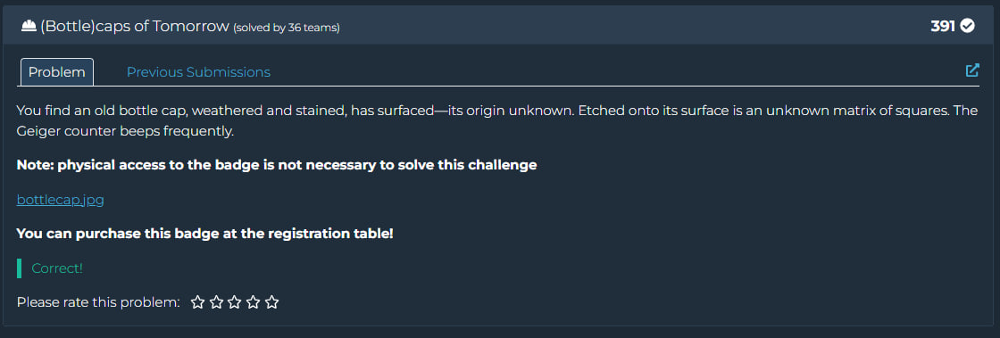
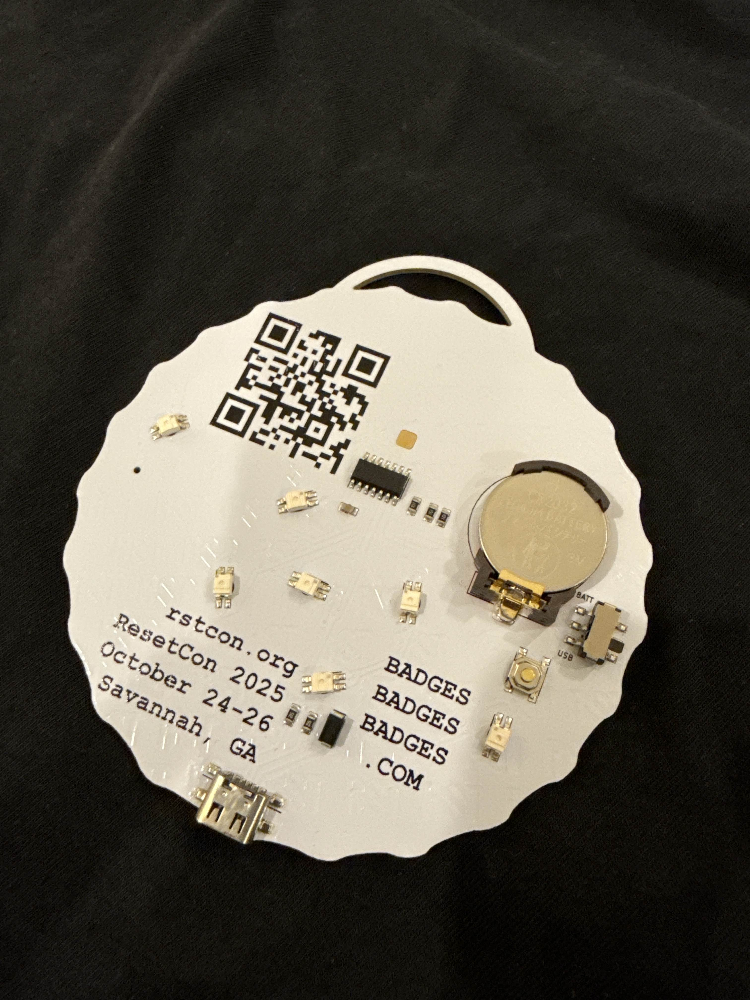
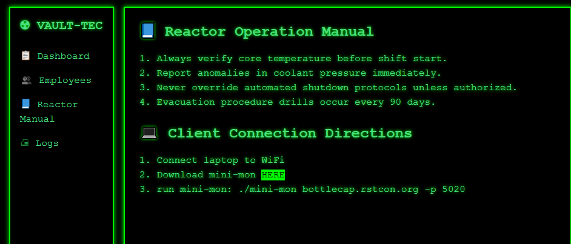
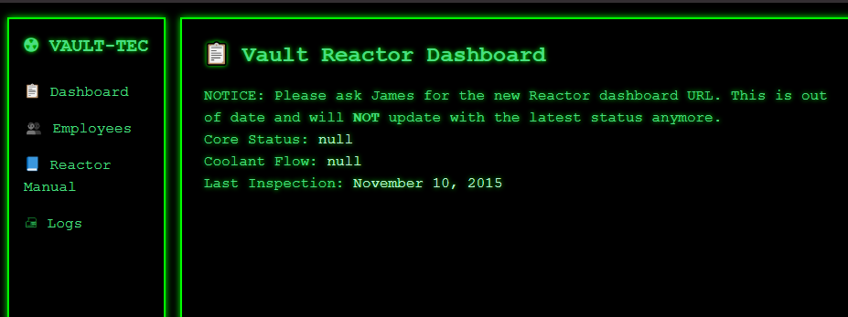
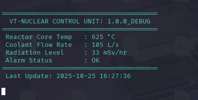
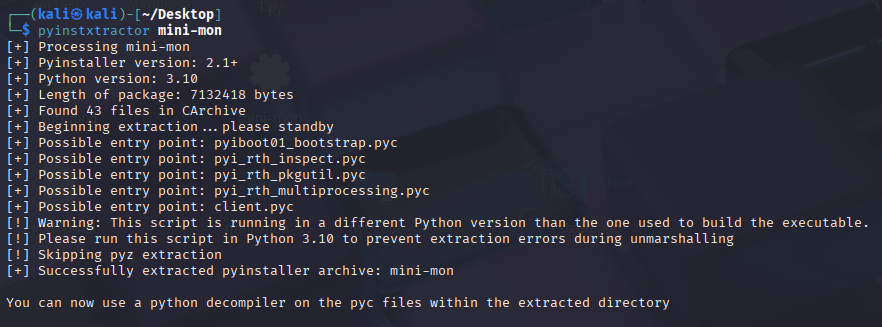
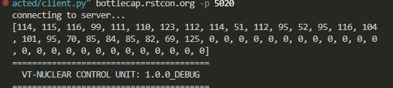
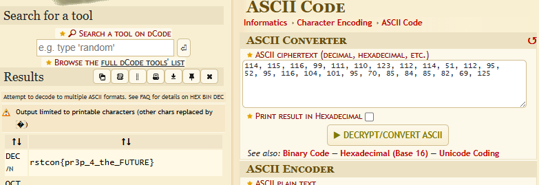

## RSTCON 2025 CTF -  (Bottle)caps of Tomorrow Write-up



### Step 1: Initial Analysis and Clues

The challenge begins with an image of a bottle-cap-shaped printed circuit board (PCB) featuring a QR code and some puzzling text.



1.  **QR Code and Website:** Scanning the QR code leads to the website `http://bottlecap.rstcon.org:3000/`. The site is styled with a "Vault-Tec" theme from the Fallout universe and contains several key clues.

2.  **Connection Instructions:** On the "Reactor Manual" page, the most important clue is found—the client connection instructions. It directs the user to download a file named `mini-mon` and run it with the command `./mini-mon bottlecap.rstcon.org -p 5020`. This indicates that the main interaction will be with a service on port 5020, not the website.



3.  **The "James" Puzzle:** On the main dashboard, a message states to "ask James" for the new URL. Meanwhile, the "Employees" page lists an employee, James H., with the ID `001`. This suggests that the number `1` will play a crucial role in authentication.



**Objective:** To reverse engineer the `mini-mon` client to understand how to interact with the service on port 5020 and retrieve the flag.



### Step 2: Step-by-Step Execution

#### 1. Unpacking the `mini-mon` client

The first step was to investigate the `mini-mon` file. An analysis of its assembly code and strings revealed it to be a **PyInstaller** executable. This means the main logic is located within a packed Python script.

The `pyinstxtractor` utility was used to extract the contents.

```bash
pyinstxtractor mini-mon
```



The utility successfully extracted the files, with the key file being `client.pyc`—the compiled Python script.

#### 2. Decompiling the Python code

The `.pyc` file contains bytecode that needs to be decompiled to get readable source code. An attempt to use `uncompyle6` was unsuccessful due to Python version mismatch.

Instead, the online decompiler **PyLingual.io** was used, which successfully recovered the source code of the `client.py` file.


#### 3. Analyzing the source code and discovering the vulnerability

Analyzing the decompiled `client.py` file revealed key details:

*   **Protocol:** The import `from pymodbus.client import ModbusTcpClient` clearly indicates that the program uses the industrial **Modbus/TCP** protocol.
*   **Main Logic:** The `main` function in the original code enters an infinite loop to poll standard registers (0-4) for displaying the reactor status.
*   **Hidden Function:** A function named `enable_debug(client)` was found in the code, but it was **never called** in the main execution flow.

    ```python
    def enable_debug(client):
        global debug_enabled
        client.write_register(1337, 2989)  # <--- Writes a "magic" value
        result = client.read_holding_registers(1338, count=50) # <--- Reads hidden data
        if not result.isError():
            debug_enabled = True
        if debug_enabled:
            print(result.registers) # <--- Prints the flag
    ```
This function is the key to the solution. It sends a command to write the value `2989` into register `1337`. Immediately after, it reads 50 registers starting from address `1338`. This is clearly where the flag is hidden.

#### 4. Exploitation: Modifying the client

The most direct path to exploitation was to make two minimal changes to the decompiled code:

1.  **Call the hidden function:** A single line, `enable_debug(client)`, was added at the beginning of the `main` function to trigger the flag-retrieval logic.
2.  **Prevent screen clearing:** The line `os.system('cls' if os.name == 'nt' else 'clear')` in the `vault_output` function was removed or commented out. This was a crucial step to prevent the program from clearing the terminal screen immediately after printing the flag array.

**Modified `client.py`:**

```python
def vault_output(temp, flow, rad, alarm, product, ver):
    # os.system('cls' if os.name == 'nt' else 'clear') # <--- LINE REMOVED
    print(' [92m')
    # ... rest of the function

def main(ip, port):
    print('connecting to server...')
    client = ModbusTcpClient(ip, port=port)
    if client.connect():
        enable_debug(client)  # <--- LINE ADDED
        try:
            # ... rest of the original main function continues
```

#### 5. Obtaining and decoding the flag

After running the modified script with the necessary arguments (`python client.py bottlecap.rstcon.org -p 5020`), the server returned an array of numbers at the top of the output.



These numbers are the ASCII decimal values of the flag's characters. To decode them, an online ASCII converter was used.

Converting the array `[114, 115, 116, 99, 111, 110, 123, 112, 114, 51, 112, 95, 52, 95, 116, 104, 101, 95, 70, 85, 84, 85, 82, 69, 125]` yielded the flag.



### Flag

`rstcon{pr3p_4_the_FUTURE}`
